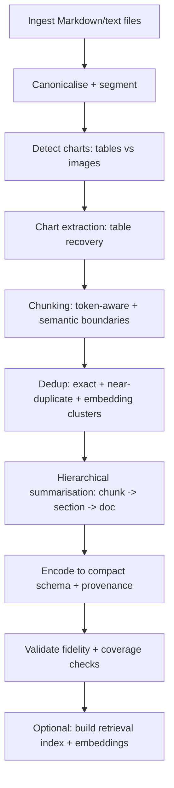
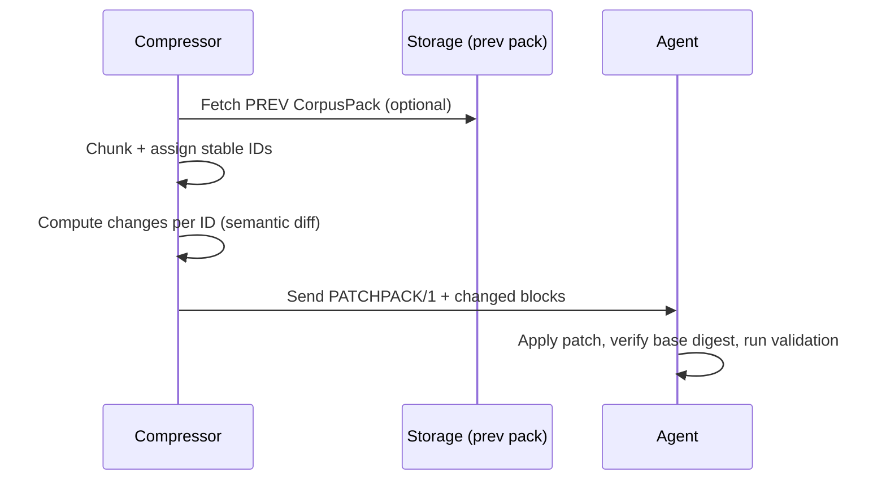

# Compressing Markdown and Text Corpora into Machine-Usable Agent Contexts

## Executive summary

Compressing multiple Markdown/text files into a compact, agent-usable context is best treated as a **pipeline** rather than a single summarisation step: (a) normalise and segment, (b) deduplicate, (c) extract structure and data (especially charts), (d) compress into a schema optimised for **retrieval, grounding, and patchability**, and (e) validate fidelity against measurable checks. Techniques that consistently perform well in practice combine **hierarchical summarisation** (document → section → atomic facts) with **semantic indexing** (embeddings + retrieval) and **provenance-aware structured output** so the agent can trace claims back to sources. citeturn0search22turn3search3turn2search13turn1search3

For *textual redundancy*, near-duplicate detection methods from large-scale web search (e.g., **shingling + MinHash sketches** and **SimHash-style fingerprints**) are strong building blocks for semantic deduplication and “keep-one-canonical” compaction; they offer controllable trade-offs between speed, memory footprint, and false matches. citeturn7search2turn0search9turn5search0turn5search5

For *charts*, the highest-fidelity compression comes from extracting **underlying tables** rather than describing pixels. When charts exist as images, “plot-to-table” models (e.g., **DePlot**) and chart OCR/structure recovery systems (e.g., **ChartOCR**) provide a route to convert chart images into structured tables that can then be numerically compressed (change-points, top‑k, quantiles, regression coefficients, etc.). citeturn0search15turn1search0turn1search29

For **incremental updates** (your follow-up on “diff compression”), the most token-efficient approach for LLM contexts is usually *not* a traditional unified diff, but an **ID-addressed patch format** produced against a stable, chunked representation (chunks have persistent IDs). This allows you to upload only “changed blocks” plus minimal metadata. Traditional unified diffs are compact *relative to older formats* and broadly tool-supported, but they carry overhead (headers + context lines) and are brittle if the base text in the model’s working memory drifts. citeturn11search1turn11search2turn11search17turn11search0

The report’s prompts provide templates for (1) single-file compression, (2) multi-file corpus compression with dedup + provenance, and (3) optional delta/patch generation to keep future uploads token-light. All unspecified parameters (model token limit, desired compression ratio, downstream tasks, allowed external memory) are explicitly marked as **unspecified** unless you provide them.

## Scope, assumptions, and definitions

### Assumptions provided by you

Inputs are **Markdown/text only**; charts may appear as (a) embedded images, or (b) ASCII diagrams / Markdown tables / CSV-like tables. This means the compressor can rely on parsing text and extracting structured tables, but image charts need explicit *chart-to-data* handling rather than simple Markdown parsing. citeturn0search15turn1search0turn1search29

### Key definitions used in this report

**Compact, machine-usable context**: a representation optimised for an LLM agent to *retrieve and reason over* (and optionally update), rather than for human reading.

**Lossy vs lossless**:
- *Lossy*: summarisation, abstraction, entity normalisation, numeric approximation—information is intentionally discarded.
- *Lossless-in-text*: canonicalisation that preserves all semantics and data (e.g., exact tables), but removes redundant formatting.
- *Lossless-outside-context*: storing originals externally and supplying identifiers/digests in-context; the in-context payload can then be small, but faithful reconstruction requires external access (this is often paired with retrieval). citeturn2search13turn1search3turn6search6

**Token-aware**: text is segmented and encoded with awareness that LLMs process **tokens**, and tokenisation varies across BPE/SentencePiece-like schemes; token-aware chunking is best done with the specific tokenizer for the target model family. citeturn3search6turn3search1turn3search0

### Unspecified details and why they matter

The following are **unspecified** in your request; recommendations below assume they are open design choices:

- Target LLM family/tokeniser and context length (drives chunk size, schema verbosity). citeturn3search6turn3search1  
- Desired compression ratio or target “budget” per file/corpus (drives aggressiveness of lossy steps). citeturn0search0turn3search39  
- Downstream agent tasks (Q&A, planning, extraction, reasoning, code synthesis) and which content types are highest value. citeturn2search13turn0search22  
- Whether the agent has access to external storage/retrieval (changes the optimal balance between in-context density vs index + retrieval). citeturn2search13turn2search0turn2search3  
- Whether deterministic parsing is required (schema choice; JSON Patch vs custom patch DSL). citeturn11search3turn12search0turn6search6  

## Catalogue of effective compression techniques

The techniques below are grouped by where they sit in the pipeline: **pre-processing**, **deduplication**, **summarisation/compression**, **representation/schema**, and **retrieval support**. “Complexity” is split into (a) computational cost and (b) implementation complexity.

### Techniques comparison table

| Technique | What it does | Lossy | Pros | Cons | Computational complexity | Implementation complexity | Recommended use-cases |
|---|---|---:|---|---|---|---|---|
| Canonicalisation (strip Markdown noise, normalise whitespace, standardise tables) | Removes formatting redundancy while keeping content | No (if done carefully) | Cheap, reduces tokens without “thinking”; makes dedup easier | Can destroy semantics if you drop structure; must preserve code blocks/tables | Low | Low–Medium | Any pipeline as first stage |
| Token-aware chunking | Splits into chunks that respect token budgets and semantic boundaries | No | Prevents truncation; improves recall in retrieval and map-reduce summarisation | Requires target tokenizer; different tokenisers behave differently | Low–Medium | Medium | Summarising long docs; RAG chunking citeturn3search2turn3search6turn3search0turn3search1 |
| Map–reduce / hierarchical summarisation | Summarise chunks; summarise summaries; optionally recursively | Yes | Scales to long docs; modular; controllable budgets | Compounding errors; can “wash out” rare details | Medium–High | Medium | Long doc summarisation; corpus condensation citeturn4search0turn3search3turn3search39 |
| Recursive summarisation with feedback loops | Iterated summarisation across levels for book-length inputs | Yes | Demonstrated as a way to supervise long summarisation pipelines | Needs careful controls for faithfulness | High | High | Ultra-long documents; multi-stage pipelines citeturn3search39 |
| Extractive key-sentence compression | Keeps sentences/spans most “important” | Yes (but often higher fidelity than abstractive) | High factual retention; easier provenance | Still verbose; importance heuristics can be brittle | Medium | Medium | Technical docs where wording matters |
| Prompt-level compression (token pruning) | Removes low-utility tokens from prompts while preserving task performance | Yes | Can yield large compression ratios with small performance loss in some benchmarks | Model/task dependence; may remove “rare but crucial” details | Medium–High | High | Accelerating inference; compressing contexts before LLM call citeturn0search0turn0search17 |
| Near-duplicate detection via shingling + MinHash | Sketches documents to estimate resemblance and filter duplicates | No (dedup itself is lossy if you discard copies) | Fast at scale; well-studied; supports large corpora | Similar but non-duplicate content may collide; needs thresholds | Medium | Medium | Semantic dedup, canonical chunk selection citeturn7search2turn7search26 |
| SimHash / LSH-style fingerprints | Compact fingerprints to catch near-duplicates | No (if only used for detection) | Very small fingerprints; scalable web-crawling style | Similarity notion depends on representation; false positives possible | Low–Medium | Medium | Fast, memory-light dedup at scale citeturn0search9turn5search0 |
| Embedding-based clustering + summarise clusters | Embed chunks, cluster, summarise each cluster | Yes | Captures semantic redundancy beyond surface text | Needs embedding model + clustering strategy | Medium–High | High | Cross-file merging; topic-based consolidation citeturn2search0turn0search22 |
| Tree-organised recursive summaries for retrieval | Build multi-level summaries, retrieve at multiple abstraction levels | Yes | Improves retrieval over long docs by mixing granular and abstract nodes | More complex indexing; tuning required | High | High | RAG over long docs; multi-resolution context citeturn0search22turn0search1 |
| Structured metadata + provenance (PROV-style) | Store source references, lineage, transformation steps | No (metadata), sometimes Yes (if summarised) | Enables traceability, debugging, trust calibration | Adds token overhead; must be compactly encoded | Low–Medium | Medium | Critical for multi-file merges; validation citeturn1search3turn1search15 |
| Schema design (JSON/JSONL, compact DSL) | Formalises output so agents can parse/use it | No (schema itself) | Machine-usable; supports diffs/patching; enables tooling | Overhead if verbose; must balance legibility and density | Low | Medium | Any serious multi-file compression output citeturn6search6turn11search3 |
| Retrieval-augmented generation (RAG) instead of full in-context packing | Store data externally; retrieve only relevant chunks into context | N/A | Avoids stuffing everything into context; adapts to updates | Requires infra; retrieval quality limits answer quality | Medium–High | High | Large corpora; frequently updated corpora citeturn2search13turn2search0 |
| Approximate nearest neighbour indexes (HNSW, PQ, etc.) | Fast similarity search over embeddings | N/A | Scales retrieval; supports large memory stores | Needs index building/tuning | Medium | High | Production-scale RAG; multi-file stores citeturn2search3turn2search38 |

### Notes on embedding and retrieval building blocks

- Sentence-level embedding methods such as **Sentence-BERT** produce semantically meaningful sentence embeddings for similarity search and clustering. citeturn2search0turn2search4  
- RAG-style systems explicitly combine parametric memory (the model) with non-parametric memory (a retrieved text store accessed via a retriever). citeturn2search13turn2search1  
- Efficient similarity search libraries and methods often rely on **graph-based indexes** (e.g., HNSW) and compression/non-exhaustive search trade-offs; these are relevant if you choose “external memory plus retrieval” rather than fully packing everything into a single prompt. citeturn2search15turn2search38  

## Chart-aware extraction and compression

Charts are special because **visuals are not inherently token-efficient** unless you can recover *data* and *semantics*. The practical objective is: *convert any chart to a stable, tabular representation, then compress numerically*.

### Extracting chart data

**When charts are already text/tables** (Markdown tables, CSV blocks): treat them as structured data and avoid summarising them into prose unless required; instead, compress with numeric techniques (below). (This is a design recommendation; no single primary source dictates it.)

**When charts are images**: use chart-to-table extraction approaches.

- **DePlot** explicitly translates plot/chart images into a linearised table, enabling downstream reasoning once you have the table text. citeturn0search15turn0search2turn0search31  
- **ChartOCR** presents a hybrid approach to extract data from various chart types by combining deep-learning and rule-based components; it is positioned as a general method for chart image data extraction. citeturn1search0turn1search8  
- Benchmarks like **ChartQA** and **PlotQA** illustrate the diversity and difficulty of chart reasoning and can be used as “target behaviours” for what your compressed chart representation must retain (axes, values, legends, reasoning-critical features). citeturn1search29turn1search6turn1search2  

### Compressing chart data once extracted

The best compression method depends on chart type and the agent’s likely questions.

| Chart type | High-fidelity compact encoding | Typical lossy steps that preserve reasoning | Validation checks |
|---|---|---|---|
| Time series / line charts | Store points as (a) original table if small, else (b) change-point or piecewise-linear segments + residual error bounds | Downsample, change-point detection, quantile summaries, slope intervals; keep extrema and anomalies | Recompute key extrema; validate monotonicity/seasonality notes match |
| Bar charts / rankings | Store sorted list; optionally top‑k + “other” bucket | Merge small bars, keep ranks, keep totals | Validate top‑k and totals match original |
| Stacked bars | Store per-stack totals + dominant contributors | Collapse tiny segments; keep per-bar total + major contributors | Validate totals per bar and overall |
| Scatter plots | Store regression fit(s), correlation, cluster summaries; keep outliers | Bin, summarise clusters, keep convex hull extrema | Validate outlier preservation + fit stats |
| Pie charts | Store category proportions; combine tiny slices | Combine tiny slices into “other” | Validate sum≈1 and largest slices |

If you require the agent to answer numeric questions (e.g., “what is the rightmost value?”), favour retaining **actual recovered tables** (even if compressed) over narrative summaries; ChartQA-style queries include exact-value and reasoning operations that are hard to answer from prose alone. citeturn1search29turn1search5turn1search6  

## Delta and diff-based incremental updates for token efficiency

Your follow-up asks whether you can “upload more token friendly change” (diff compression) and which diff format is best for LLM efficiency. The short answer is: **yes**, but the optimal approach depends on whether the model must *apply* the patch, and whether you can control the base representation.

### What diff compression is optimising

Diffs historically optimise **bytes transmitted/stored** and patch applicability; classic diff algorithms formalise the “shortest edit script” / LCS relation (e.g., the O(ND) family of difference algorithms). citeturn11search0turn11search8

In an LLM setting, you are optimising:
- **Token count** (cost + context usage). citeturn3search2turn3search6  
- **Cognitive load / error rate** when the model applies updates (misapplied patches can silently corrupt the context pack). (Design inference; validate with checks below.)
- **Stability under drift** (the “base” text the patch targets must match what the model actually has). (Design inference.)

### Common diff/patch formats and their trade-offs

| Format | Standardisation / source | Strengths | Weaknesses in LLM contexts | Token-efficiency notes |
|---|---|---|---|---|
| Unified diff (unidiff) | Documented in GNU diffutils; also used widely in Git tooling | Compact vs older context diff; includes context lines; tool support; humans/LLMs recognise it | Overhead from headers and context; patch can fail if base text differs; line-oriented (bad for reflowed Markdown) | Compact relative to context diff because redundant context is omitted citeturn11search1turn11search17turn11search2 |
| Git “diff-format” variants | Git’s diff-format docs describe format variants | Rich metadata; multi-file support | Git-specific headers add overhead; not always needed for plain text updates | Often more verbose than minimal custom scripts citeturn11search2turn11search6 |
| ed scripts / traditional diff scripts | Traditional diff and patch ecosystems (POSIX lineage discussed in diff literature) | Very compact operations | Harder for models/humans; brittle targeting | Potentially token-light but riskier (inference) citeturn11search27turn11search17 |
| JSON Patch (RFC 6902) | entity["organization","IETF","internet standards body"] standard | Precise, operation-based; machine-validated; good for structured docs | Verbose JSON syntax; requires JSON document target | Token overhead from JSON punctuation/quotes citeturn11search3turn6search6 |
| JSON Merge Patch (RFC 7396) | IETF standard | Simple “overlay” patch style | Semantics differ from op-based patches; arrays are tricky; still JSON-verbose | Often smaller than JSON Patch for object merges, but still JSON syntax citeturn12search0turn12search20 |
| VCDIFF (RFC 3284) | IETF standard for delta encoding | Highly compact byte-level deltas | Not LLM-friendly as text; would need base64/hex, often inflating tokens and requiring a decoder | Good for bytes; poor for in-context text unless you run an external decoder citeturn12search1turn12search5 |

### The most LLM-efficient strategy in practice: stable IDs + “chunk patching”

If your goal is to minimise tokens for *updates* **and** reduce patching errors, the usual best practice is:

1. Define an initial compressed representation with **stable chunk IDs** (e.g., each heading block / table / chart summary gets an ID).  
2. On updates, compute changes **at chunk granularity** (or semantic sentence granularity), not raw line granularity.  
3. Ship a patch consisting of “replace chunk X with payload Y” operations (plus minimal provenance updates).

This resembles content synchronisation ideas where you avoid sending unchanged blocks and refer to them by compact identifiers; remote update algorithms like rsync formalise “send only unmatched blocks” using rolling checksums, illustrating the general principle even though rsync itself is byte/block level rather than semantic-chunk level. citeturn12search2turn12search6

It also aligns with deduplication thinking: describe content as a sequence of chunk fingerprints and only transmit/store unique chunks (content-defined chunking is a canonical approach in deduplication systems). citeturn12search3turn12search33turn12search7

### A recommended “LLM patch” format

A practical, token-light patch DSL (proposed here) can be:

- **Line-oriented**
- Uses short op codes
- Targets stable IDs (not fragile line numbers)
- Includes a small digest to validate base compatibility

Example (proposed):

```
CPATCH/1
BASE digest=sha256:...
OPS
R|id=sec:a1b2|text=<<NEW ...>>
D|id=tbl:09ff
I|after=sec:a1b2|id=sec:a1b3|text=<<INSERT ...>>
META|prov+=fact:77@file=...
END
```

This is not a standard, but it is designed to be:
- cheaper than JSON for tokens (no braces/quotes),
- less brittle than unified diff (ID-targeted),
- easier for an LLM to apply deterministically.

### When should you still use unified diff?

Use unified diff when:
- you cannot control the base representation or introduce stable IDs,
- you already have diff tooling and want interoperability,
- human review is essential,
- small line edits dominate and the model does not need to apply patches autonomously.

Unified diff is explicitly described as compact relative to context diff because redundant context lines are omitted, and it is selectable via the GNU diffutils unified option. citeturn11search1turn11search17

## Workflow designs and compact schemas

This section proposes an end-to-end workflow and a compact output schema (“ContextPack”) suitable for agent ingestion, with optional delta updates.

### Workflow overview



Key pipeline elements map to established research and standards:
- Hierarchical and recursive summarisation patterns are widely used for long inputs and are reflected both in practical guidance and research on recursive summarisation. citeturn3search3turn3search39  
- Deduplication can use MinHash resemblance estimation and SimHash-style fingerprint approaches from large-scale near-duplicate detection. citeturn7search2turn0search9turn5search0  
- Provenance can reuse the conceptual model of PROV (entities, activities, agents) if you need interoperable lineage tracking. citeturn1search3turn1search15  
- Token-aware chunking should be tied to the target tokenizer; BPE/SentencePiece designs explain why token boundaries vary and why you should not assume “characters per token” is stable. citeturn3search0turn3search1turn3search6  

### A compact schema pattern: “ContextPack v1” (proposed)

Design goals:
- Minimal “decorative” text
- Stable IDs for patching
- Line-oriented records
- Provenance attached at fact level
- Optional embedding/index hooks without embedding vectors inline

Suggested record types (proposed):
- `H|` header metadata (version, corpus id, creation time, tokenizer family, compression policy)
- `F|` atomic facts/triples (subject–predicate–object style)
- `S|` section summaries keyed by section ID
- `T|` tables (CSV-like but with compact metadata)
- `C|` charts (as extracted tables + compressed descriptors)
- `G|` glossary/entity map (entity IDs → canonical forms)
- `P|` provenance mapping (fact IDs → source spans)

Where you need strict machine parsing, using a standard structured format like JSON is viable (JSON is standardised as a lightweight, text-based data interchange format), but JSON’s punctuation/quoting overhead can be non-trivial for token budgets—hence many production systems use JSON externally and a more compact DSL inside contexts. citeturn6search6turn3search2

## Prompt template for compressing a single file

The following is a **ready-to-use** prompt you can paste into an LLM call. It is designed to output a compact representation and to request an example output + validation checklist as you asked.

### Single-file compression prompt template

```text
SYSTEM:
You are a context-compression engine for LLM agents. Optimise for maximum information retention per token.
Prefer structured, parseable output over human readability. Do not hallucinate.

USER:
TASK
Compress ONE markdown/text file into a compact, machine-usable representation ("ContextPack/1") for downstream agent reasoning.

REQUIRED INPUTS (provided below)
- file_name: {{FILE_NAME}}
- file_path: {{FILE_PATH_OR_ID}}
- file_timestamp: {{FILE_TIMESTAMP_ISO8601_OR_UNSPECIFIED}}
- file_text: <<BEGIN_FILE
{{FILE_TEXT}}
END_FILE>>

OPTIONAL INPUTS (may be omitted; if omitted, treat as UNSPECIFIED)
- target_tokeniser_family: {{e.g., "tiktoken/cl100k_base" or "sentencepiece" or "unspecified"}}
- output_token_budget: {{integer or "unspecified"}}
- compression_level: {{"low-loss" | "balanced" | "max-compress"}}
- downstream_tasks: {{e.g., "QA, planning, extraction" or "unspecified"}}
- chart_handling_mode: {{ "extract-table" | "summarise-only" | "unspecified" }}
- numeric_precision_policy: {{e.g., "keep as-is", "round 3dp", "unspecified"}}

OUTPUT REQUIREMENTS
Return exactly TWO blocks:

BLOCK A: CONTEXTPACK/1 (machine-usable)
- Format: line-oriented records, no Markdown headings, no prose outside records.
- Every record must start with a tag and a pipe:
  - H| header metadata (include: schema_version, file_name, file_path, file_timestamp, compression_level, tokeniser_family, output_token_budget)
  - M| structure map (heading hierarchy with stable ids)
  - S| section summary keyed by section id (very dense)
  - F| atomic facts keyed by fact id (maximally information-dense; include units; avoid synonyms)
  - T| tables (for Markdown/CSV tables): include column names, row count, and either full rows if small OR compressed stats if large
  - C| charts:
      * If chart is ASCII/table: treat as T| plus C| descriptor
      * If chart is an image reference: DO NOT invent values; emit C| with "unextracted" + what is needed to extract (caption, alt text, nearby text, file name)
  - P| provenance: map each fact/table/chart to source anchors (section id + approximate line spans or quote snippets ≤ 12 words)
  - X| constraints & unresolved items: list any ambiguities, missing chart data, or unspecified metadata

BLOCK B: EXAMPLES + VALIDATION
- Provide:
  1) A tiny fabricated example input (<= 15 lines) and the corresponding ContextPack/1 output excerpt (<= 40 lines) to demonstrate the schema.
  2) A short validation checklist (<= 12 items) that another system can run to verify fidelity.

COMPRESSION RULES
- Preserve: headings, definitions, numeric values, lists, code blocks semantics, table schemas, and any stated assumptions/constraints.
- Collapse: boilerplate, repeated paragraphs, redundant explanations, duplicated definitions, and repeated tables.
- Normalise: units (but keep original units if conversion is unspecified), entity names (canonicalise aliases), dates (ISO 8601 if present).
- If any required detail is missing in the source, mark it as UNSPECIFIED (do not guess).
- NO external links; represent external URLs only as source strings if present in file_text.
- Aim to maximise information density per token; minimise filler words.

NOW PRODUCE THE OUTPUT.
```

This template explicitly ties token-aware behaviour to a chosen tokenizer family (or marks it unspecified), echoing official guidance that token counting requires the model/tokeniser context (e.g., token counting with entity["company","OpenAI","ai company"]’s tiktoken) and that recursive summarisation patterns can be used for long documents. citeturn3search2turn3search6turn3search3

### Example output sketch for the single-file prompt

Below is a *minimal* illustration of what “ContextPack/1” might look like (the real output would be derived from a real file):

```text
H|schema=ContextPack/1|file_name=spec.md|ts=UNSPECIFIED|compression=balanced|tokeniser=unspecified|budget=unspecified
M|sec:root>sec:1(title="Overview")>sec:1.1(title="Definitions")
S|sec:1|sum=purpose, scope, constraints; key terms defined in sec:1.1
F|fact:001|sub=system|pred=assumes|obj="inputs are markdown/text only"|prov=P:001
F|fact:002|sub=charts|pred=may_be|obj="embedded images or ascii/csv tables"|prov=P:002
T|tbl:01|sec=2.3|cols=[technique,pros,cons]|rows=12|mode=full
P|P:001|src=sec:1 lines~3-4
P|P:002|src=sec:1 lines~5-6
X|unresolved=none
```

## Prompt template for compressing multiple files into a coherent corpus

This prompt template adds ordering, cross-document coreference resolution, deduplication, chart merging, provenance tracking, and validation checks.

### Multi-file compression prompt template

```text
SYSTEM:
You are a corpus-level context-compression and consolidation engine for LLM agents.
Optimise for maximum retained information per token, and for correctness under deduplication and merging.
Do not hallucinate; preserve provenance.

USER:
TASK
Compress MULTIPLE markdown/text files into ONE coherent, deduplicated, provenance-tracked compressed document ("CorpusPack/1")
suitable for an LLM agent.

REQUIRED INPUTS
- corpus_id: {{CORPUS_ID}}
- file_list: {{LIST_OF_FILES_WITH_IDS_AND_NAMES}}
- files: for each file i:
  - file_id: {{FILE_ID_i}}
  - file_name: {{FILE_NAME_i}}
  - file_timestamp: {{FILE_TIMESTAMP_i_OR_UNSPECIFIED}}
  - file_text: <<BEGIN_FILE {{FILE_ID_i}}
{{FILE_TEXT_i}}
END_FILE {{FILE_ID_i}}>>

OPTIONAL INPUTS (if omitted treat as UNSPECIFIED)
- global_output_token_budget: {{integer or UNSPECIFIED}}
- target_tokeniser_family: {{e.g., "tiktoken/cl100k_base" or "sentencepiece" or UNSPECIFIED}}
- downstream_tasks: {{UNSPECIFIED or list}}
- dedup_aggressiveness: {{"conservative"|"medium"|"aggressive"}}
- chart_merge_policy: {{"merge-by-title"|"merge-by-structure"|"no-merge"|"UNSPECIFIED"}}
- chronology_policy: {{"prefer_newer"|"prefer_authoritative"|"UNSPECIFIED"}}
- conflict_policy: {{"retain_both_with_provenance"|"choose_one_with_rationale"|"UNSPECIFIED"}}

PROCESS REQUIREMENTS (follow these steps and reflect them in output metadata)
1) Normalise each file: canonicalise Markdown, detect headings/tables/code blocks, extract chart candidates.
2) Build a global outline: choose an ordering strategy:
   - If files share a TOC/topic: merge into one hierarchy
   - If not: group by topic clusters (semantic clustering allowed) and create a hierarchy
3) Cross-document coreference resolution:
   - Build a compact entity registry (entity_id -> canonical name + aliases)
   - Resolve pronouns and aliases to canonical ids when possible; if ambiguous mark UNSPECIFIED.
4) Deduplicate:
   - Exact duplicates: keep one canonical copy
   - Near-duplicates: keep one canonical statement and attach multiple provenance refs
   - Keep contradictory variants if conflict_policy says so.
5) Charts:
   - If table/CSV: merge by schema and provenance when appropriate
   - If image-based: do not invent numbers; capture captions/context and mark unextracted
6) Output encoding:
   - Create stable IDs for sections, facts, tables, charts so future updates can be PATCHED by ID.
7) Validation:
   - Coverage checks (headings/tables/charts accounted for)
   - Consistency checks (units, date formats, entity ids)
   - Provenance checks (every fact/table/chart maps to at least one source)

OUTPUT REQUIREMENTS
Return exactly TWO blocks:

BLOCK A: CORPUSPACK/1
- Format: line-oriented records, no Markdown, no prose outside records.
- Record tags:
  - H| corpus header (include: corpus_id, file_count, tokeniser_family, global_token_budget, dedup_settings, conflict_policy, chart_merge_policy)
  - E| entity registry (entity_id, canonical_name, aliases)
  - O| global outline (section ids + titles + parent ids)
  - S| section summaries (dense)
  - F| atomic facts with entity ids and qualifiers
  - T| tables (merged where appropriate; include provenance list)
  - C| charts (extracted tables or unextracted image placeholders)
  - P| provenance records (fact/table/chart -> list of {file_id, section, line_span_or_snippet})
  - K| known conflicts/contradictions (state both sides + provenance)
  - X| unresolved items and UNSPECIFIED fields

BLOCK B: EXAMPLES + VALIDATION
- Provide:
  1) A tiny fabricated 2-file example input (<= 30 lines total) and a CorpusPack/1 output excerpt (<= 60 lines).
  2) A short validation checklist (<= 15 items), including:
     - dedup correctness
     - provenance completeness
     - chart handling correctness
     - conflict handling correctness
     - ID stability rules

OPTIONAL: DELTA OUTPUT (only if the caller provides a previous CorpusPack/1)
If an additional input PREV_CORPUSPACK is provided, also output:
- PATCHPACK/1: an ID-addressed patch list (replace/insert/delete by id) + base digest check.

RULES
- If any detail is missing or ambiguous, mark UNSPECIFIED; do not guess.
- Prefer compactness over readability.
- Preserve factual specificity and numeric values.
- Never drop tables silently: either include them or summarise with explicit loss declaration and provenance.
```

This template explicitly calls for near-duplicate handling grounded in classical resemblance/fingerprinting ideas (MinHash-style sketches and SimHash-like fingerprints) and for multi-resolution summarisation/retrieval patterns. citeturn7search2turn0search9turn0search22turn2search0

### Example output sketch for the multi-file prompt

```text
H|schema=CorpusPack/1|corpus_id=demo|file_count=2|tokeniser=UNSPECIFIED|budget=UNSPECIFIED|dedup=medium|conflict=retain_both_with_prov
E|ent:e1|name="Project X"|aliases=["PX","X initiative"]
O|sec:s1|title="Overview"|parent=none
F|fact:f1|sub=ent:e1|pred=has_goal|obj="reduce latency"|prov=P:p1
K|conf:k1|topic="launch_date"|a="2025-01-01"|provA=P:p7|b="UNSPECIFIED"|provB=P:p8
P|p1|src={file=A,sec=1,lines~4-5}
X|unresolved=chart:image in file B sec 3 needs extraction
```

## Validation and quality controls

Because lossy compression is unavoidable (unless you keep full originals in-context), quality control should be treated as a first-class requirement.

### Practical validation checklist

The following checklist is intentionally short and automatable:

1. **Structural coverage:** every source heading appears in the structure map (or is explicitly dropped with reason).  
2. **Table accounting:** every table/CSV block is either preserved (T|) or summarised with explicit loss declaration.  
3. **Chart accounting:** every chart mention has a C| record; image charts are marked “unextracted” unless table data is actually present. citeturn0search15turn1search0  
4. **Provenance completeness:** every fact/table/chart has at least one provenance pointer (file + section + span/snippet). citeturn1search3turn1search15  
5. **Dedup sanity:** identical/near-identical statements map to one canonical fact with multiple provenance refs (thresholds logged). citeturn7search2turn0search9  
6. **Conflict handling:** contradictions are either preserved as conflicts or resolved per conflict_policy (resolution reasoning logged).  
7. **Unit and date normalisation:** units are consistent and dates are normalised (or marked unspecified).  
8. **Token budget compliance:** output stays within declared budget; if budget is unspecified, emit estimated token count using the chosen tokenizer if available. citeturn3search2turn3search6  
9. **ID stability:** IDs are stable across runs when inputs are unchanged; update patches target IDs, not fragile line numbers.  
10. **Round-trip spot checks:** sample N facts and verify they can be located in sources via provenance and match numeric/detail fidelity.

### A lightweight incremental-update workflow for future uploads



This “patch-by-ID” design is informed by the general principle of sending only unmatched blocks (as in rsync-style remote update algorithms) and by standardised patch representations in structured settings (JSON Patch/Merge Patch), while optimising for LLM token budgets and patch applicability. citeturn12search2turn11search3turn12search0
