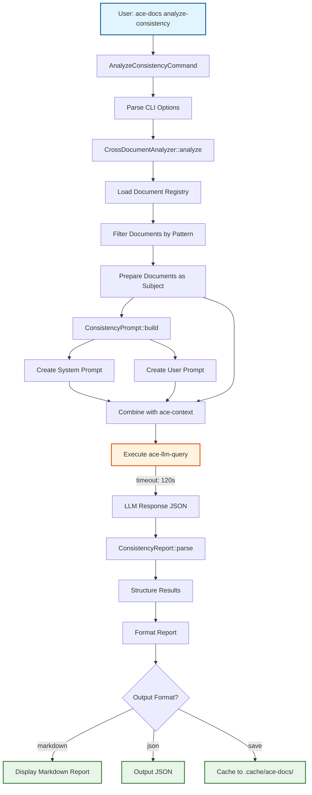
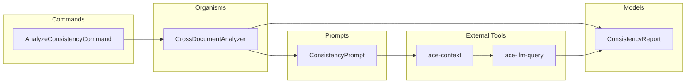

# Cross-Document Consistency Analysis Architecture

## Overview

The cross-document consistency analysis feature uses LLM-powered analysis to detect inconsistencies across multiple documentation files. It follows the existing ace-docs `analyze` command pattern, utilizing ace-context for prompt preparation and ace-llm-query for execution.

## Solution Flow



## Component Architecture



## Data Flow

1. **Input Phase**
   - User executes `ace-docs analyze-consistency` with optional pattern and flags
   - AnalyzeConsistencyCommand parses options (--terminology, --duplicates, --versions, --output, --save)

2. **Document Loading Phase**
   - CrossDocumentAnalyzer loads document registry
   - Filters documents based on pattern or loads all managed documents
   - Prepares documents as structured subject for LLM

3. **Prompt Building Phase**
   - ConsistencyPrompt creates system prompt with analysis instructions
   - Creates user prompt with specific analysis parameters
   - Combines with document content using ace-context

4. **LLM Execution Phase**
   - Executes ace-llm-query with extended timeout (120s default)
   - Receives structured JSON response from LLM

5. **Result Processing Phase**
   - ConsistencyReport parses JSON response
   - Structures results by issue type
   - Formats report based on output preference

6. **Output Phase**
   - Displays formatted report (markdown/json/text)
   - Optionally saves to cache directory

## Component Details

### AnalyzeConsistencyCommand
- **Location**: `lib/ace/docs/commands/analyze_consistency_command.rb`
- **Purpose**: CLI interface for the analyze-consistency command
- **Responsibilities**:
  - Parse command-line arguments
  - Validate options
  - Call CrossDocumentAnalyzer
  - Handle output display

### CrossDocumentAnalyzer
- **Location**: `lib/ace/docs/organisms/cross_document_analyzer.rb`
- **Purpose**: Orchestrate the consistency analysis workflow
- **Responsibilities**:
  - Load and filter documents
  - Prepare LLM context
  - Execute LLM query
  - Handle timeouts and errors
  - Cache results

### ConsistencyPrompt
- **Location**: `lib/ace/docs/prompts/consistency_prompt.rb`
- **Purpose**: Build structured prompts for LLM analysis
- **Responsibilities**:
  - Generate system prompt with analysis instructions
  - Generate user prompt with document context
  - Format for structured JSON response

### ConsistencyReport
- **Location**: `lib/ace/docs/models/consistency_report.rb`
- **Purpose**: Parse and format analysis results
- **Responsibilities**:
  - Parse LLM JSON response
  - Structure results by issue type
  - Generate markdown report
  - Support JSON serialization

## Analysis Types

The system analyzes four types of consistency issues:

1. **Terminology Conflicts**
   - Different words for the same concept (gem vs package)
   - Spelling variations (US vs UK)
   - Case inconsistencies

2. **Duplicate Content**
   - Similar or identical text blocks
   - Configurable similarity threshold (default 70%)

3. **Version Inconsistencies**
   - Mismatched version numbers across documents
   - Outdated references

4. **Consolidation Opportunities**
   - Content that could be merged
   - Redundant explanations

## LLM Interaction

### Prompt Structure
```
System: Analysis instructions and expected JSON format
User: Document contents and specific analysis parameters
```

### Response Format
```json
{
  "terminology_conflicts": [
    {
      "terms": ["term1", "term2"],
      "documents": {...},
      "recommendation": "..."
    }
  ],
  "duplicate_content": [...],
  "version_inconsistencies": [...],
  "consolidation_opportunities": [...]
}
```

## Performance Considerations

- **Timeout Scaling**:
  - <10 documents: 60 seconds
  - 10-50 documents: 120 seconds (default)
  - >50 documents: 180 seconds

- **Document Batching**:
  - Automatic warning for >50 documents
  - Suggest filtering for large sets

- **Caching**:
  - Results cached in `.cache/ace-docs/consistency-{timestamp}.md`
  - Enables historical comparison

## Error Handling

1. **LLM Timeout**: Retry with increased timeout or suggest document filtering
2. **Parse Failure**: Display raw LLM output with warning
3. **No Documents**: Clear error message with pattern help
4. **LLM Unavailable**: Error with suggestion to check ace-llm configuration

## Success Metrics

- Command executes without errors
- Accurately detects terminology conflicts
- Identifies duplicate content above threshold
- Finds version inconsistencies
- Provides actionable recommendations
- Completes in <30s for typical document sets (10-20 docs)