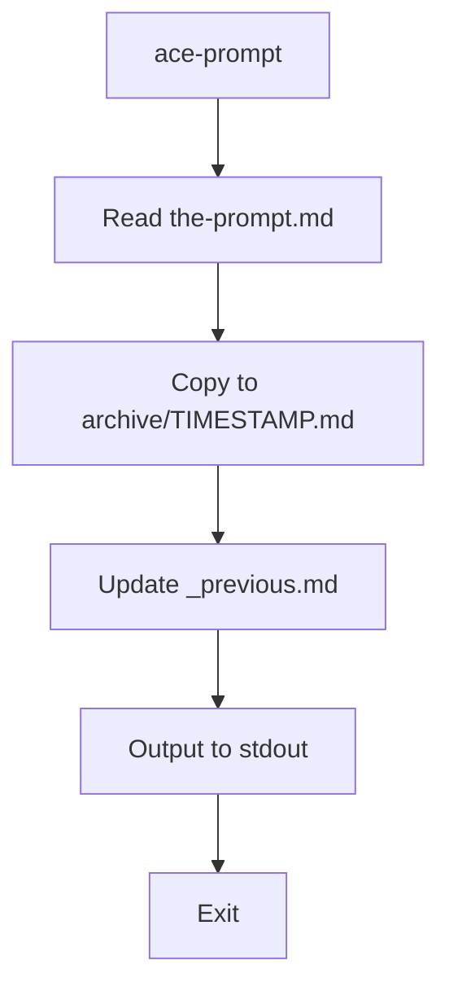
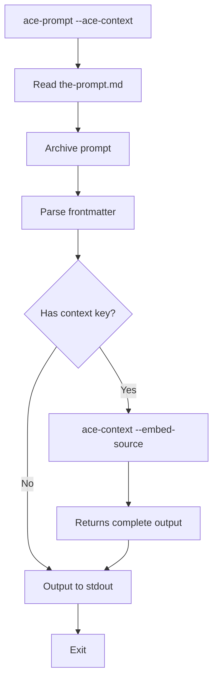
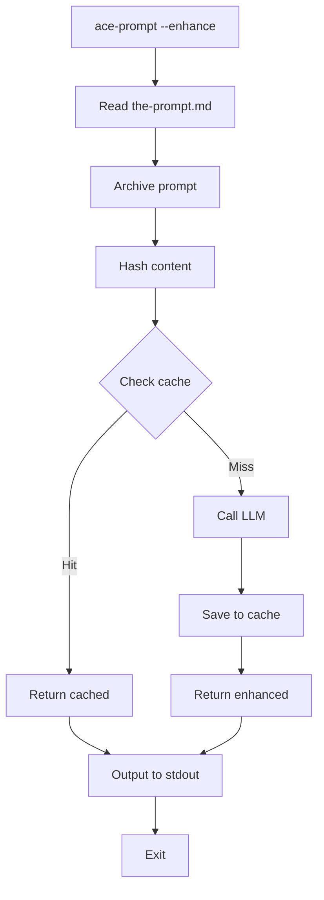
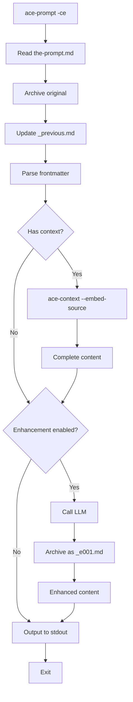

# ace-prompt Usage Documentation

## Overview

`ace-prompt` is a simple queue-based workflow tool for managing AI prompts. It solves the problem of Claude Code's limited in-editor prompt writing by allowing developers to write prompts in their full-featured editor with automatic archiving and optional enhancements.

**Core Concept**: Think of it like a print queue - you write to ONE file (`the-prompt.md`), run the command, it archives and outputs. Simple.

## Command Structure

### Basic Usage (Most Common)

```bash
# First time setup - initialize with template
ace-prompt setup

# Default - no arguments needed!
ace-prompt

# What happens:
# 1. Reads .cache/ace-prompt/prompts/the-prompt.md
# 2. Archives to .cache/ace-prompt/prompts/archive/YYYYMMDD-HHMMSS.md
# 3. Updates _previous.md symlink
# 4. Outputs prompt content to stdout

# Reset to fresh template
ace-prompt reset
```

### Template Management

```bash
# Initialize with base template
ace-prompt setup

# Use custom template
ace-prompt setup --template tmpl://custom/template

# Reset to base template (archives current)
ace-prompt reset

# Force overwrite without archiving
ace-prompt setup --force
```

### With Options

```bash
# Load context from frontmatter
ace-prompt --ace-context
ace-prompt -c

# Enhance prompt via LLM
ace-prompt --enhance
ace-prompt -e

# Combine options
ace-prompt --ace-context --enhance
ace-prompt -ce

# Skip configured defaults
ace-prompt --raw           # Skip enhancement if configured
ace-prompt --no-context    # Skip context if configured

# Task-specific prompt
ace-prompt --task 117
ace-prompt -t 117

# Task with options
ace-prompt --task 117 --ace-context
ace-prompt -t 117 -c
```

## Processing Flow Diagrams

### Simple Flow (No Options)



### With Context Loading (Delegated)



### With Enhancement



### Complete Flow (Simplified)



## File Structure

### Default Location

```
.cache/ace-prompt/prompts/
├── the-prompt.md              # Your active prompt (edit this!)
├── _previous.md               # Symlink to last archived prompt
└── archive/
    ├── 20251119-120000.md     # Archived at noon
    ├── 20251119-143000.md     # Archived at 2:30pm
    └── 20251119-155500.md     # Archived at 3:55pm
```

### Task-Specific Location

```
.ace-taskflow/v.0.9.0/tasks/117-feature-name/
└── prompts/
    ├── the-prompt.md
    ├── _previous.md → archive/20251119-143000.md
    └── archive/
        └── 20251119-143000.md
```

## Usage Scenarios

### Scenario 1: Getting Started with Template

**Goal**: Initialize prompt workflow with structured template

```bash
# First time - set up with template
ace-prompt setup

# This creates .cache/ace-prompt/prompts/the-prompt.md with:
# - Frontmatter for context specification
# - Sections for prompt, context requirements, expected output

# Edit the template
vim .cache/ace-prompt/prompts/the-prompt.md

# Run your customized prompt
ace-prompt

# Need to start fresh?
ace-prompt reset  # Archives current, restores template
```

### Scenario 2: Simple Code Review

**Goal**: Review recent changes for security issues

```bash
# Write your prompt
cat > .cache/ace-prompt/prompts/the-prompt.md <<'EOF'
Review the recent PR changes for:
1. Security vulnerabilities (SQL injection, XSS, etc.)
2. Performance issues
3. Code quality concerns

Focus on authentication module changes.
EOF

# Run it
ace-prompt | ace-llm query --model claude-3.5-sonnet

# Check what was archived
cat .cache/ace-prompt/prompts/_previous.md
```

### Scenario 3: Prompt with Context (Delegated)

**Goal**: Review specific files with their content loaded

```bash
# Write prompt with frontmatter
cat > .cache/ace-prompt/prompts/the-prompt.md <<'EOF'
---
context:
  files:
    - ace-prompt/lib/ace/prompt/cli.rb
    - ace-prompt/lib/ace/prompt/organisms/prompt_processor.rb
  commands:
    - git diff HEAD~1
---

Review these changes and suggest:
1. Code organization improvements
2. Better error handling
3. Test coverage gaps
EOF

# Run with context loading
ace-prompt --ace-context

# Behind the scenes:
# ace-prompt delegates to: ace-context --embed-source --stdin < the-prompt.md
# ace-context returns complete output (no merging needed)
```

### Scenario 4: Enhancement Chain Tracking

**Goal**: Refine a prompt through multiple enhancements

```bash
# Write initial prompt
echo "Review code for issues" > .cache/ace-prompt/prompts/the-prompt.md

# First enhancement
ace-prompt --enhance
# Archives as: archive/20251119-143000.md (original)
# Creates: archive/20251119-143100_e001.md (enhanced with frontmatter)

# Second enhancement (refine further)
ace-prompt --enhance
# Creates: archive/20251119-143200_e002.md (enhancement 2)

# Check enhancement chain
ls -la .cache/ace-prompt/prompts/archive/
# Shows: original + _e001 + _e002 versions

# View enhancement metadata
head .cache/ace-prompt/prompts/archive/*_e002.md
# Shows frontmatter with:
# enhancement_of: archive/20251119-143000.md
# enhancement_iteration: 2
```

### Scenario 5: Task-Specific Development

**Goal**: Work on task 117 with task-specific prompts

```bash
# Navigate to task
cd $(ace-taskflow task 117 | grep Path | awk '{print $2}')

# Create task-specific prompt
mkdir -p prompts
cat > prompts/the-prompt.md <<'EOF'
Implement the archive mechanism:
- Copy the-prompt.md to archive/TIMESTAMP.md
- Update _previous.md symlink
- Handle errors gracefully

Include comprehensive tests.
EOF

# Run task-specific prompt
ace-prompt --task 117

# Later, check history
ls -la prompts/archive/
```

### Scenario 6: Claude Code Integration

**Goal**: Use prompts directly in Claude Code

```bash
# Write your prompt
cat > .cache/ace-prompt/prompts/the-prompt.md <<'EOF'
---
context:
  presets:
    - project
---

Refactor the PromptProcessor class to:
1. Simplify the main workflow
2. Add better error handling
3. Improve test coverage
EOF

# In Claude Code, just type:
/prompt

# Claude reads, archives, loads context, and executes
```

### Scenario 7: Iterative Prompt Development

**Goal**: Refine prompts over multiple iterations

```bash
# First iteration
echo "Add user authentication" > .cache/ace-prompt/prompts/the-prompt.md
ace-prompt

# Check result, refine
cat > .cache/ace-prompt/prompts/the-prompt.md <<'EOF'
Add OAuth2 authentication with:
- Google provider support
- 24-hour session timeout
- Remember me option
EOF
ace-prompt

# Compare iterations
diff .cache/ace-prompt/prompts/_previous.md .cache/ace-prompt/prompts/the-prompt.md

# View full history
ls -lt .cache/ace-prompt/prompts/archive/ | head -10
```

## Configuration

### Simplified Default Configuration

```yaml
# .ace/prompt/config.yml
prompt:
  # File locations
  default_dir: .cache/ace-prompt/prompts
  default_file: the-prompt.md
  archive_subdir: archive

  # Template using protocol
  template: tmpl://ace-prompt/base-prompt
```

### With Enhancement

```yaml
# .ace/prompt/config.yml
prompt:
  default_dir: .cache/ace-prompt/prompts
  template: tmpl://ace-prompt/base-prompt

  enhancement:
    enabled: true  # Enable by default
    model: glite   # Simple alias for google:gemini-2.0-flash-lite
    temperature: 0.3
```

### With Context Loading

```yaml
# .ace/prompt/config.yml
prompt:
  default_dir: .cache/ace-prompt/prompts
  template: tmpl://ace-prompt/base-prompt

  context:
    enabled: true  # Load context by default
    # No separator - context flows naturally before prompt
```

### Full Configuration (Simplified)

```yaml
# .ace/prompt/config.yml
prompt:
  # Paths
  default_dir: .cache/ace-prompt/prompts
  default_file: the-prompt.md
  archive_subdir: archive  # Single archive for everything

  # Template via protocol
  template: tmpl://ace-prompt/base-prompt

  # Context loading (delegated to ace-context)
  context:
    enabled: false  # CLI flags override
    # No merging - ace-context handles via --embed-source

  # Enhancement (with chain tracking)
  enhancement:
    enabled: false  # CLI flags override
    model: glite    # Alias for google:gemini-2.0-flash-lite
    temperature: 0.3
    system_prompt: prompt://ace-prompt/base/enhance  # Protocol-based
    # No separate cache - uses main archive with _e001, _e002 suffixes
```

### Model Aliases

Built-in aliases for convenience:
- `glite` → `google:gemini-2.0-flash-lite` (default)
- `claude` → `anthropic:claude-3.5-sonnet`
- `haiku` → `anthropic:claude-3-haiku`

## Frontmatter and Template Format

### Optional Frontmatter for Context

```yaml
---
context:
  # Load specific files
  files:
    - path/to/file1.rb
    - path/to/file2.rb

  # Run commands and include output
  commands:
    - git status
    - git diff HEAD~1

  # Load context presets
  presets:
    - project     # Project-wide context
    - task        # Current task context
---
[Your prompt content here]
```

### Base Template Structure

The default template (`tmpl://ace-prompt/base-prompt`) provides structure:

```markdown
---
context:
  presets: []
  files: []
  commands: []
---

# Prompt

[Your prompt here]

## Context Requirements

[Describe what context is needed]

## Expected Output

[Describe expected results]
```

Initialize with: `ace-prompt setup`
Reset to template: `ace-prompt reset`

## Archive Management

### Viewing History

```bash
# See last prompt
cat .cache/ace-prompt/prompts/_previous.md

# List recent archives
ls -lt .cache/ace-prompt/prompts/archive/ | head -20

# Search archives for content
grep -r "authentication" .cache/ace-prompt/prompts/archive/

# Compare current vs previous
diff .cache/ace-prompt/prompts/the-prompt.md \
     .cache/ace-prompt/prompts/_previous.md
```

### Archive Naming

Files are archived with timestamp format: `YYYYMMDD-HHMMSS.md`
- Example: `20251119-143055.md`
- Sortable by name
- Uses local time (not UTC)
- Preserves exact time of archival

## Error Handling

### Common Errors and Solutions

**Prompt file not found**:
```bash
Error: Prompt file not found: .cache/ace-prompt/prompts/the-prompt.md

# Solution:
mkdir -p .cache/ace-prompt/prompts
echo "Your prompt" > .cache/ace-prompt/prompts/the-prompt.md
```

**Task not found**:
```bash
Error: Task 117 not found in .ace-taskflow/

# Solution:
ace-taskflow tasks all  # List available tasks
```

**Archive failure** (warning only):
```bash
Warning: Failed to archive prompt: Permission denied
[prompt content outputs anyway]

# Solution:
chmod 755 .cache/ace-prompt/prompts
chmod 755 .cache/ace-prompt/prompts/archive
```

**Enhancement timeout** (fallback to raw):
```bash
Warning: Enhancement failed: Connection timeout. Outputting raw prompt.
[raw prompt content]

# Solution: Check network or disable enhancement
ace-prompt --raw
```

## Tips and Best Practices

### 1. Keep Prompts Focused
Write clear, specific prompts. Enhancement can help but starting clear is better.

### 2. Use Context Wisely
Don't overload with context. Include only relevant files and commands.

### 3. Review Archive Regularly
Check your archive to see how your prompts evolve and what works best.

### 4. Task-Specific for Features
Use `--task N` when working on specific features to keep prompts organized.

### 5. Cache for Speed
Enhancement caching makes repeated similar prompts instant.

### 6. Combine with ace-llm
Pipe output directly to ace-llm for immediate AI assistance:
```bash
ace-prompt -ce | ace-llm query --model claude-3.5-sonnet
```

## Comparison with Task 117

**What Task 117 Built** (Wrong):
- Complex prompt library with named prompts
- Discovery system with search paths
- Protocol registration (`prompt://`)
- YAML frontmatter for categorization
- Multiple CLI commands

**What Task 118 Builds** (Correct):
- Simple queue workflow (one file)
- Automatic archiving with timestamps
- Optional context via frontmatter
- Optional enhancement via LLM
- Single command with flags

**Key Insight**: It's a workflow tool, not a content management system.

## Summary

`ace-prompt` provides a **simple queue workflow** for AI prompt management:

1. **Write** in your editor (the-prompt.md)
2. **Run** with zero arguments (ace-prompt)
3. **Get** archived and output (with full history tracking)

**Key Design Principles**:
- **Single file queue**: One active prompt at a time (like a print queue)
- **Unified archive**: All versions in one place with enhancement tracking (_e001, _e002)
- **Context delegation**: ace-context handles all aggregation via --embed-source
- **No merge logic**: Complete delegation eliminates complexity
- **Enhancement chains**: Track refinement history transparently

**Optional Features**:
- Context loading (delegated to ace-context)
- Enhancement (with chain tracking)
- Task-specific prompts
- Template system for starting/resetting

This is the tool we should have built from the start - simple, focused, and effective. It's NOT a prompt library manager, it's a workflow tool.