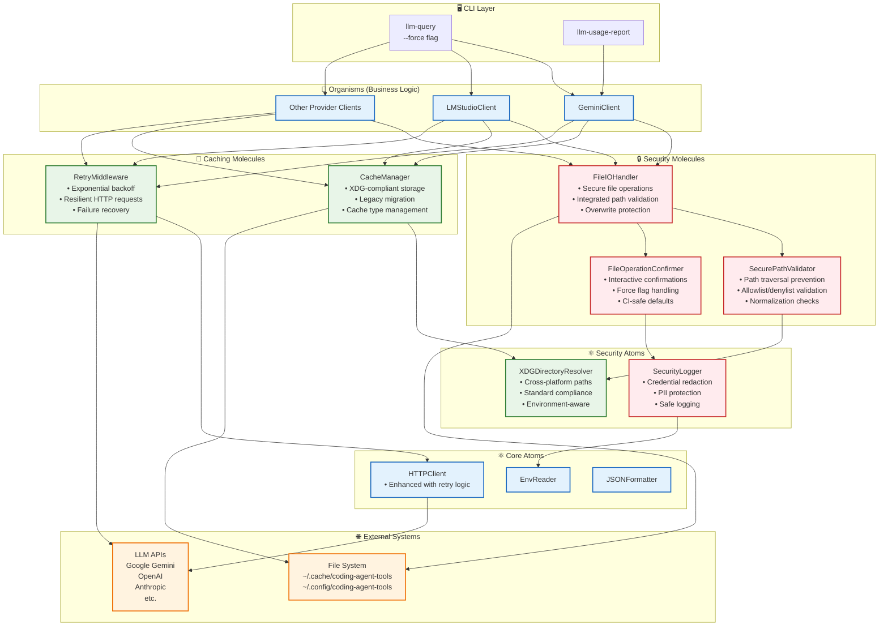
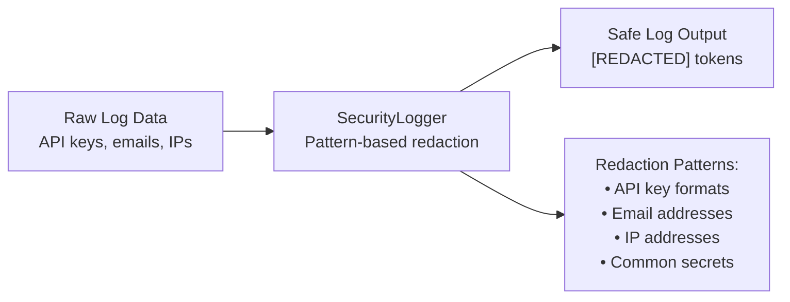
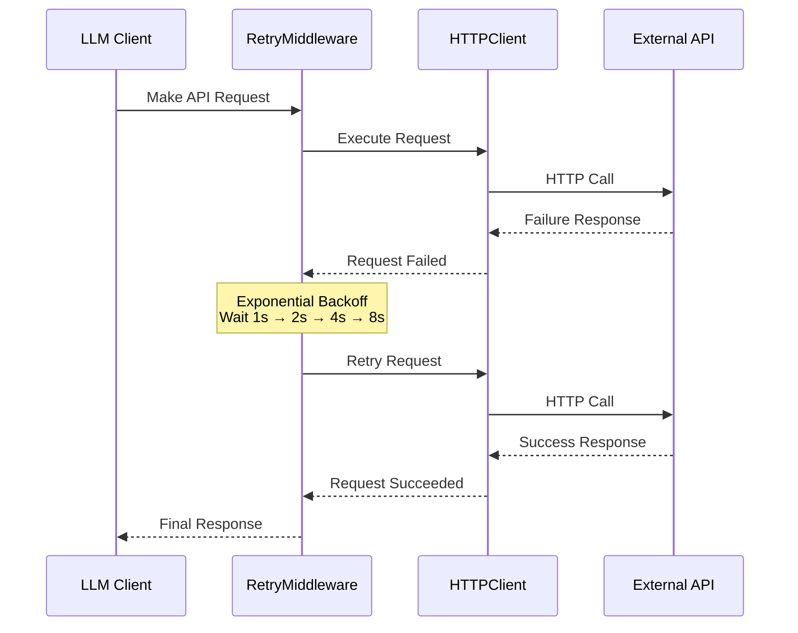

# Architecture Diagrams

This document contains all architectural diagrams for the Coding Agent Tools gem, illustrating both the overall ATOM architecture and the detailed security and caching component interactions.

## Overall ATOM Architecture

This diagram shows the high-level structure of the gem following the ATOM-based hierarchy (Atoms, Molecules, Organisms, Ecosystems) and external system interactions.

```mermaid
flowchart TD
    subgraph Ruby Gem (CAT)
        direction TB
        CLI[CLI Commands<br/>dev-tools/exe/* & cli/]
        Organisms[🧬 Organisms<br/>Business Logic]
        Molecules[🔬 Molecules<br/>Composed Operations]
        Atoms[⚛️ Atoms<br/>Basic Utilities]
        Models[(Models<br/>Data Structures)]
    end
    CLI --> Organisms
    Organisms --> Molecules
    Molecules --> Atoms
    Organisms --> Models

    Atoms -->|HTTP| GeminiAPI((Google Gemini))
    Atoms -->|HTTP| LMStudio((LM Studio))<br/>(localhost:1234)
    Atoms -->|System Calls| FileSystem[(File System)]
    Atoms -->|ENV| Environment[Environment Variables]
```

## Security and Caching Components Interaction

## High-Level Component Interaction Diagram



## Security Component Flow

### Path Validation and File Operations
1. **User Input**: CLI commands receive file paths and output destinations
2. **Path Validation**: `SecurePathValidator` checks all paths against:
   - Allowlist of safe directories (project root, XDG cache/config, system temp)
   - Denylist of dangerous patterns (path traversal, system directories)
   - Normalization to prevent bypass attempts
3. **User Confirmation**: `FileOperationConfirmer` prompts for overwrite confirmation
   - Respects `--force` flag for automation
   - Safe defaults in CI environments
4. **Secure Execution**: `FileIOHandler` performs validated file operations
5. **Audit Logging**: `SecurityLogger` records operations while redacting sensitive data

### Security Logger Protection


## Caching Component Flow

### XDG-Compliant Cache Management
1. **Initialization**: `CacheManager` uses `XDGDirectoryResolver` for standard paths
2. **Migration**: Automatically migrates from legacy `~/.coding-agent-tools-cache`
3. **Structured Storage**: Organizes cache by type (models, HTTP responses, temp files)
4. **Cross-Platform**: Works consistently across Linux, macOS, and Windows

### HTTP Resilience with Retry Logic


## Component Benefits

### Security Improvements
- **Defense in Depth**: Multiple layers of protection for file operations
- **Path Traversal Prevention**: Comprehensive validation against directory escape attacks  
- **Safe Defaults**: Secure behavior in automated environments
- **Audit Trail**: Detailed logging without credential exposure
- **Interactive Safety**: User confirmation for destructive operations

### Caching & Performance Benefits
- **Standards Compliance**: XDG Base Directory specification adherence
- **Backward Compatibility**: Seamless migration from legacy cache locations
- **Failure Resilience**: Automatic retry with intelligent backoff strategies
- **Performance Optimization**: Reduced redundant API calls through intelligent caching
- **Cross-Platform Consistency**: Works reliably across different operating systems

## Integration Points

The security and caching components are tightly integrated:

1. **Shared Path Resolution**: Both systems use `XDGDirectoryResolver` for consistent path handling
2. **Unified Logging**: `SecurityLogger` protects sensitive data across all operations
3. **Cache Security**: Cache operations go through the same path validation as user files
4. **Resilient Caching**: Failed cache operations are logged securely and can be retried
5. **Configuration Management**: Both systems respect environment variables and user configuration

This architecture ensures that security is built-in rather than bolted-on, while providing robust caching that enhances performance without compromising safety.