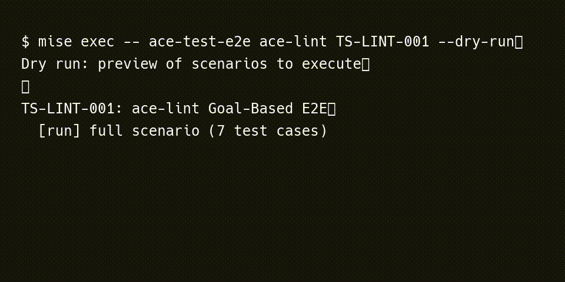

# Ace::Test::EndToEndRunner

Agent-executed end-to-end tests with reproducible sandboxes and structured reporting.

## Why

`ace-test-runner-e2e` helps teams run realistic workflow validation that standard unit and integration suites cannot cover.

- It executes scenarios through agents to validate real developer workflows.
- It keeps setup, execution, and reporting reproducible across runs.
- It isolates execution in sandboxes so test activity does not leak into your working tree.
- It supports both single-file (MT) and per-test-case directory (TS) scenario conventions for documentation and migration workflows.

## Works With

- `ace-test` and `ace-test-runner` for fast package-level/unit-level loops
- `ace-assign` workflows for structured fan-out and retry orchestration
- Package-local `test/e2e/` scenario suites across ACE gems

## Agent Skills

- `as-e2e-run`
- `as-e2e-create`
- `as-e2e-review`
- `as-e2e-plan-changes`
- `as-e2e-rewrite`
- `as-e2e-fix`
- `as-e2e-manage`
- `as-e2e-setup-sandbox`

## Features

- Agent-executed scenario runs with structured test reports.
- Reproducible sandbox setup and cleanup workflows.
- Scenario discovery and selective execution by package, ID, and tags.
- Suite-level execution for broad regression validation.

## Documentation

- [Getting Started](docs/getting-started.md)
- [Usage Reference](docs/usage.md)
- [Handbook](docs/handbook.md)
- [Changelog](CHANGELOG.md)

## Cross-Reference

For unit and integration tests, see `ace-test-runner`.

## Part of ACE

This package is part of the ACE monorepo and follows ACE workflow and documentation conventions.
