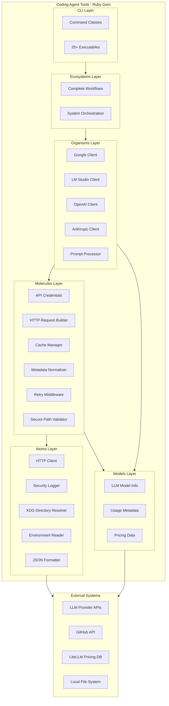
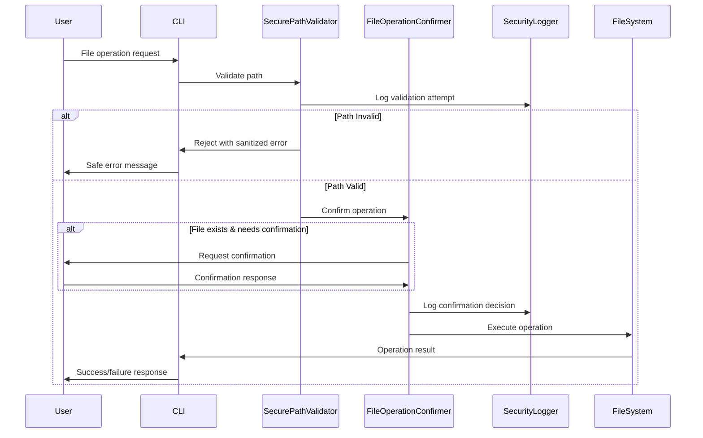
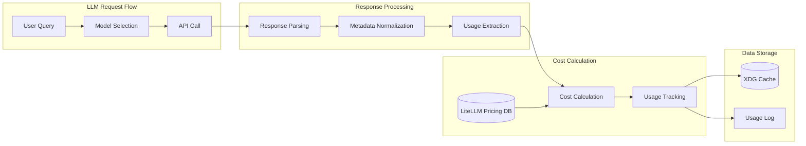

# Context

## Files

<file path="/Users/michalczyz/Projects/CodingAgent/handbook-meta/docs/what-do-we-build.md" size="6790">
# Coding Agent Workflow Toolkit

## What We Build 🔍

The **Coding Agent Workflow Toolkit** is a comprehensive meta-system that provides both **development handbook workflows** and **executable tools** to enable seamless AI-assisted software development. It combines structured workflow instructions for autonomous AI agents with a robust CLI toolkit (Coding Agent Tools - CAT) that provides tools for LLM integration, Git automation, and project management.

The system bridges the gap between human developers and AI coding agents by offering:
- **Standardized workflow instructions** that AI agents can execute independently
- **Predictable CLI tools** for common development operations
- **Documentation-driven task management** integrated with executable tooling
- **Multi-provider LLM integration** with cost tracking and caching

By providing both the "what to do" (workflows) and "how to do it" (tools), the toolkit enables developers and AI agents to collaborate effectively on higher-value design and coding activities.

## ✨ Key Features

### Workflow Instructions & Agents
- **Self-Contained AI Workflows**: Structured workflow instructions that AI agents can execute independently
- **Specialized Development Agents**: Task-focused agents for Git operations, task management, code review, and more
- **Development Handbook**: Comprehensive guides, templates, and best practices for consistent development
- **Documentation-Driven Task Management**: Organized approach to tracking and managing development work
- **Template Synchronization**: Automated management of embedded templates across workflows

### Executable Tools & Automation
- **Multi-Provider LLM Communication**: Unified interface for interacting with various language models
- **Enhanced Git Workflow Automation**: Tools for intelligent commit messages and repository management
- **Task Management Utilities**: Commands for navigating and tracking development tasks
- **Code Review Automation**: Tools for systematic code quality improvement
- **Offline Support**: Full capability to work with local language models for privacy and speed


## Target Use Cases

### Primary Use Cases

- **Automated Development Workflows**: AI coding agents using CAT commands to perform tasks like committing code, querying models, or finding the next work item within CI/CD pipelines or local development environments.
- **Accelerated Project Setup**: Developers quickly initializing Git repositories and setting up remotes with standardized commands.
- **Streamlined Commit Process**: Developers generating informative and consistent commit messages automatically based on their code changes and intent.
- **Efficient Task Navigation**: Developers and agents easily identifying and tracking development tasks within a structured documentation system.

### Secondary Use Cases

- **Offline AI Interaction**: Developers and agents interacting with local language models via LM Studio for rapid iteration or sensitive tasks.
- **Integrating with Documentation**: Utilizing CAT commands to manage task backlogs defined within documentation files.

## User Personas

### Primary Users

**Alex – AI Coding Agent**: An automated system designed to perform coding tasks.

- Needs: A deterministic and stable CLI surface to reliably execute development and operations steps.
- Goals: Successfully complete assigned coding and Dev Ops tasks without manual intervention.
- Pain Points: Brittle and inconsistent ad-hoc shell scripts that cause workflow failures.

**Sam – Senior Dev**: An experienced software engineer focused on efficient development.

- Needs: Rapidly set up new project remotes, easily craft descriptive and atomic commits.
- Goals: Reduce time spent on routine Git and project setup chores; maintain a clean and traceable commit history.
- Pain Points: Forgetting push URLs for new repositories, struggling to write clear and concise commit messages for complex changes.

### Secondary Users

**Priya – DX Engineer**: An engineer focused on improving the developer experience.

- Context: Priya uses CAT as a foundation for building standardized, testable, and extendable developer tools and workflows within their organization. They need a framework that follows Ruby best practices and is easy to integrate and extend.


## Project Boundaries

### Distribution Model

The Coding Agent Workflow Toolkit uses a **multi-repository architecture** coordinated through Git submodules, enabling both comprehensive development environment setup and flexible library integration when needed.

### What We Build

- **Comprehensive workflow instruction system** with self-contained AI workflows that agents can execute independently
- **Specialized AI agents** designed for focused development tasks, compatible with multiple AI platforms
- **Development handbook** providing guides, templates, and best practices for consistent development
- **CLI toolkit** (Coding Agent Tools) with executables for development automation and LLM integration
- **Multi-provider LLM integrations** supporting both online and offline language models
- **Documentation-driven task management** system for organizing and tracking development work
- **Multi-repository coordination** enabling seamless work across interconnected components


## Value Proposition

### Problems We Solve

1. **Inconsistent Automation**: Replaces ad-hoc, project-specific scripts with a standardized, testable, and maintainable toolkit.
2. **Agent Orchestration Gap**: Provides coding agents with reliable, deterministic tools to perform common development and Dev Ops tasks they currently struggle with.
3. **Dev Ops Overhead**: Automates routine tasks like repository creation and commit message generation, reducing manual effort for developers.

### Unique Advantages

- **AI-Native Design**: Built specifically with the needs of AI coding agents in mind, offering a robust and predictable interface.
- **Documentation-Driven**: Designed to integrate with documentation-based workflows and task management.
- **Opinionated but Extendable**: Provides strong conventions while allowing for customization and extension of specific tools and workflows.
- **Offline Capability**: Supports interaction with local LLMs for enhanced privacy and speed.

## Future Vision

The Coding Agent Workflow Toolkit aims to become the standard foundation for AI-assisted software development, enabling seamless collaboration between human developers and AI agents. We envision a future where development teams leverage intelligent automation for routine tasks while focusing their expertise on creative problem-solving and system design.


---

*This document should be updated as the project evolves and new insights are gained about user needs and project direction.*

</file>

<file path="/Users/michalczyz/Projects/CodingAgent/handbook-meta/docs/architecture.md" size="10792">
# Coding Agent Workflow Toolkit - System Architecture

## Overview

This document outlines the system architecture and technical design decisions for the Coding Agent Workflow Toolkit.

For detailed Ruby gem implementation, see [Tools Architecture](./architecture-tools.md).

## Core Design Principles

### System-Level Principles
- **Meta-Repository Architecture**: Multi-repository coordination using Git submodules for clear separation of concerns
- **Workflow Self-Containment**: AI workflows must be completely independent and executable without external dependencies (per ADR-001)
- **Documentation-Driven Development**: Workflows, tasks, and processes are documented first, then implemented
- **AI-Native Design**: Built specifically with autonomous AI agent capabilities and limitations in mind

### Implementation Principles
- **ATOM Architecture**: Structured around Atoms, Molecules, Organisms, and Ecosystems for maintainability and testability (per ADR-011)
- **Test-Driven Development**: High emphasis on testing with comprehensive unit and integration test coverage using RSpec
- **Predictable CLI**: Designing commands with ergonomic flags suitable for both human and agent interaction
- **Modularity**: Components are designed with explicit boundaries and dependency injection
- **Security-First**: Multi-layered security framework with path validation, sanitization, and secure logging

## Technology Stack

### Core Technology Choices
- **Primary Language**: Ruby (>= 3.2) - Chosen for its expressiveness, developer productivity, and suitability for scripting and tooling
- **Runtime**: MRI (C Ruby) >= 3.2 - Standard and widely adopted Ruby implementation
- **Architecture Pattern**: ATOM (Atoms, Molecules, Organisms, Ecosystems) - Guiding principle for structuring the codebase

### Technical Infrastructure
- **Coordination**: Git submodules for multi-repository management
- **Documentation**: Markdown with markdownlint validation
- **Template System**: XML-based embedding (per ADR-002)
- **CLI Framework**: dry-cli with comprehensive command structure
- **HTTP Client**: Faraday with retry middleware and observability (per ADR-010)
- **Testing**: RSpec with VCR for HTTP interaction recording (per ADR-006)
- **Autoloading**: Zeitwerk with proper inflections (per ADR-007)
- **Observability**: dry-monitor for event publishing (per ADR-008)
- **Error Handling**: Centralized ErrorReporter (per ADR-009)

### External Integrations
- **LLM Providers**: Google Gemini, OpenAI, Anthropic, Mistral, Together AI, LM Studio (per ADR-014)
- **Cost Tracking**: LiteLLM pricing database for accurate cost calculations
- **Version Control**: Git CLI, GitHub REST API

### Security Architecture
- **Path Validation**: Multi-layer validation for file operations
- **Sanitization**: Automatic sanitization of sensitive information
- **Secure Logging**: Privacy-preserving log output
- **Defense in Depth**: Multiple validation layers

## System Architecture

## Multi-Repository Architecture

The toolkit uses Git submodules to coordinate four interconnected repositories:

### handbook-meta (Coordination Hub)
- **Purpose**: Central coordination and system-level documentation
- **Contents**: Core docs (what-do-we-build, architecture, blueprint, decisions), meta-level scripts
- **Role**: Provides unified view across all components

### dev-handbook (Workflows & Agents)
- **Purpose**: AI workflow instructions and specialized development agents
- **Contents**: 
  - Self-contained workflows (`.wf.md` files in `workflow-instructions/`)
  - Specialized agents (`.ag.md` files in `.integrations/claude/agents/`)
  - Development guides and templates
- **Integration**: Exposed to Claude Code via commands (`.claude/commands/`)

### dev-tools (Executable Tools)
- **Purpose**: CLI tools submodule for development automation
- **Contents**: 
  - ATOM-structured Ruby code (atoms/, molecules/, organisms/)
  - CLI executables in `exe/` directory
  - Shell integration scripts (`config/bin-setup-env/setup.fish`)
- **Integration**: Tools added to PATH for direct command-line access

### dev-taskflow (Task Management)
- **Purpose**: Documentation-driven task and release management
- **Contents**:
  - Task organization (backlog/, current/, done/)
  - Release planning and roadmap
  - Project-specific decisions
- **Role**: Central hub for work tracking and planning

## Integration & Data Flow

### How Components Connect

1. **Workflows & Agents**: Defined in `dev-handbook/`, exposed to Claude Code through:
   - Commands: `.claude/commands/` directory with workflow mappings
   - Subagents: `.integrations/claude/agents/` for specialized task execution

2. **CLI Tools**: Available system-wide through shell integration:
   - Fish: `source dev-tools/config/bin-setup-env/setup.fish`
   - Bash/Zsh: Similar setup scripts
   - Direct PATH access for all agents and workflows

3. **Agent Access**: AI agents have full access to:
   - All CLI tools via PATH
   - Workflow instructions via commands
   - Other agents via Task tool delegation

### Example: Context Loading Flow

A concrete example of how the system components work together:

1. **User Action**: Runs Claude Code and types `/load-context`
2. **Command Mapping**: Claude Code maps to workflow instruction
3. **Tool Execution**: Workflow guides agent to run `context --preset project --output stdout`
4. **Configuration**: Tool reads `.coding-agent/context.yml` for settings
5. **Template Processing**: Based on config, uses template in `docs/context/project.md`
6. **File Embedding**: Template embeds multiple files according to configuration
7. **Command Execution**: Runs shell commands to add dynamic content
8. **Output**: Returns complete context with embedded documents (when `embed_document_source: true`)
9. **Result**: Agent receives pre-structured context, avoiding manual exploration

### Other Key Workflows

**TODO**: Document detailed flows for:
- `work-on-task` workflow - Task execution from selection to completion
- `draft-release` workflow - Release preparation and coordination
- Agent delegation patterns - How agents invoke each other


## Agent Architecture

### Specialized Development Agents

The toolkit includes specialized agents designed for focused development tasks, located in `dev-handbook/.integrations/claude/agents/`. Each agent follows a single-purpose design with standardized interfaces.

#### Agent Categories
- **Task Management**: `task-finder`, `task-creator`, `release-navigator`
- **Git Operations**: `git-all-commit`, `git-files-commit`, `git-review-commit`
- **Development Tools**: `lint-files`, `create-path`, `feature-research`
- **Search & Analysis**: `search` for intelligent code discovery

#### Compatibility Architecture
Agents are designed with multi-platform compatibility in mind:
- **Claude Code Subagents**: Primary integration through Claude's Task tool with `subagent_type` parameter
- **MCP Proxy Integration**: Compatible with the MCP (Model Context Protocol) proxy we're developing for broader AI platform support
- **Future OpenCode Support**: Architecture designed for direct integration with OpenCode and similar platforms

#### Agent Design Principles
- **Single Purpose**: Each agent performs one focused task exceptionally well
- **Standardized Response Format**: Consistent output structure across all agents
- **Parameter Support**: Accept `expected_params` for configuration
- **Composition Ready**: Agents can delegate to each other for complex workflows

## Integration Patterns

### AI Agent Integration
- Direct CLI execution via agent tools
- Structured workflow instructions (.wf.md)
- Specialized agent invocation through platform-specific interfaces
- Embedded template system
- Documentation-driven task tracking

### Human Developer Integration
- Enhanced CLI tools for productivity
- Development guides and templates
- Multi-repository coordination

### CI/CD Integration
- Batch processing support
- Non-interactive execution modes
2. **Configuration Management**: Environment-based configuration
3. **Security Integration**: Safe defaults for automated environments
4. **Cost Tracking**: Comprehensive usage and cost monitoring

## Security Architecture

### System-Level Security

- **Repository Isolation**: Clear boundaries between different concerns
- **Access Control**: Appropriate file permissions and path restrictions
- **Credential Management**: Secure handling of API keys and tokens
- **Audit Trail**: Comprehensive logging of all operations

### Implementation Security

- **Path Validation**: Prevent directory traversal attacks
- **Input Sanitization**: Clean all user inputs and file paths
- **Secure Logging**: Automatic redaction of sensitive information
- **Operation Confirmation**: Safe defaults with confirmation prompts

## Performance Considerations

### System-Level Performance

- **Submodule Efficiency**: Minimal overhead for multi-repository coordination
- **Documentation Speed**: Fast template synchronization and analysis
- **Task Management**: Efficient file-based task tracking

### Implementation Performance

- **Startup Speed**: ≤ 200ms CLI command initialization
- **Caching Strategy**: XDG-compliant caching with intelligent invalidation
- **HTTP Optimization**: Connection pooling, retry logic, and timeout management
- **Memory Efficiency**: Minimal memory footprint with lazy loading

## Developer Environment Setup

The toolkit is designed exclusively for developer environments:

1. **Repository Setup**: `git submodule update --init --recursive`
2. **Ruby Environment**: Bundle installation in dev-tools submodule directory
3. **Shell Integration**: Source appropriate setup script for your shell
4. **API Configuration**: Set environment variables for LLM providers

This is a developer toolkit - there is no production deployment. All components run locally in the developer's environment.


## Architectural Decisions

All architectural decisions are documented in Architecture Decision Records (ADRs). 

**For actionable decisions and their impacts**, see: `docs/decisions.md`

This consolidated document provides:
- Core decisions that affect development behavior
- Direct impacts on how agents and developers work
- Links to full ADR documents for detailed context

ADRs are organized by scope:
- **System-Level**: `docs/decisions/ADR-*.md` (architecture, workflows)
- **Tools-Specific**: `docs/decisions/ADR-*.t.md` (dev-tools implementation)

The decisions.md file is automatically maintained by the `update-context-docs` workflow to ensure it stays current with all ADRs.

---

*This document should be updated when significant structural changes are made to the system architecture. For tools-specific technical details, see [Tools Architecture](./architecture-tools.md).*

</file>

<file path="/Users/michalczyz/Projects/CodingAgent/handbook-meta/docs/decisions.md" size="6459">
# Project Decisions

This document provides actionable decisions from Architecture Decision Records (ADRs) that directly affect how AI agents and developers should work with this codebase.

## Active Decisions

### Workflow Self-Containment
**Decision**: All AI workflows must be completely self-contained with embedded templates and context. Workflows cannot depend on other workflows or external files except the three standard context documents.
**Impact**: When executing workflows, never load external guides or templates. All necessary information must be within the .wf.md file itself. Only load `docs/what-do-we-build.md`, `docs/architecture.md`, and `docs/blueprint.md` for project context.
**Details**: [ADR-001](decisions/ADR-001-workflow-self-containment-principle.md)

### XML Template Embedding
**Decision**: Use XML format `<documents>` and `<template>` tags for embedding templates within workflow files, placed at the end of the document.
**Impact**: When updating workflows, preserve XML template blocks exactly. Use `handbook sync-templates` command to synchronize embedded templates with source files. Never use four-tick markdown blocks for templates.
**Details**: [ADR-002](decisions/ADR-002-xml-template-embedding-architecture.md)

### Template Directory Structure
**Decision**: All templates must be stored in `dev-handbook/templates/` with standardized subdirectories and `.template.md` extension.
**Impact**: When creating new templates, place them in the appropriate subdirectory (project-docs/, release-tasks/, code-review/, reflections/, task-management/). Always use `.template.md` extension.
**Details**: [ADR-003](decisions/ADR-003-template-directory-separation.md)

### Consistent Path Standards
**Decision**: All document paths must be relative to project root, never absolute. Follow standard patterns like `dev-handbook/templates/**/*.template.md`.
**Impact**: When referencing files in documentation or code, always use paths relative to the project root. Never use absolute paths or paths starting with `./` or `../`.
**Details**: [ADR-004](decisions/ADR-004-consistent-path-standards.md)

### Universal Document Embedding
**Decision**: Use the universal `<documents>` container format for embedding any type of document (templates, guides, examples) in workflows.
**Impact**: When embedding documents in workflows, always use the `<documents>` wrapper with appropriate document type tags. This enables automated synchronization and validation.
**Details**: [ADR-005](decisions/ADR-005-universal-document-embedding-system.md)

## Development Tool Decisions

### CI-Aware VCR Configuration
**Decision**: VCR cassettes must be environment-aware with CI detection and appropriate recording modes.
**Impact**: When writing tests with external API calls, ensure VCR is configured to detect CI environments. Use `new_episodes` mode locally and `none` in CI.
**Details**: [ADR-006](decisions/ADR-006-CI-Aware-VCR-Configuration.t.md)

### Zeitwerk Autoloading
**Decision**: Use Zeitwerk for all Ruby autoloading with proper inflections for acronyms (CLI, HTTP, API, JSON, etc.).
**Impact**: Follow file naming conventions strictly. Use snake_case filenames that match class names. Configure inflections for technical acronyms in the Zeitwerk setup.
**Details**: [ADR-007](decisions/ADR-007-Zeitwerk-for-Autoloading.t.md)

### Observability with dry-monitor
**Decision**: Implement observability using dry-monitor's publish/subscribe pattern with a central Notifications instance.
**Impact**: When adding new features that need monitoring, publish events through the Notifications instance. Subscribe to events for logging, metrics, or debugging.
**Details**: [ADR-008](decisions/ADR-008-Observability-with-dry-monitor.t.md)

### Centralized CLI Error Reporting
**Decision**: Use a centralized ErrorReporter module for all CLI error handling with debug flag support.
**Impact**: Never print errors directly to stdout/stderr in CLI commands. Always route errors through ErrorReporter for consistent formatting and debug support.
**Details**: [ADR-009](decisions/ADR-009-Centralized-CLI-Error-Reporting.t.md)

### HTTP Client Strategy
**Decision**: Use Faraday as the standard HTTP client with retry middleware and observability integration.
**Impact**: For all HTTP requests, use Faraday with the standard middleware stack. Never use Net::HTTP directly. Ensure retry logic and monitoring are configured.
**Details**: [ADR-010](decisions/ADR-010-HTTP-Client-Strategy-with-Faraday.t.md)

### ATOM Architecture Rules
**Decision**: Strictly follow ATOM architecture layers: Models (pure data), Molecules (focused operations), Organisms (business orchestration), Ecosystems (complete workflows).
**Impact**: When creating new components in dev-tools:
- Pure data structures go in `models/` (no behavior)
- Focused operations composing Atoms go in `molecules/` (single responsibility)
- Business logic orchestrating Molecules goes in `organisms/` (complex coordination)
- Never place data carriers in `molecules/` or behavior in `models/`
**Details**: [ADR-011](decisions/ADR-011-ATOM-Architecture-House-Rules.t.md)

### Dynamic Provider System
**Decision**: Implement a dynamic provider system for LLM integrations with standardized interfaces.
**Impact**: When adding new LLM providers, follow the established provider interface pattern. Register providers dynamically through the provider system.
**Details**: [ADR-012](decisions/ADR-012-Dynamic-Provider-System-Architecture.t.md)

### Class Naming Conventions
**Decision**: Preserve established technical acronyms in class names (JSONFormatter, HTTPClient, APICredentials) while using CamelCase for domain terms.
**Impact**: When naming classes, keep technical acronyms uppercase (HTTP, API, JSON, LLM). Use CamelCase for domain-specific terms (LlmModelInfo, not LLMModelInfo).
**Details**: [ADR-013](decisions/ADR-013-Class-Naming-Conventions-and-Zeitwerk-Inflections.t.md)

### LLM Integration Architecture
**Decision**: Use hybrid approach for LLM context sizes: API-first with static fallback mappings.
**Impact**: When integrating with LLM providers, first attempt to get context size from API. Maintain static mappings as fallback for providers without API support.
**Details**: [ADR-014](decisions/ADR-014-LLM-Integration-Architecture.t.md)

## Decision History

For complete decision history and detailed rationale, refer to the individual ADR documents in `docs/decisions/`.
</file>

<file path="/Users/michalczyz/Projects/CodingAgent/handbook-meta/docs/blueprint.md" size="3991">
# Project Blueprint: Coding Agent Workflow Toolkit (Meta)

## What is a Blueprint?

This document provides a concise overview of the project's structure and organization, highlighting key directories and files to help developers (especially AI assistants) quickly understand how to navigate the codebase. It should be updated periodically using the `update-blueprint` workflow.

## Project Organization

This is a **meta-repository** using Git submodules to organize different aspects of the workflow toolkit:

- **dev-handbook/** - Development resources and workflows (Git submodule)
  - **guides/** - Best practices and standards for development
  - **tools/** - Utility scripts to support development workflows
  - **workflow-instructions/** - Structured commands for AI agents
  - **templates/** - Project templates and document templates
  - **zed/** - Editor integration

- **dev-taskflow/** - Project-specific documentation and task management (Git submodule)
  - **backlog/** - Pending tasks for future releases
  - **current/** - Active release cycle work
  - **done/** - Completed releases and tasks
  - **decisions/** - Architecture Decision Records (ADRs)

- **dev-tools/** - CLI tools submodule for LLM integration (Git submodule)
  - **lib/** - Ruby source code, organized by the ATOM architecture pattern
    - **coding_agent_tools/** - Main module
      - **atoms/** - Basic utilities and low-level components
      - **molecules/** - Composed operations and behavior-oriented helpers
      - **organisms/** - Business logic and complex orchestration
      - **ecosystems/** - Complete workflows and system-level coordination
      - **models/** - Data structures and pure data carriers
      - **cli/** - CLI command classes
      - **middlewares/** - Cross-cutting concerns
  - **spec/** - RSpec test files (unit, integration, CLI)
  - **exe/** - Executable CLI tools for LLM integration (25+ commands)
  - **docs/** - Tools-specific documentation (moved from root)

- **docs/** - Core project documentation (permanent reference materials)
  - **decisions/** - Architecture Decision Records (ADRs)
  - **migrations/** - Documentation migration records


## Read-Only Paths

AI agents should treat the following paths as read-only unless explicitly instructed to modify them for specific maintenance or update tasks:

- `docs/decisions/**/*` # Architecture Decision Records
- `docs/migrations/**/*` # Documentation migration records
- `dev-handbook/guides/**/*` # Development guides (submodule)
- `dev-handbook/workflow-instructions/**/*` # AI workflow instructions (submodule)
- `dev-handbook/templates/**/*` # Project templates (submodule)
- `dev-taskflow/done/**/*` # Completed tasks should not be modified
- `dev-taskflow/current/*/handbook_review/**/*` # Historical review snapshots
- `dev-taskflow/*/handbook_review/**/*` # All historical review snapshots
- `dev-tools/lib/**/*` # Ruby source code (submodule)
- `dev-tools/spec/**/*` # Test files (submodule)
- `dev-tools/exe/**/*` # CLI executables (submodule)
- `*.lock` # Dependency lock files
- `package-lock.json` # Node.js dependency lock
- `dev-tools/Gemfile.lock` # Ruby dependency lock

## Ignored Paths

AI agents should generally ignore the contents of the following paths during normal operations:

- `dev-taskflow/done/**/*` # Completed tasks and releases
- `dev-taskflow/sessions/**/*` # Session logs
- `node_modules/**/*` # Node.js dependencies
- `dev-tools/vendor/**/*` # Bundler dependencies
- `tmp/**/*` # Temporary files
- `log/**/*` # Log files
- `.git/**/*` # Git internals
- `.bundle/**/*` # Bundle cache
- `coverage/**/*` # Test coverage reports
- `.idea/**/*`, `.vscode/**/*` # Editor configurations
- `**/.*.swp`, `**/.*.swo` # Swap files
- `**/.DS_Store` # macOS system files
- `**/Thumbs.db` # Windows system files
- `**/.env` # Environment files
- `**/.env.*` # Environment variants
- `*.session.log` # Session logs
- `*.lock` # Lock files
- `*.tmp` # Temporary files
- `*~` # Backup files

</file>

<file path="/Users/michalczyz/Projects/CodingAgent/handbook-meta/docs/tools.md" size="16173">
# Coding Agent Tools - Development Tools Reference   {#coding-agent-tools---development-tools-reference}

## Main Cheat-sheet   {#main-cheat-sheet}

| Tool | Purpose | Key Flags |
|----------
| `code-review` | Interactive code review tool | `--interactive`, `--batch` |
| `code-review-prepare` | Review preparation tool | `--context`, `--diff-only` |
| `code-review-synthesize` | Review synthesis tool | `--format`, `--include-recommendations` |
| `create-path` | Create files/directories with templates | `file`, `directory`, `docs-new`, `--content` |
| `git-add` | Enhanced git add | `--patch`, `--all` |
| `git-commit` | Enhanced git commit | `--intention`, `--no-edit` |
| `git-diff` | Enhanced git diff | `--staged`, `--stat` |
| `git-fetch` | Enhanced git fetch | `--all`, `--prune` |
| `git-log` | Enhanced git log | `--oneline`, `--graph` |
| `git-pull` | Enhanced git pull | `--rebase`, `--ff-only` |
| `git-push` | Enhanced git push | `--force`, `--dry-run` |
| `git-status` | Enhanced git status | `--verbose`, `--short` |
| `handbook` | Development handbook access | `sync-templates`, `claude [subcommand]` |
| `handbook claude` | Claude Code integration | `list`, `validate`, `generate-commands`, `integrate` |
| `llm-query` | Unified LLM query interface | `--model`, `--output` |
| `nav-ls` | Enhanced directory listing | `--long`, `--all` |
| `nav-path` | Intelligent path navigation | `task`, `file` |
| `nav-tree` | Enhanced project tree | `--context`, `--depth` |
| `reflection-synthesize` | Reflection report generator | `--session`, `--focus` |
| `release-manager` | Release management tool | `current`, `report` |
| `task-manager` | Project task management | `next`, `list` |

## Persona Cheat-sheets   {#persona-cheat-sheets}

### AI Agent   {#ai-agent}

\| Tool \| Purpose \| Key Flags \| \|------\|---------\|-----------\| \|
`task-manager` \| Manage tasks \| `next`, `list`, `create --title` \| \|
`llm-query` \| Query AI models \| `--model`, `--output` \| \| `nav-path`
\| Navigate project paths \| `task`, `file` \| \| `release-manager`
\| Manage releases \| `current`, `report` \|

### Human Developer   {#human-developer}

\| Tool \| Purpose \| Key Flags \| \|------\|---------\|-----------\| \|
`code-review` \| Review code interactively \| `--interactive`, `--batch`
\| \| `handbook` \| Access development guides \| `sync-templates` \| \|
`reflection-synthesize` \| Generate session reports \| `--session`,
`--focus` \|

### Git Power-User   {#git-power-user}

\| Tool \| Purpose \| Key Flags \| \|------\|---------\|-----------\| \|
`git-add` \| Enhanced file staging \| `--patch`, `--all` \| \|
`git-commit` \| Smart commit tool \| `--intention`, `--no-edit` \| \|
`git-diff` \| Advanced diff viewer \| `--staged`, `--stat` \| \|
`git-status` \| Multi-repo status \| `--verbose`, `--short` \|

### Release Manager   {#release-manager}

\| Tool \| Purpose \| Key Flags \| \|------\|---------\|-----------\| \|
`release-manager` \| Release coordination \| `current`, `report` \| \|
`task-manager` \| Track deliverables \| `next`, `list` \|

## Setup Requirements   {#setup-requirements}

### Dependencies   {#dependencies}

* **Ruby** >= 3.2.0
* **Bundler** for dependency management
* **Git** CLI for repository operations
* **dev-handbook** submodule for task management utilities

### Environment Setup   {#environment-setup}

    # Initial setup (run from dev-tools/ directory)
    cd dev-tools && bundle install
    
    # Load Ruby console with gem loaded (run from dev-tools/ directory)
    cd dev-tools && bundle exec irb -r ./lib/coding_agent_tools
{: .language-bash}

## Gem Executables   {#gem-executables}

### `llm-query` – Unified LLM query interface   {#llm-query--unified-llm-query-interface}

<details><summary>Details</summary>

```bash
llm-query [PROVIDER:MODEL] [PROMPT] [OPTIONS]
```

| Flag | Purpose | Default |
|------|---------|---------|
| `--model` | Specify AI model | Provider default |
| `--output` | Output file path | stdout |
| `--system` | System instruction | None |
| `--temperature` | Response randomness | 0.7 |

**Examples**
```bash
llm-query google:gemini-2.5-flash "What is Ruby?"
llm-query anthropic "Explain ATOM architecture" --output review.json
llm-query csonet "Write a function" --system "You are a Ruby expert"
```
</details>

### `task-manager` – Project task management   {#task-manager--project-task-management}

<details><summary>Details</summary>

```bash
task-manager [COMMAND] [OPTIONS]
```

| Flag | Purpose | Default |
|------|---------|---------|
| `next` | Show next actionable task | N/A |
| `list` | List all tasks | N/A |
| `recent` | Show recently modified tasks | N/A |
| `generate-id` | Generate new task ID | N/A |

**Examples**
```bash
task-manager next
task-manager list
task-manager recent
```
</details>

### `code-review` – Interactive code review tool   {#code-review--interactive-code-review-tool}

<details><summary>Details</summary>

```bash
code-review [OPTIONS]
```

| Flag | Purpose | Default |
|------|---------|---------|
| `--interactive` | Interactive review mode | `false` |
| `--batch` | Batch processing mode | `false` |
| `--output-format` | Output format | `text` |

**Examples**
```bash
code-review --interactive
code-review --batch --output-format json
```
</details>

### `code-review-prepare` – Review preparation tool   {#code-review-prepare--review-preparation-tool}

<details><summary>Details</summary>

```bash
code-review-prepare [OPTIONS]
```

| Flag | Purpose | Default |
|------|---------|---------|
| `--context` | Context level | `basic` |
| `--diff-only` | Focus on diff only | `false` |

**Examples**
```bash
code-review-prepare --context full
code-review-prepare --diff-only
```
</details>

### `code-review-synthesize` – Review synthesis tool   {#code-review-synthesize--review-synthesis-tool}

<details><summary>Details</summary>

```bash
code-review-synthesize [OPTIONS]
```

| Flag | Purpose | Default |
|------|---------|---------|
| `--format` | Output format | `text` |
| `--include-recommendations` | Include recommendations | `false` |

**Examples**
```bash
code-review-synthesize --format report
code-review-synthesize --include-recommendations
```
</details>

### `reflection-synthesize` – Reflection report generator   {#reflection-synthesize--reflection-report-generator}

<details><summary>Details</summary>

```bash
reflection-synthesize [OPTIONS]
```

| Flag | Purpose | Default |
|------|---------|---------|
| `--session` | Session identifier | `current` |
| `--focus` | Focus areas | All areas |

**Examples**
```bash
reflection-synthesize --session current
reflection-synthesize --focus architecture,testing
```
</details>

### `git-add` – Enhanced git add   {#git-add--enhanced-git-add}

<details><summary>Details</summary>

```bash
git-add [OPTIONS]
```

| Flag | Purpose | Default |
|------|---------|---------|
| `--patch` | Interactively choose hunks to add | `false` |
| `--all` | Add all changes (new, modified, deleted) | `false` |
| `--update` | Add only modified and deleted files | `false` |
| `--repository` | Specify repository context | Current |

**Examples**
```bash
git-add --patch
git-add --all
```
</details>

### `git-commit` – Enhanced git commit   {#git-commit--enhanced-git-commit}

<details><summary>Details</summary>

```bash
git-commit [OPTIONS]
```

| Flag | Purpose | Default |
|------|---------|---------|
| `--intention` | Intention context for commit message | None |
| `--no-edit` | Skip editor and commit directly | `false` |
| `--message` | Use provided message instead of LLM | None |
| `--all` | Stage all changes before committing | `false` |
| `--model` | Specify LLM model | Default model |

**Examples**
```bash
git-commit --intention "fix typo"
git-commit --no-edit --all
```
</details>

### `git-diff` – Enhanced git diff   {#git-diff--enhanced-git-diff}

<details><summary>Details</summary>

```bash
git-diff [OPTIONS]
```

| Flag | Purpose | Default |
|------|---------|---------|
| `--staged` | Show staged changes only | `false` |
| `--name-only` | Show file names only | `false` |
| `--stat` | Show diffstat summary | `false` |
| `--repository` | Specific repository context | Current |

**Examples**
```bash
git-diff --staged
git-diff --stat
git-diff --staged
```
</details>

### `git-fetch` – Enhanced git fetch   {#git-fetch--enhanced-git-fetch}

<details><summary>Details</summary>

```bash
git-fetch [OPTIONS]
```

| Flag | Purpose | Default |
|------|---------|---------|
| `--all` | Fetch all remotes | `false` |
| `--prune` | Remove stale remote references | `false` |
| `--tags` | Fetch tags | `false` |
| `--repository` | Specify repository context | Current |

**Examples**
```bash
git-fetch --all --prune
git-fetch --tags
```
</details>

### `git-log` – Enhanced git log   {#git-log--enhanced-git-log}

<details><summary>Details</summary>

```bash
git-log [OPTIONS]
```

| Flag | Purpose | Default |
|------|---------|---------|
| `--oneline` | Show commits in oneline format | `false` |
| `--graph` | Show commit graph | `false` |
| `--since` | Show commits since date | None |
| `--author` | Show commits by specific author | None |

**Examples**
```bash
git-log --oneline
git-log --graph --since "1 week ago"
```
</details>

### `git-pull` – Enhanced git pull   {#git-pull--enhanced-git-pull}

<details><summary>Details</summary>

```bash
git-pull [OPTIONS]
```

| Flag | Purpose | Default |
|------|---------|---------|
| `--rebase` | Rebase instead of merge | `false` |
| `--ff-only` | Only allow fast-forward merges | `false` |
| `--no-commit` | Don't commit automatic merge | `false` |
| `--strategy` | Merge strategy to use | Default |

**Examples**
```bash
git-pull --rebase
git-pull --ff-only
```
</details>

### `git-push` – Enhanced git push   {#git-push--enhanced-git-push}

<details><summary>Details</summary>

```bash
git-push [OPTIONS]
```

| Flag | Purpose | Default |
|------|---------|---------|
| `--force` | Force push (use with caution) | `false` |
| `--dry-run` | Show what would be pushed | `false` |
| `--set-upstream` | Set upstream tracking | `false` |
| `--tags` | Push tags along with commits | `false` |

**Examples**
```bash
git-push --dry-run
git-push --set-upstream
```
</details>

### `git-status` – Enhanced git status   {#git-status--enhanced-git-status}

<details><summary>Details</summary>

```bash
git-status [OPTIONS]
```

| Flag | Purpose | Default |
|------|---------|---------|
| `--verbose` | Show detailed status information | `false` |
| `--short` | Give output in short format | `false` |
| `--repository` | Specify repository context | Current |
| `--porcelain` | Give output in porcelain format | `false` |

**Examples**
```bash
git-status --verbose
git-status --short
```
</details>

### `nav-ls` – Enhanced directory listing   {#nav-ls--enhanced-directory-listing}

<details><summary>Details</summary>

```bash
nav-ls [OPTIONS]
```

| Flag | Purpose | Default |
|------|---------|---------|
| `--long` | Use long format (ls -l) | `false` |
| `--all` | Show hidden files (ls -a) | `false` |
| `--autocorrect` | Enable path autocorrection | `true` |

**Examples**
```bash
nav-ls --long docs/
nav-ls --all --long src/
```
</details>

### `nav-path` – Intelligent path navigation   {#nav-path--intelligent-path-navigation}

<details><summary>Details</summary>

```bash
nav-path [COMMAND] [OPTIONS]
```

| Flag | Purpose | Default |
|------|---------|---------|
| `task` | Resolve task by ID | N/A |
| `file` | Resolve file path | N/A |
| `--title` | Title for new items | Required |

**Examples**
```bash
task-manager create --title "Feature Name"
nav-path task 42
nav-path file README
```
</details>

### `nav-tree` – Enhanced project tree   {#nav-tree--enhanced-project-tree}

<details><summary>Details</summary>

```bash
nav-tree [OPTIONS]
```

| Flag | Purpose | Default |
|------|---------|---------|
| `--context` | Tree context (default, dev, tasks, full) | `default` |
| `--depth` | Maximum tree depth | Unlimited |
| `--autocorrect` | Enable path autocorrection | `true` |

**Examples**
```bash
nav-tree --context dev
nav-tree --depth 3 docs/
```
</details>

### `handbook` – Development handbook access   {#handbook--development-handbook-access}

<details><summary>Details</summary>

```bash
handbook [COMMAND]
```

| Command | Purpose | Key Options |
|---------|---------|-------------|
| `sync-templates` | Sync template content | N/A |
| `claude list` | List Claude commands | `--verbose`, `--type`, `--format` |
| `claude validate` | Validate Claude setup | `--check`, `--strict`, `--workflow` |
| `claude generate-commands` | Generate missing commands | `--dry-run`, `--force`, `--workflow` |
| `claude integrate` | Install Claude commands | `--dry-run`, `--backup`, `--force` |

**Examples**
```bash
# Sync templates
handbook sync-templates

# Claude integration
handbook claude integrate
handbook claude list --verbose
handbook claude validate --strict
```

**Claude Subcommands Documentation:**
- [`handbook claude list`](../dev-tools/docs/user/handbook-claude-list.md) - List available commands and their status
- [`handbook claude validate`](../dev-tools/docs/user/handbook-claude-validate.md) - Validate command coverage
- [`handbook claude generate-commands`](../dev-tools/docs/user/handbook-claude-generate-commands.md) - Generate missing commands
- [`handbook claude integrate`](../dev-tools/docs/user/handbook-claude-integrate.md) - Complete integration workflow

For Claude quick start, see [Claude Integration Guide](../dev-handbook/.integrations/claude/README.md).
</details>

### `release-manager` – Release management tool   {#release-manager--release-management-tool}

<details><summary>Details</summary>

```bash
release-manager [COMMAND] [OPTIONS]
```

| Flag | Purpose | Default |
|------|---------|---------|
| `current` | Show current release | N/A |
| `report` | Generate reports | N/A |
| `--format` | Report format | `standard` |

**Examples**
```bash
release-manager current
release-manager report --format detailed
```
</details>

## Tool Categories   {#tool-categories}

### By Function   {#by-function}

* **Code Review**: `code-review`, `code-review-prepare`,
  `code-review-synthesize`
* **Git Operations**: `git-add`, `git-commit`, `git-diff`, `git-fetch`,
  `git-log`, `git-pull`, `git-push`, `git-status`
* **LLM Integration**: `llm-query`
* **Navigation & Documentation**: `handbook`, `nav-ls`, `nav-path`,
  `nav-tree`
* **Project Management**: `release-manager`, `task-manager`
* **Reflection & Analysis**: `reflection-synthesize`

### By Persona   {#by-persona}

* **AI Agent**: `llm-query`, `nav-path`, `release-manager`,
  `task-manager`
* **Human Developer**: `code-review`, `handbook`,
  `reflection-synthesize`
* **Git Power-User**: `git-add`, `git-commit`, `git-diff`, `git-status`
* **Release Manager**: `release-manager`, `task-manager`

## Common Workflows   {#common-workflows}

### AI Agent Workflow   {#ai-agent-workflow}

    # Find next task and navigate
    task-manager next
    nav-path task 42
    
    # Query AI for implementation guidance
    llm-query google "How to implement feature X?"
    
    # Generate new task when needed
    task-manager create --title "Implement feature X"
{: .language-bash}

### Human Developer Workflow   {#human-developer-workflow}

    # Sync documentation and review code
    handbook sync-templates
    code-review --interactive
    
    # Track recent work and generate reflection
    task-manager recent
    reflection-synthesize --session current
{: .language-bash}

### Git Power-User Workflow   {#git-power-user-workflow}

    # Enhanced git operations across repositories
    git-status --verbose
    git-diff --stat
    git-commit --intention "update features"
    git-push
{: .language-bash}

## Notes   {#notes}

* All tools available directly by name via fish integration
* Use `tool-name --help` for detailed usage information
* Git wrappers provide enhanced functionality over standard git commands
* LLM integration includes intelligent caching and cost tracking

* * *

*For the most up-to-date information, run individual tools with `--help`
flag.*


</file>

<file path="/Users/michalczyz/Projects/CodingAgent/handbook-meta/docs/architecture-tools.md" size="12740">
# Coding Agent Tools Ruby Gem - Technical Architecture

## Overview

This document outlines the detailed technical architecture and implementation of the Coding Agent Tools (CAT) Ruby gem, which provides the executable tools component of the Coding Agent Workflow Toolkit. For the broader system architecture, see [System Architecture](./architecture.md).

## Technology Stack

### Core Technologies

- **Primary Language**: Ruby (>= 3.2)
- **Runtime/Framework**: MRI (C Ruby) 
- **Package Manager**: Bundler
- **Architecture Pattern**: ATOM (Atoms, Molecules, Organisms, Ecosystems)

### Development Tools

- **Build System**: Standard Ruby Gem build (`gemspec`)
- **Testing Framework**: RSpec (unit/integration), Aruba (CLI integration)
- **Linting/Formatting**: StandardRB for code style enforcement
- **CLI Framework**: dry-cli for command structure
- **HTTP Client**: Faraday with middleware architecture
- **Caching**: XDG-compliant with automatic migration

### External Dependencies

- **Faraday**: Flexible HTTP client library
- **Zeitwerk**: Efficient and thread-safe code loader
- **dry-monitor**: Event-based monitoring and instrumentation
- **dry-cli**: Command-line interface framework
- **VCR**: HTTP interaction recording for tests
- **WebMock**: HTTP request stubbing for tests

## ATOM Architecture

The gem implements a sophisticated ATOM-based hierarchy inspired by Atomic Design principles:



### Component Classifications

#### Atoms (`lib/coding_agent_tools/atoms/`)
**Definition**: Smallest, indivisible units with no dependencies on other gem components.

**Key Components**:
- `HTTPClient` - Basic HTTP request execution
- `SecurityLogger` - Security-focused logging with sanitization
- `XDGDirectoryResolver` - Cross-platform directory resolution
- `EnvReader` - Environment variable reading
- `JSONFormatter` - JSON serialization/deserialization

#### Molecules (`lib/coding_agent_tools/molecules/`)
**Definition**: Behavior-oriented helpers that compose Atoms for focused operations.

**Key Components**:
- `APICredentials` - Authentication credential management
- `HTTPRequestBuilder` - HTTP request construction
- `CacheManager` - XDG-compliant cache operations with migration
- `MetadataNormalizer` - Provider response standardization
- `RetryMiddleware` - HTTP resilience with exponential backoff
- `SecurePathValidator` - Path security validation and sanitization

#### Organisms (`lib/coding_agent_tools/organisms/`)
**Definition**: Complex business logic components that orchestrate Molecules and Atoms.

**Key Components**:
- `GoogleClient` - Google Gemini API integration
- `LMStudioClient` - Local LM Studio integration
- `OpenAIClient` - OpenAI API integration
- `AnthropicClient` - Anthropic API integration
- `PromptProcessor` - LLM prompt preparation and processing

#### Models (`lib/coding_agent_tools/models/`)
**Definition**: Pure data carriers with no behavior or external dependencies.

**Key Components**:
- `LlmModelInfo` - Language model metadata (provider, name, context_size)
- `UsageMetadata` - Token usage and timing information
- `PricingData` - Cost calculation data structures

## Security Architecture

The gem implements a comprehensive multi-layered security framework:

### Security Components

#### SecurityLogger (Atom)
- **Purpose**: Security-focused logging with automatic sanitization
- **Features**: API key redaction, email/IP sanitization, path privacy protection
- **Integration**: Used across all security components

#### SecurePathValidator (Molecule)
- **Purpose**: Path validation and traversal attack prevention
- **Features**: Pattern detection, allowlist/denylist controls, normalization
- **Protection**: Against ../traversal, null bytes, system directory access

#### FileOperationConfirmer (Molecule)
- **Purpose**: Safe file operation confirmations
- **Features**: CI environment detection, interactive prompts, safe defaults

### Security Data Flow



## LLM Integration Architecture

The gem provides unified integration with multiple LLM providers:

### Provider Support
- **Google Gemini**: Full API integration with model discovery
- **OpenAI**: Complete ChatGPT and GPT-4 support
- **Anthropic**: Claude model family integration
- **Mistral**: Mistral model support
- **Together AI**: Open-source model access
- **LM Studio**: Local model integration (offline)

### Cost Tracking System



### Unified Usage Metadata

All providers normalize to a consistent usage structure:

```ruby
{
  input_tokens: Integer,
  output_tokens: Integer,
  total_tokens: Integer,
  took: Float, # execution time in seconds
  provider: String,
  model: String,
  timestamp: String, # ISO 8601 UTC
  finish_reason: String,
  cached_tokens: Integer, # when available
  cost: {
    input_cost: Float,
    output_cost: Float,
    total_cost: Float,
    currency: String
  },
  provider_specific: Hash # additional provider data
}
```

## Caching Architecture

### XDG Compliance

The gem implements XDG Base Directory Specification compliance:

- **Primary Location**: `$XDG_CACHE_HOME/coding-agent-tools/`
- **Fallback Location**: `$HOME/.cache/coding-agent-tools/`
- **Automatic Migration**: From legacy `~/.coding-agent-tools-cache`

### Cache Structure

```
$XDG_CACHE_HOME/coding-agent-tools/
├── models/              # LLM model information cache
│   ├── google_models.json
│   ├── openai_models.json
│   └── lmstudio_models.json
├── pricing/             # Cost tracking and pricing data
│   ├── litellm_pricing.json
│   └── usage_history.jsonl
├── usage/               # Usage tracking data
│   └── monthly_usage.json
└── temp/                # Temporary cache files
```

## Performance Considerations

### Startup Optimization
- **Target**: ≤ 200ms startup latency for CLI commands
- **Lazy Loading**: Components loaded on-demand
- **Zeitwerk**: Efficient autoloading without manual requires

### HTTP Resilience
- **Retry Middleware**: Exponential backoff with jitter
- **Circuit Breaker**: Prevent cascade failures
- **Timeout Management**: Configurable request timeouts

### Cache Performance
- **Atomic Operations**: Prevent cache corruption
- **Intelligent Invalidation**: Minimize redundant API calls
- **Concurrent Access**: Thread-safe cache operations

## Extension Points

The ATOM architecture provides clear extension paths:

### Adding New LLM Providers
1. Create new Organism in `organisms/`
2. Implement provider-specific Molecules as needed
3. Add provider-specific Models for data structures
4. Register new CLI commands in `cli/commands/`

### Adding New Security Features
1. Extend SecurityLogger Atom for new sanitization patterns
2. Create new security Molecules for specific validations
3. Integrate with existing FileIOHandler for automatic protection

### Adding New Cache Types
1. Extend CacheManager Molecule with new cache categories
2. Update XDGDirectoryResolver for new directory structures
3. Add Models for new cached data types

## Testing Strategy

### Test Categories
- **Unit Tests**: Individual component behavior
- **Integration Tests**: Component interaction
- **CLI Tests**: End-to-end command testing with Aruba
- **Security Tests**: Attack vector validation
- **HTTP Tests**: VCR-based API interaction testing

### Test Architecture
```
spec/
├── unit/                # Isolated component tests
│   ├── atoms/
│   ├── molecules/
│   ├── organisms/
│   └── models/
├── integration/         # Component interaction tests
├── cli/                 # End-to-end CLI tests
├── security/            # Security-specific tests
├── support/             # Test helpers and utilities
└── cassettes/           # VCR HTTP recordings
```

## Deployment Architecture

### Gem Distribution
- **Primary**: RubyGems.org publication
- **Secondary**: Submodule-based development environment
- **Installation**: `gem install coding_agent_tools` or Bundler

### Executable Structure
- **`exe/`**: User-facing CLI tools (25+ commands)
- **`bin/`**: Development tools (test, lint, build, setup)
- **Binstubs**: Generated by Bundler for PATH integration

## Future Architecture Considerations

### Planned Enhancements
- **Ecosystem Layer**: Complete workflow orchestration
- **Plugin System**: Third-party provider extensions  
- **Streaming Support**: Real-time LLM response handling
- **Advanced Caching**: Distributed cache support
- **Monitoring**: Enhanced observability and metrics

### Scalability Patterns
- **Concurrent Processing**: Multi-threaded request handling
- **Connection Pooling**: HTTP connection reuse
- **Background Processing**: Async operations for non-critical tasks
- **Resource Management**: Memory and connection limits

---

For system-level architecture and multi-repository coordination, see [System Architecture](./architecture.md).
</file>

<file path="/Users/michalczyz/Projects/CodingAgent/handbook-meta/dev-handbook/README.md" size="8415">
# Development Handbook (`dev-handbook`)

Standardized development guides, workflow instructions, and templates for AI-assisted development systems. Designed to be integrated as a Git submodule.

## Quick Start

```sh
git submodule add <repository-url> dev-handbook
git submodule update --init --recursive
```

## Structure

- **`guides/`** - Development best practices and standards
- **`workflow-instructions/`** - Step-by-step AI agent workflows
- **`templates/`** - Project and documentation templates
- **`.integrations/`** - AI assistant configurations (agents, commands)
- **`dev-taskflow/`** - Task management (backlog → current → done)
- **`dev-tools/`** - CLI utilities for LLM integration and automation

## Development Guides

### Core Process & Meta
- [Project Management](./guides/project-management.g.md) | [Task Definition](./guides/task-definition.g.md) | [Strategic Planning](./guides/strategic-planning.g.md)
- [Roadmap Definition](./guides/roadmap-definition.g.md) | [Changelog](./guides/changelog.g.md) | [Release Codenames](./guides/release-codenames.g.md)
- [Documents Embedding](./guides/documents-embedding.g.md) | [Embedded Sync](./guides/documents-embedded-sync.g.md) | [Embedded Testing](./guides/embedded-testing-guide.g.md)
- [AI Agent Integration](./guides/ai-agent-integration.g.md) | [LLM Query Reference](./guides/llm-query-tool-reference.g.md) | [Temp File Management](./guides/temporary-file-management.g.md)

### Technical Standards
- [ATOM Pattern](./guides/atom-pattern.g.md) | [Code Review Process](./guides/code-review-process.g.md) | [Debug Troubleshooting](./guides/debug-troubleshooting.g.md)
- [Version Control Messages](./guides/version-control-system-message.g.md) | [Git Workflow](./guides/version-control-system-git.g.md)

### Language-Specific Guides
Each guide has Ruby, Rust, and TypeScript variants:
- **[Coding Standards](./guides/coding-standards.g.md)** ([Ruby](./guides/coding-standards/ruby.md) | [Rust](./guides/coding-standards/rust.md) | [TypeScript](./guides/coding-standards/typescript.md))
- **[Documentation](./guides/documentation.g.md)** ([Ruby](./guides/documentation/ruby.md) | [Rust](./guides/documentation/rust.md) | [TypeScript](./guides/documentation/typescript.md))
- **[Error Handling](./guides/error-handling.g.md)** ([Ruby](./guides/error-handling/ruby.md) | [Rust](./guides/error-handling/rust.md) | [TypeScript](./guides/error-handling/typescript.md))
- **[Performance](./guides/performance.g.md)** ([Ruby](./guides/performance/ruby.md) | [Rust](./guides/performance/rust.md) | [TypeScript](./guides/performance/typescript.md))
- **[Quality Assurance](./guides/quality-assurance.g.md)** ([Ruby](./guides/quality-assurance/ruby.md) | [Rust](./guides/quality-assurance/rust.md) | [TypeScript](./guides/quality-assurance/typescript.md))
- **[Security](./guides/security.g.md)** ([Ruby](./guides/security/ruby.md) | [Rust](./guides/security/rust.md) | [TypeScript](./guides/security/typescript.md))
- **[Troubleshooting](./guides/troubleshooting)** ([Ruby](./guides/troubleshooting/ruby.md) | [Rust](./guides/troubleshooting/rust.md) | [TypeScript](./guides/troubleshooting/typescript.md))
- **[Version Control](./guides/version-control)** ([Ruby](./guides/version-control/ruby.md) | [Rust](./guides/version-control/rust.md) | [TypeScript](./guides/version-control/typescript.md))

### Testing & TDD
- **[Testing Guidelines](./guides/testing.g.md)** | **[TDD Cycle](./guides/testing-tdd-cycle.g.md)**
- Platform-specific: [Ruby RSpec](./guides/testing/ruby-rspec.md) | [Rust](./guides/testing/rust.md) | [TypeScript Bun](./guides/testing/typescript-bun.md) | [Vue](./guides/testing/vue-vitest.md)
- TDD Templates: [Meta Docs](./guides/test-driven-development-cycle/meta-documentation.md) | [Ruby App](./guides/test-driven-development-cycle/ruby-application.md) | [Ruby Gem](./guides/test-driven-development-cycle/ruby-gem.md) | [Rust CLI](./guides/test-driven-development-cycle/rust-cli.md) | [TypeScript](./guides/test-driven-development-cycle/typescript-vue.md)

### Release Management
- **[Draft Release Templates](./guides/draft-release/README.md)** | **[Publish Process](./guides/release-publish.g.md)**
- Platform-specific: [Ruby](./guides/release-publish/ruby.md) | [Rust](./guides/release-publish/rust.md) | [TypeScript](./guides/release-publish/typescript.md)

## Workflow Instructions

### By Category

| Category | Key Workflows |
|----------|--------------|
| **Foundation** | [initialize-project-structure](./workflow-instructions/initialize-project-structure.wf.md), [load-project-context](./workflow-instructions/load-project-context.wf.md) |
| **Tasks** | [capture-idea](./workflow-instructions/capture-idea.wf.md), [draft-task](./workflow-instructions/draft-task.wf.md), [plan-task](./workflow-instructions/plan-task.wf.md), [work-on-task](./workflow-instructions/work-on-task.wf.md) |
| **Quality** | [review-code](./workflow-instructions/review-code.wf.md), [fix-tests](./workflow-instructions/fix-tests.wf.md), [improve-code-coverage](./workflow-instructions/improve-code-coverage.wf.md) |
| **Release** | [draft-release](./workflow-instructions/draft-release.wf.md), [publish-release](./workflow-instructions/publish-release.wf.md), [update-context-docs](./workflow-instructions/update-context-docs.wf.md) |
| **Docs** | [create-adr](./workflow-instructions/create-adr.wf.md), [create-api-docs](./workflow-instructions/create-api-docs.wf.md), [create-user-docs](./workflow-instructions/create-user-docs.wf.md) |
| **Session** | [save-session-context](./workflow-instructions/save-session-context.wf.md), [create-reflection-note](./workflow-instructions/create-reflection-note.wf.md) |

### Common Sequences

| Scenario | Workflow Chain | Time |
|----------|---------------|------|
| New Project | `initialize` → `load-context` → `draft-release` | 2-4h |
| Feature | `draft-task` → `plan-task` → `work-on-task` → `review-code` | 4-16h |
| Bug Fix | `work-on-task` → `fix-tests` | 1-8h |
| Release | `synthesize-reviews` → `publish-release` → `update-context-docs` | 2-6h |

### All Workflows

**Task Management:** [capture-idea](./workflow-instructions/capture-idea.wf.md) | [draft-task](./workflow-instructions/draft-task.wf.md) | [plan-task](./workflow-instructions/plan-task.wf.md) | [work-on-task](./workflow-instructions/work-on-task.wf.md) | [review-task](./workflow-instructions/review-task.wf.md) | [replan-cascade-task](./workflow-instructions/replan-cascade-task.wf.md) | [prioritize-align-ideas](./workflow-instructions/prioritize-align-ideas.wf.md) | [document-unplanned-work](./workflow-instructions/document-unplanned-work.wf.md)

**Code Quality:** [review-code](./workflow-instructions/review-code.wf.md) | [synthesize-reviews](./workflow-instructions/synthesize-reviews.wf.md) | [fix-tests](./workflow-instructions/fix-tests.wf.md) | [fix-linting-issue-from](./workflow-instructions/fix-linting-issue-from.wf.md) | [improve-code-coverage](./workflow-instructions/improve-code-coverage.wf.md) | [rebase-against](./workflow-instructions/rebase-against.wf.md)

**Documentation:** [create-adr](./workflow-instructions/create-adr.wf.md) | [create-api-docs](./workflow-instructions/create-api-docs.wf.md) | [create-user-docs](./workflow-instructions/create-user-docs.wf.md) | [create-test-cases](./workflow-instructions/create-test-cases.wf.md) | [update-blueprint](./workflow-instructions/update-blueprint.wf.md)

**Session:** [save-session-context](./workflow-instructions/save-session-context.wf.md) | [create-reflection-note](./workflow-instructions/create-reflection-note.wf.md) | [synthesize-reflection-notes](./workflow-instructions/synthesize-reflection-notes.wf.md)

## Decision Tree

```
START → What do you need?
├─ New project? → initialize-project-structure
├─ Need context? → load-project-context  
├─ Have idea? → capture-idea → draft-task
├─ Ready to code? → work-on-task
├─ Tests failing? → fix-tests
├─ Need review? → review-code
├─ Ready to ship? → publish-release
└─ Session ending? → save-session-context
```

## Templates

[Architecture](./templates/project-docs/architecture.template.md) | [Blueprint](./templates/project-docs/blueprint.template.md) | [PRD](./templates/project-docs/prd.template.md) | [Vision](./templates/project-docs/vision.template.md)

---

*Updated as workflows evolve and new patterns emerge.*
</file>

<file path="/Users/michalczyz/Projects/CodingAgent/handbook-meta/dev-handbook/.meta/README.md" size="4239">
# Meta Documentation (`.meta`)

Internal documentation and tooling for maintaining the dev-handbook itself. This directory contains the "documentation about documentation" - guides, workflows, and templates used to create and maintain handbook content.

## Structure

### `/gds` - Guide Definition Standards

Standards and specifications for different documentation types:

- **[agents-definition.g.md](./gds/agents-definition.g.md)** - Agent structure and response format standards
- **[guides-definition.g.md](./gds/guides-definition.g.md)** - Standards for creating development guides
- **[workflow-instructions-definition.g.md](./gds/workflow-instructions-definition.g.md)** - Workflow instruction format and requirements
- **[tools-definition.g.md](./gds/tools-definition.g.md)** - CLI tool documentation standards
- **[markdown-definition.g.md](./gds/markdown-definition.g.md)** - Markdown formatting and style guide

### `/wfi` - Meta Workflow Instructions

Workflows for maintaining the handbook itself:

**Agent & Integration Management:**
- **[manage-agents.wf.md](./wfi/manage-agents.wf.md)** - Create/update agents in `.integrations/claude/agents/`
- **[update-integration-claude.wf.md](./wfi/update-integration-claude.wf.md)** - Sync Claude Code integration and commands
- **[install-dotfiles.wf.md](./wfi/install-dotfiles.wf.md)** - Install configuration files to project root

**Documentation Management:**
- **[manage-guides.wf.md](./wfi/manage-guides.wf.md)** - Create and maintain development guides
- **[manage-workflow-instructions.wf.md](./wfi/manage-workflow-instructions.wf.md)** - Manage workflow instruction files
- **[update-tools-documentation.wf.md](./wfi/update-tools-documentation.wf.md)** - Update dev-tools documentation

**Quality Control:**
- **[review-guides.wf.md](./wfi/review-guides.wf.md)** - Review and validate guide quality
- **[review-workflows.wf.md](./wfi/review-workflows.wf.md)** - Review workflow instruction quality

### `/tpl` - Templates

Reusable templates for creating new content:

- **[agent.md.tmpl](./tpl/agent.md.tmpl)** - Template for creating new agents
- **[workflow-context-loading-template.md](./tpl/workflow-context-loading-template.md)** - Standard context loading pattern
- **[workflow-execution-template.md](./tpl/workflow-execution-template.md)** - Workflow execution structure
- **[git-commit.system.prompt.md](./tpl/git-commit.system.prompt.md)** - Git commit message guidelines
- **[dotfiles/](./tpl/dotfiles/)** - Configuration file templates

## Relationships

```
.meta/ provides standards for →
  └─ .integrations/claude/agents/ (agent definitions)
  └─ guides/ (development guides)
  └─ workflow-instructions/ (workflow files)

.meta/wfi/ maintains →
  └─ All handbook content via meta-workflows
  └─ Claude integration sync and updates
  
.meta/tpl/ generates →
  └─ New agents from templates
  └─ Standardized workflow structures
```

## Usage

### Creating New Content

1. **New Agent**: Use `manage-agents.wf.md` with `agent.md.tmpl`
2. **New Guide**: Use `manage-guides.wf.md` following `guides-definition.g.md`
3. **New Workflow**: Use `manage-workflow-instructions.wf.md` following standards

### Maintaining Integration

```bash
# Update Claude integration after adding workflows
@update-integration-claude

# Create new agent
@manage-agents

# Review documentation quality
@review-guides
@review-workflows
```

### Quality Standards

All content must follow the definitions in `/gds`:
- Agents → `agents-definition.g.md`
- Guides → `guides-definition.g.md`  
- Workflows → `workflow-instructions-definition.g.md`
- Tools → `tools-definition.g.md`

## Quick Reference

| Type | Definition | Template | Management Workflow |
|------|------------|----------|-------------------|
| Agents | gds/agents-definition.g.md | tpl/agent.md.tmpl | wfi/manage-agents.wf.md |
| Guides | gds/guides-definition.g.md | - | wfi/manage-guides.wf.md |
| Workflows | gds/workflow-instructions-definition.g.md | tpl/workflow-*.md | wfi/manage-workflow-instructions.wf.md |
| Integration | - | - | wfi/update-integration-claude.wf.md |

---

*Meta-documentation maintained using its own workflows - the handbook that documents itself.*
</file>

<file path="/Users/michalczyz/Projects/CodingAgent/handbook-meta/dev-handbook/.integrations/README.md" size="4908">
# Integrations (`.integrations`)

AI assistant integrations for the dev-handbook. Currently focused on Claude Code integration with plans for broader AI assistant support.

## Current Integration: Claude Code

The `claude/` directory contains a complete Claude Code integration system with agents, commands, and configuration.

### Directory Structure

```
claude/
├── agents/           # 10 specialized agent definitions
├── commands/         # 34 command definitions
│   ├── _custom/     # 7 hand-crafted commands
│   └── _generated/  # 27 auto-generated from workflows
├── templates/       # Claude-specific templates
├── install-prompts.md      # Installation instructions
├── metadata-field-reference.md  # Field documentation
└── README.md        # Claude integration guide
```

### Agents

Single-purpose agents following `.meta/gds/agents-definition.g.md` standards:

**Task Management:**
- **[task-finder](./claude/agents/task-finder.ag.md)** - Find and list tasks
- **[task-creator](./claude/agents/task-creator.ag.md)** - Create new task files

**Git Operations:**
- **[git-all-commit](./claude/agents/git-all-commit.ag.md)** - Commit all changes
- **[git-files-commit](./claude/agents/git-files-commit.ag.md)** - Commit specific files
- **[git-review-commit](./claude/agents/git-review-commit.ag.md)** - Review before commit

**Development Tools:**
- **[lint-files](./claude/agents/lint-files.ag.md)** - Lint and fix code issues
- **[create-path](./claude/agents/create-path.ag.md)** - Create files/directories
- **[search](./claude/agents/search.ag.md)** - Search code patterns
- **[feature-research](./claude/agents/feature-research.ag.md)** - Research missing features
- **[release-navigator](./claude/agents/release-navigator.ag.md)** - Navigate releases

### Commands

Commands map to workflow instructions and custom operations:

**Custom Commands** (`_custom/`):
- `/commit` - Enhanced git commit workflow
- `/load-project-context` - Load project documentation
- `/draft-tasks`, `/plan-tasks`, `/review-tasks`, `/work-on-tasks` - Task workflows
- `/create-task-based-on-plan` - Task creation from plans

**Generated Commands** (`_generated/`):
Auto-generated from `workflow-instructions/*.wf.md`:
- All 27 workflow instructions have corresponding commands
- Examples: `/draft-release`, `/fix-tests`, `/create-adr`, `/update-blueprint`

## Installation & Setup

### Quick Install

```bash
# From dev-tools directory
bundle exec handbook claude integrate

# This creates:
# - .claude/agents/ → symlinks to .integrations/claude/agents/
# - .claude/commands/ → copies from .integrations/claude/commands/
# - Updates CLAUDE.md with agent documentation
```

### Manual Setup

1. **Create symlinks for agents:**
   ```bash
   ln -s dev-handbook/.integrations/claude/agents/*.ag.md .claude/agents/
   ```

2. **Copy command files:**
   ```bash
   cp -r dev-handbook/.integrations/claude/commands/* .claude/commands/
   ```

3. **Update CLAUDE.md** with agent recommendations

## Relationships & Dependencies

### Managed By

- **[.meta/wfi/manage-agents.wf.md](../.meta/wfi/manage-agents.wf.md)** - Create/update agents
- **[.meta/wfi/update-integration-claude.wf.md](../.meta/wfi/update-integration-claude.wf.md)** - Sync integration

### Uses Templates From

- **[.meta/tpl/agent.md.tmpl](../.meta/tpl/agent.md.tmpl)** - Agent creation template

### Follows Standards From

- **[.meta/gds/agents-definition.g.md](../.meta/gds/agents-definition.g.md)** - Agent structure standards

### Generates Commands From

- **[workflow-instructions/*.wf.md](../workflow-instructions/)** - Source for generated commands

### Creates Symlinks In

- **`.claude/agents/`** - Project root agent directory
- **`.claude/commands/`** - Project root command directory

## Usage in Claude Code

Once installed, use commands directly in Claude Code:

```
/load-project-context
/draft-task "Add user authentication"
/work-on-task
/commit
```

Or invoke agents:

```
@task-finder next --limit 5
@git-all-commit
@lint-files **/*.rb
```

## Adding New Integrations

To add support for other AI assistants:

1. Create new directory: `.integrations/[assistant-name]/`
2. Follow the Claude structure as a template
3. Create meta-workflow for management
4. Document in this README

## Maintenance

### Update Commands After Adding Workflows

```bash
# Regenerate commands from workflows
bundle exec handbook claude update

# Or use the workflow
@update-integration-claude
```

### Create New Agent

```bash
# Use the management workflow
@manage-agents

# Agent will be created in:
# .integrations/claude/agents/[name].ag.md
```

### Review Integration Health

```bash
# Check command status
bundle exec handbook claude list

# Verify symlinks
ls -la .claude/agents/
```

---

*Integration system designed for extensibility - Claude Code today, more assistants tomorrow.*
</file>

## Commands

<output command="git-status --short" success="true">
[main] Status:
  On branch master
  Your branch is ahead of 'origin/master' by 10 commits.
    (use "git push" to publish your local commits)
  
  Changes not staged for commit:
    (use "git add <file>..." to update what will be committed)
    (use "git restore <file>..." to discard changes in working directory)
  	modified: dev-taskflow (new commits)
  
  no changes added to commit (use "git add" and/or "git commit -a")

[dev-handbook] Status:
  On branch main
  Your branch is ahead of 'origin/main' by 3 commits.
    (use "git push" to publish your local commits)
  
  nothing to commit, working tree clean

[dev-taskflow] Status:
  On branch main
  Your branch is ahead of 'origin/main' by 12 commits.
    (use "git push" to publish your local commits)
  
  nothing to commit, working tree clean

[dev-tools] Status:
  On branch main
  Your branch is ahead of 'origin/main' by 4 commits.
    (use "git push" to publish your local commits)
  
  nothing to commit, working tree clean

</output>

<output command="task-manager recent --limit 5" success="true">
Status: 4 completed, 25 done (29 total)
Recent Tasks (5/416 shown):
==================================================
v.0.5.0+task.029 * DONE * 1 hours ago * Implement composable prompt system for code review
  dev-taskflow/current/v.0.5.0-insights/tasks/v.0.5.0+task.029-implement-composable-prompt-system-for-code-review.md
v.0.5.0+task.028 * DONE * 3 hours ago * Redesign code-review command with preset-based configuration
  dev-taskflow/current/v.0.5.0-insights/tasks/v.0.5.0+task.028-redesign-code-review-command-with-preset-based-configuration.md
v.0.5.0+task.027 * DONE * 1 days ago * Centralize .env file management in standardized locations
  dev-taskflow/current/v.0.5.0-insights/tasks/v.0.5.0+task.027-centralize-env-file-management-in-standardized-locations.md
v.0.5.0+task.026 * DONE * 1 days ago * Improve initialize-project-structure workflow to use modern dev-tools
  dev-taskflow/current/v.0.5.0-insights/tasks/v.0.5.0+task.026-improve-initialize-project-structure-workflow-to-use-modern.md
v.0.5.0+task.025 * DONE * 2 days ago * Improved workflow documentation system with renamed tools workflow and new handbook docs workflow
  dev-taskflow/current/v.0.5.0-insights/tasks/v.0.5.0+task.025-improved-workflow-documentation-system-with-renamed-tools.md

</output>

<output command="task-manager next --limit 5" success="true">
Status: 4 completed, 25 done (29 total)
No actionable tasks found

</output>

<output command="release-manager current" success="true">
Current Release Information:
========================================
  Name:      v.0.5.0-insights
  Version:   v.0.5.0
  Path:      /Users/michalczyz/Projects/CodingAgent/handbook-meta/dev-taskflow/current/v.0.5.0-insights
  Status:    active
  Tasks:     29
  Created:   2025-08-21 18:24:42
  Modified:  2025-08-21 18:24:42

</output>

<output command="git ls-files" success="true">
.DS_Store
.claude/.DS_Store
.claude/agents/create-path.ag.md
.claude/agents/feature-research.ag.md
.claude/agents/git-all-commit.ag.md
.claude/agents/git-files-commit.ag.md
.claude/agents/git-review-commit.ag.md
.claude/agents/lint-files.ag.md
.claude/agents/release-navigator.ag.md
.claude/agents/search.ag.md
.claude/agents/task-creator.ag.md
.claude/agents/task-finder.ag.md
.claude/commands/capture-application-features.md
.claude/commands/capture-idea.md
.claude/commands/commit.md
.claude/commands/create-adr.md
.claude/commands/create-api-docs.md
.claude/commands/create-reflection-note.md
.claude/commands/create-task-based-on-plan.md
.claude/commands/create-test-cases.md
.claude/commands/create-user-docs.md
.claude/commands/document-unplanned-work.md
.claude/commands/draft-release.md
.claude/commands/draft-task.md
.claude/commands/draft-tasks.md
.claude/commands/fix-linting-issue-from.md
.claude/commands/fix-tests.md
.claude/commands/improve-code-coverage.md
.claude/commands/initialize-project-structure.md
.claude/commands/load-project-context.md
.claude/commands/meta-manage-agents.md
.claude/commands/meta-manage-guides.md
.claude/commands/meta-manage-workflow-instructions.md
.claude/commands/meta-review-guides.md
.claude/commands/meta-review-workflows.md
.claude/commands/meta-update-handbook-docs.md
.claude/commands/meta-update-integration-claude.md
.claude/commands/meta-update-tools-docs.md
.claude/commands/plan-task.md
.claude/commands/plan-tasks.md
.claude/commands/prioritize-align-ideas.md
.claude/commands/publish-release.md
.claude/commands/rebase-against.md
.claude/commands/replan-cascade-task.md
.claude/commands/review-code.md
.claude/commands/review-task.md
.claude/commands/review-tasks.md
.claude/commands/save-session-context.md
.claude/commands/synthesize-reflection-notes.md
.claude/commands/synthesize-reviews.md
.claude/commands/update-blueprint.md
.claude/commands/update-context-docs.md
.claude/commands/update-handbook-docs.md
.claude/commands/update-roadmap.md
.claude/commands/update-tools-docs.md
.claude/commands/work-on-task.md
.claude/commands/work-on-tasks.md
.claude/hooks/enforce-wrapper-tools.rb
.claude/hooks/wrapper-tools-config.json
.claude/settings.json
.coding-agent/code-review.yml
.coding-agent/context.yml
.coding-agent/create-path.yml
.coding-agent/lint.yml
.coding-agent/path.yml
.coding-agent/task-manager.yml
.coding-agent/tools.yml
.coding-agent/tree.yml
.gitignore
.gitmodules
.markdownlint.json
.tool-versions
.zed/settings.json
CHANGELOG.md
CLAUDE.md
README.md
dev-handbook
dev-local/handbook/tpl/review/handbook.system.prompt.md
dev-taskflow
dev-tools
docs/architecture-tools.md
docs/architecture.md
docs/blueprint.md
docs/context/dev-handbook.md
docs/context/dev-taskflow.md
docs/context/dev-tools.md
docs/context/project.md
docs/decisions.md
docs/decisions/ADR-001-workflow-self-containment-principle.md
docs/decisions/ADR-002-xml-template-embedding-architecture.md
docs/decisions/ADR-003-template-directory-separation.md
docs/decisions/ADR-004-consistent-path-standards.md
docs/decisions/ADR-005-universal-document-embedding-system.md
docs/decisions/ADR-006-CI-Aware-VCR-Configuration.t.md
docs/decisions/ADR-007-Zeitwerk-for-Autoloading.t.md
docs/decisions/ADR-008-Observability-with-dry-monitor.t.md
docs/decisions/ADR-009-Centralized-CLI-Error-Reporting.t.md
docs/decisions/ADR-010-HTTP-Client-Strategy-with-Faraday.t.md
docs/decisions/ADR-011-ATOM-Architecture-House-Rules.t.md
docs/decisions/ADR-012-Dynamic-Provider-System-Architecture.t.md
docs/decisions/ADR-013-Class-Naming-Conventions-and-Zeitwerk-Inflections.t.md
docs/decisions/ADR-014-LLM-Integration-Architecture.t.md
docs/migrations/20250627-workflow-self-containment-migration.md
docs/tools.md
docs/what-do-we-build.md
v.0.3.0-workflows/reflections/20250724-210510-fix-tests-workflow-implementation-and-learning-analysis.md
vendor/test/bad_ruby.rb

</output>

<output command="git -C dev-handbook ls-files -- workflow-instructions" success="true">
workflow-instructions/capture-application-features.wf.md
workflow-instructions/capture-idea.wf.md
workflow-instructions/create-adr.wf.md
workflow-instructions/create-api-docs.wf.md
workflow-instructions/create-reflection-note.wf.md
workflow-instructions/create-test-cases.wf.md
workflow-instructions/create-user-docs.wf.md
workflow-instructions/document-unplanned-work.wf.md
workflow-instructions/draft-release.wf.md
workflow-instructions/draft-task.wf.md
workflow-instructions/fix-linting-issue-from.wf.md
workflow-instructions/fix-tests.wf.md
workflow-instructions/improve-code-coverage.wf.md
workflow-instructions/initialize-project-structure.wf.md
workflow-instructions/load-project-context.wf.md
workflow-instructions/plan-task.wf.md
workflow-instructions/prioritize-align-ideas.wf.md
workflow-instructions/publish-release.wf.md
workflow-instructions/rebase-against.wf.md
workflow-instructions/replan-cascade-task.wf.md
workflow-instructions/review-code.wf.md
workflow-instructions/review-task.wf.md
workflow-instructions/save-session-context.wf.md
workflow-instructions/synthesize-reflection-notes.wf.md
workflow-instructions/synthesize-reviews.wf.md
workflow-instructions/update-blueprint.wf.md
workflow-instructions/update-context-docs.wf.md
workflow-instructions/work-on-task.wf.md

</output>

<output command="git -C dev-tools ls-files -- lib" success="true">
lib/coding_agent_tools.rb
lib/coding_agent_tools/atoms.rb
lib/coding_agent_tools/atoms/.keep
lib/coding_agent_tools/atoms/adaptive_threshold_calculator.rb
lib/coding_agent_tools/atoms/claude/command_existence_checker.rb
lib/coding_agent_tools/atoms/claude/workflow_scanner.rb
lib/coding_agent_tools/atoms/claude/yaml_frontmatter_validator.rb
lib/coding_agent_tools/atoms/code/directory_creator.rb
lib/coding_agent_tools/atoms/code/file_content_reader.rb
lib/coding_agent_tools/atoms/code/session_name_builder.rb
lib/coding_agent_tools/atoms/code/session_timestamp_generator.rb
lib/coding_agent_tools/atoms/code_quality/cassettes_validator.rb
lib/coding_agent_tools/atoms/code_quality/configuration_loader.rb
lib/coding_agent_tools/atoms/code_quality/error_distributor.rb
lib/coding_agent_tools/atoms/code_quality/file_type_detector.rb
lib/coding_agent_tools/atoms/code_quality/kramdown_formatter.rb
lib/coding_agent_tools/atoms/code_quality/language_file_filter.rb
lib/coding_agent_tools/atoms/code_quality/markdown_link_validator.rb
lib/coding_agent_tools/atoms/code_quality/path_resolver.rb
lib/coding_agent_tools/atoms/code_quality/security_validator.rb
lib/coding_agent_tools/atoms/code_quality/standard_rb_validator.rb
lib/coding_agent_tools/atoms/code_quality/task_metadata_validator.rb
lib/coding_agent_tools/atoms/code_quality/template_embedding_validator.rb
lib/coding_agent_tools/atoms/compact_range_formatter.rb
lib/coding_agent_tools/atoms/context/context_config_loader.rb
lib/coding_agent_tools/atoms/context/template_parser.rb
lib/coding_agent_tools/atoms/coverage_calculator.rb
lib/coding_agent_tools/atoms/coverage_file_reader.rb
lib/coding_agent_tools/atoms/directory_scanner.rb
lib/coding_agent_tools/atoms/docs_dependencies_config_loader.rb
lib/coding_agent_tools/atoms/dot_graph_writer.rb
lib/coding_agent_tools/atoms/editor/editor_detector.rb
lib/coding_agent_tools/atoms/editor/editor_launcher.rb
lib/coding_agent_tools/atoms/env_reader.rb
lib/coding_agent_tools/atoms/file_reference_extractor.rb
lib/coding_agent_tools/atoms/git/git_command_executor.rb
lib/coding_agent_tools/atoms/git/log_color_formatter.rb
lib/coding_agent_tools/atoms/git/path_resolver.rb
lib/coding_agent_tools/atoms/git/repository_scanner.rb
lib/coding_agent_tools/atoms/git/status_color_formatter.rb
lib/coding_agent_tools/atoms/git/submodule_detector.rb
lib/coding_agent_tools/atoms/http_client.rb
lib/coding_agent_tools/atoms/json_exporter.rb
lib/coding_agent_tools/atoms/json_formatter.rb
lib/coding_agent_tools/atoms/mcp/protocol_validator.rb
lib/coding_agent_tools/atoms/path_resolver.rb
lib/coding_agent_tools/atoms/path_sanitizer.rb
lib/coding_agent_tools/atoms/project_root_detector.rb
lib/coding_agent_tools/atoms/ruby_method_parser.rb
lib/coding_agent_tools/atoms/search/fd_executor.rb
lib/coding_agent_tools/atoms/search/pattern_analyzer.rb
lib/coding_agent_tools/atoms/search/result_parser.rb
lib/coding_agent_tools/atoms/search/ripgrep_executor.rb
lib/coding_agent_tools/atoms/search/tool_availability_checker.rb
lib/coding_agent_tools/atoms/security_logger.rb
lib/coding_agent_tools/atoms/system_command_executor.rb
lib/coding_agent_tools/atoms/table_renderer.rb
lib/coding_agent_tools/atoms/taskflow_management/directory_navigator.rb
lib/coding_agent_tools/atoms/taskflow_management/file_system_scanner.rb
lib/coding_agent_tools/atoms/taskflow_management/shell_command_executor.rb
lib/coding_agent_tools/atoms/taskflow_management/task_id_parser.rb
lib/coding_agent_tools/atoms/taskflow_management/yaml_frontmatter_parser.rb
lib/coding_agent_tools/atoms/threshold_validator.rb
lib/coding_agent_tools/atoms/timestamp_generator.rb
lib/coding_agent_tools/atoms/xdg_directory_resolver.rb
lib/coding_agent_tools/atoms/yaml_reader.rb
lib/coding_agent_tools/cli.rb
lib/coding_agent_tools/cli/commands/agent_lint.rb
lib/coding_agent_tools/cli/commands/all.rb
lib/coding_agent_tools/cli/commands/code/lint.rb
lib/coding_agent_tools/cli/commands/code/review.rb
lib/coding_agent_tools/cli/commands/code/review_synthesize.rb
lib/coding_agent_tools/cli/commands/code_lint/all.rb
lib/coding_agent_tools/cli/commands/code_lint/docs_dependencies.rb
lib/coding_agent_tools/cli/commands/code_lint/markdown.rb
lib/coding_agent_tools/cli/commands/code_lint/ruby.rb
lib/coding_agent_tools/cli/commands/context.rb
lib/coding_agent_tools/cli/commands/coverage/analyze.rb
lib/coding_agent_tools/cli/commands/git.rb
lib/coding_agent_tools/cli/commands/git/add.rb
lib/coding_agent_tools/cli/commands/git/checkout.rb
lib/coding_agent_tools/cli/commands/git/commit.rb
lib/coding_agent_tools/cli/commands/git/diff.rb
lib/coding_agent_tools/cli/commands/git/fetch.rb
lib/coding_agent_tools/cli/commands/git/log.rb
lib/coding_agent_tools/cli/commands/git/mv.rb
lib/coding_agent_tools/cli/commands/git/pull.rb
lib/coding_agent_tools/cli/commands/git/push.rb
lib/coding_agent_tools/cli/commands/git/restore.rb
lib/coding_agent_tools/cli/commands/git/rm.rb
lib/coding_agent_tools/cli/commands/git/status.rb
lib/coding_agent_tools/cli/commands/git/switch.rb
lib/coding_agent_tools/cli/commands/git/tag.rb
lib/coding_agent_tools/cli/commands/handbook/claude/generate_commands.rb
lib/coding_agent_tools/cli/commands/handbook/claude/integrate.rb
lib/coding_agent_tools/cli/commands/handbook/claude/list.rb
lib/coding_agent_tools/cli/commands/handbook/claude/update_registry.rb
lib/coding_agent_tools/cli/commands/handbook/claude/validate.rb
lib/coding_agent_tools/cli/commands/handbook/sync_templates.rb
lib/coding_agent_tools/cli/commands/ideas/capture.rb
lib/coding_agent_tools/cli/commands/install_dotfiles.rb
lib/coding_agent_tools/cli/commands/llm/models.rb
lib/coding_agent_tools/cli/commands/llm/query.rb
lib/coding_agent_tools/cli/commands/llm/usage_report.rb
lib/coding_agent_tools/cli/commands/mcp_proxy.rb
lib/coding_agent_tools/cli/commands/nav.rb
lib/coding_agent_tools/cli/commands/nav/ls.rb
lib/coding_agent_tools/cli/commands/nav/path.rb
lib/coding_agent_tools/cli/commands/nav/tree.rb
lib/coding_agent_tools/cli/commands/reflection/synthesize.rb
lib/coding_agent_tools/cli/commands/release.rb
lib/coding_agent_tools/cli/commands/release/all.rb
lib/coding_agent_tools/cli/commands/release/current.rb
lib/coding_agent_tools/cli/commands/release/generate_id.rb
lib/coding_agent_tools/cli/commands/release/next.rb
lib/coding_agent_tools/cli/commands/release/validate.rb
lib/coding_agent_tools/cli/commands/search.rb
lib/coding_agent_tools/cli/commands/task.rb
lib/coding_agent_tools/cli/commands/task/create.rb
lib/coding_agent_tools/cli/commands/task/generate_id.rb
lib/coding_agent_tools/cli/commands/task/list.rb
lib/coding_agent_tools/cli/commands/task/next.rb
lib/coding_agent_tools/cli/commands/task/recent.rb
lib/coding_agent_tools/cli/commands/task/reschedule.rb
lib/coding_agent_tools/cli/create_path_command.rb
lib/coding_agent_tools/constants/cli_constants.rb
lib/coding_agent_tools/constants/model_constants.rb
lib/coding_agent_tools/cost_tracker.rb
lib/coding_agent_tools/ecosystems.rb
lib/coding_agent_tools/ecosystems/.keep
lib/coding_agent_tools/ecosystems/coverage_analysis_workflow.rb
lib/coding_agent_tools/error.rb
lib/coding_agent_tools/error_reporter.rb
lib/coding_agent_tools/integrations/claude_commands_installer.rb
lib/coding_agent_tools/middlewares/faraday_dry_monitor_logger.rb
lib/coding_agent_tools/models.rb
lib/coding_agent_tools/models/.keep
lib/coding_agent_tools/models/autofix_operation.rb
lib/coding_agent_tools/models/claude_command.rb
lib/coding_agent_tools/models/claude_validation_result.rb
lib/coding_agent_tools/models/code/review_context.rb
lib/coding_agent_tools/models/code/review_prompt.rb
lib/coding_agent_tools/models/code/review_session.rb
lib/coding_agent_tools/models/code/review_target.rb
lib/coding_agent_tools/models/command_metadata.rb
lib/coding_agent_tools/models/coverage_analysis_result.rb
lib/coding_agent_tools/models/coverage_result.rb
lib/coding_agent_tools/models/default_model_config.rb
lib/coding_agent_tools/models/error_distribution.rb
lib/coding_agent_tools/models/file_operation.rb
lib/coding_agent_tools/models/installation_options.rb
lib/coding_agent_tools/models/installation_result.rb
lib/coding_agent_tools/models/installation_stats.rb
lib/coding_agent_tools/models/linting_config.rb
lib/coding_agent_tools/models/llm_model_info.rb
lib/coding_agent_tools/models/method_coverage.rb
lib/coding_agent_tools/models/pricing.rb
lib/coding_agent_tools/models/result.rb
lib/coding_agent_tools/models/search/search_options.rb
lib/coding_agent_tools/models/search/search_preset.rb
lib/coding_agent_tools/models/search/search_result.rb
lib/coding_agent_tools/models/usage_metadata.rb
lib/coding_agent_tools/models/usage_metadata_with_cost.rb
lib/coding_agent_tools/models/validation_result.rb
lib/coding_agent_tools/molecules.rb
lib/coding_agent_tools/molecules/.keep
lib/coding_agent_tools/molecules/agents/agent_parser.rb
lib/coding_agent_tools/molecules/agents/context_definition_parser.rb
lib/coding_agent_tools/molecules/agents/metadata_extractor.rb
lib/coding_agent_tools/molecules/api_credentials.rb
lib/coding_agent_tools/molecules/api_response_parser.rb
lib/coding_agent_tools/molecules/backup_creator.rb
lib/coding_agent_tools/molecules/cache_manager.rb
lib/coding_agent_tools/molecules/circular_dependency_detector.rb
lib/coding_agent_tools/molecules/claude/command_inventory_builder.rb
lib/coding_agent_tools/molecules/claude/command_metadata_inferrer.rb
lib/coding_agent_tools/molecules/claude/command_validator.rb
lib/coding_agent_tools/molecules/client_factory.rb
lib/coding_agent_tools/molecules/code/context_integrator.rb
lib/coding_agent_tools/molecules/code/file_pattern_extractor.rb
lib/coding_agent_tools/molecules/code/git_diff_extractor.rb
lib/coding_agent_tools/molecules/code/project_context_loader.rb
lib/coding_agent_tools/molecules/code/prompt_combiner.rb
lib/coding_agent_tools/molecules/code/prompt_enhancer.rb
lib/coding_agent_tools/molecules/code/report_collector.rb
lib/coding_agent_tools/molecules/code/review_assembler.rb
lib/coding_agent_tools/molecules/code/review_preset_manager.rb
lib/coding_agent_tools/molecules/code/session_directory_builder.rb
lib/coding_agent_tools/molecules/code/session_path_inferrer.rb
lib/coding_agent_tools/molecules/code/synthesis_orchestrator.rb
lib/coding_agent_tools/molecules/code_quality/autofix_orchestrator.rb
lib/coding_agent_tools/molecules/code_quality/diff_review_analyzer.rb
lib/coding_agent_tools/molecules/code_quality/error_file_generator.rb
lib/coding_agent_tools/molecules/code_quality/markdown_linting_pipeline.rb
lib/coding_agent_tools/molecules/code_quality/ruby_linting_pipeline.rb
lib/coding_agent_tools/molecules/command_template_renderer.rb
lib/coding_agent_tools/molecules/context/agent_context_extractor.rb
lib/coding_agent_tools/molecules/context/context_aggregator.rb
lib/coding_agent_tools/molecules/context/context_chunker.rb
lib/coding_agent_tools/molecules/context/context_file_writer.rb
lib/coding_agent_tools/molecules/context/context_preset_manager.rb
lib/coding_agent_tools/molecules/context/document_embedder.rb
lib/coding_agent_tools/molecules/context/input_format_detector.rb
lib/coding_agent_tools/molecules/context/markdown_yaml_extractor.rb
lib/coding_agent_tools/molecules/context/merger.rb
lib/coding_agent_tools/molecules/context/output_formatter.rb
lib/coding_agent_tools/molecules/context_loader.rb
lib/coding_agent_tools/molecules/coverage_data_processor.rb
lib/coding_agent_tools/molecules/doc_link_parser.rb
lib/coding_agent_tools/molecules/editor/editor_config_manager.rb
lib/coding_agent_tools/molecules/executable_wrapper.rb
lib/coding_agent_tools/molecules/file_analyzer.rb
lib/coding_agent_tools/molecules/file_io_handler.rb
lib/coding_agent_tools/molecules/file_operation_confirmer.rb
lib/coding_agent_tools/molecules/file_operation_executor.rb
lib/coding_agent_tools/molecules/format_handlers.rb
lib/coding_agent_tools/molecules/git/commit_message_generator.rb
lib/coding_agent_tools/molecules/git/concurrent_executor.rb
lib/coding_agent_tools/molecules/git/multi_repo_coordinator.rb
lib/coding_agent_tools/molecules/git/path_dispatcher.rb
lib/coding_agent_tools/molecules/http_request_builder.rb
lib/coding_agent_tools/molecules/idea_enhancer.rb
lib/coding_agent_tools/molecules/llm_client.rb
lib/coding_agent_tools/molecules/mcp/message_handler.rb
lib/coding_agent_tools/molecules/mcp/security_validator.rb
lib/coding_agent_tools/molecules/mcp/tool_wrapper.rb
lib/coding_agent_tools/molecules/metadata_injector.rb
lib/coding_agent_tools/molecules/metadata_normalizer.rb
lib/coding_agent_tools/molecules/method_coverage_mapper.rb
lib/coding_agent_tools/molecules/path_autocorrector.rb
lib/coding_agent_tools/molecules/path_config_loader.rb
lib/coding_agent_tools/molecules/path_resolver.rb
lib/coding_agent_tools/molecules/project_root_finder.rb
lib/coding_agent_tools/molecules/project_sandbox.rb
lib/coding_agent_tools/molecules/provider_model_parser.rb
lib/coding_agent_tools/molecules/provider_usage_parsers/anthropic_usage_parser.rb
lib/coding_agent_tools/molecules/provider_usage_parsers/google_usage_parser.rb
lib/coding_agent_tools/molecules/provider_usage_parsers/lmstudio_usage_parser.rb
lib/coding_agent_tools/molecules/provider_usage_parsers/mistral_usage_parser.rb
lib/coding_agent_tools/molecules/provider_usage_parsers/openai_usage_parser.rb
lib/coding_agent_tools/molecules/provider_usage_parsers/togetherai_usage_parser.rb
lib/coding_agent_tools/molecules/reflection/report_collector.rb
lib/coding_agent_tools/molecules/reflection/synthesis_orchestrator.rb
lib/coding_agent_tools/molecules/reflection/timestamp_inferrer.rb
lib/coding_agent_tools/molecules/report_formatter.rb
lib/coding_agent_tools/molecules/retry_middleware.rb
lib/coding_agent_tools/molecules/search/dwim_heuristics_engine.rb
lib/coding_agent_tools/molecules/search/fzf_integrator.rb
lib/coding_agent_tools/molecules/search/git_scope_enumerator.rb
lib/coding_agent_tools/molecules/search/preset_manager.rb
lib/coding_agent_tools/molecules/search/time_filter.rb
lib/coding_agent_tools/molecules/secure_path_validator.rb
lib/coding_agent_tools/molecules/source_directory_validator.rb
lib/coding_agent_tools/molecules/statistics_calculator.rb
lib/coding_agent_tools/molecules/statistics_collector.rb
lib/coding_agent_tools/molecules/taskflow_management/file_synchronizer.rb
lib/coding_agent_tools/molecules/taskflow_management/git_log_formatter.rb
lib/coding_agent_tools/molecules/taskflow_management/release_path_resolver.rb
lib/coding_agent_tools/molecules/taskflow_management/release_resolver.rb
lib/coding_agent_tools/molecules/taskflow_management/task_dependency_checker.rb
lib/coding_agent_tools/molecules/taskflow_management/task_file_loader.rb
lib/coding_agent_tools/molecules/taskflow_management/task_filter_engine.rb
lib/coding_agent_tools/molecules/taskflow_management/task_filter_parser.rb
lib/coding_agent_tools/molecules/taskflow_management/task_id_generator.rb
lib/coding_agent_tools/molecules/taskflow_management/task_sort_engine.rb
lib/coding_agent_tools/molecules/taskflow_management/task_sort_parser.rb
lib/coding_agent_tools/molecules/taskflow_management/task_status_summary.rb
lib/coding_agent_tools/molecules/taskflow_management/unified_task_formatter.rb
lib/coding_agent_tools/molecules/taskflow_management/xml_template_parser.rb
lib/coding_agent_tools/molecules/tool_categorizer.rb
lib/coding_agent_tools/molecules/tool_metadata_extractor.rb
lib/coding_agent_tools/molecules/tree_config_loader.rb
lib/coding_agent_tools/notifications.rb
lib/coding_agent_tools/organisms.rb
lib/coding_agent_tools/organisms/.keep
lib/coding_agent_tools/organisms/agent_installer.rb
lib/coding_agent_tools/organisms/anthropic_client.rb
lib/coding_agent_tools/organisms/base_chat_completion_client.rb
lib/coding_agent_tools/organisms/base_client.rb
lib/coding_agent_tools/organisms/claude_command_generator.rb
lib/coding_agent_tools/organisms/claude_command_lister.rb
lib/coding_agent_tools/organisms/claude_commands_orchestrator.rb
lib/coding_agent_tools/organisms/claude_validator.rb
lib/coding_agent_tools/organisms/code/content_extractor.rb
lib/coding_agent_tools/organisms/code/context_loader.rb
lib/coding_agent_tools/organisms/code/prompt_builder.rb
lib/coding_agent_tools/organisms/code/review_manager.rb
lib/coding_agent_tools/organisms/code/session_manager.rb
lib/coding_agent_tools/organisms/code_quality/agent_coordination_foundation.rb
lib/coding_agent_tools/organisms/code_quality/language_runner.rb
lib/coding_agent_tools/organisms/code_quality/language_runner_factory.rb
lib/coding_agent_tools/organisms/code_quality/markdown_runner.rb
lib/coding_agent_tools/organisms/code_quality/multi_phase_quality_manager.rb
lib/coding_agent_tools/organisms/code_quality/ruby_runner.rb
lib/coding_agent_tools/organisms/code_quality/validation_workflow_manager.rb
lib/coding_agent_tools/organisms/command_discoverer.rb
lib/coding_agent_tools/organisms/command_installer.rb
lib/coding_agent_tools/organisms/context_loader.rb
lib/coding_agent_tools/organisms/coverage_analyzer.rb
lib/coding_agent_tools/organisms/coverage_report_generator.rb
lib/coding_agent_tools/organisms/doc_dependency_analyzer.rb
lib/coding_agent_tools/organisms/editor/editor_integration.rb
lib/coding_agent_tools/organisms/git/git_orchestrator.rb
lib/coding_agent_tools/organisms/google_client.rb
lib/coding_agent_tools/organisms/idea_capture.rb
lib/coding_agent_tools/organisms/lmstudio_client.rb
lib/coding_agent_tools/organisms/mcp/http_transport.rb
lib/coding_agent_tools/organisms/mcp/proxy_server.rb
lib/coding_agent_tools/organisms/mcp/stdio_transport.rb
lib/coding_agent_tools/organisms/mistral_client.rb
lib/coding_agent_tools/organisms/openai_client.rb
lib/coding_agent_tools/organisms/prompt_processor.rb
lib/coding_agent_tools/organisms/search/result_aggregator.rb
lib/coding_agent_tools/organisms/search/unified_searcher.rb
lib/coding_agent_tools/organisms/system/command_executor.rb
lib/coding_agent_tools/organisms/taskflow_management/release_manager.rb
lib/coding_agent_tools/organisms/taskflow_management/task_manager.rb
lib/coding_agent_tools/organisms/taskflow_management/template_synchronizer.rb
lib/coding_agent_tools/organisms/togetherai_client.rb
lib/coding_agent_tools/organisms/tool_lister.rb
lib/coding_agent_tools/organisms/undercovered_items_extractor.rb
lib/coding_agent_tools/organisms/workflow_command_generator.rb
lib/coding_agent_tools/pricing_fetcher.rb
lib/coding_agent_tools/version.rb

</output>

<output command="cd dev-tools &amp;&amp; bin/test" success="false" error="warning: parser/current is loading parser/ruby34, which recognizes 3.4.0-dev-compliant syntax, but you are running 3.4.2.
Please see https://github.com/whitequark/parser#compatibility-with-ruby-mri.
Stopped processing SimpleCov as a previous error not related to SimpleCov has been detected
">
Running unit tests...
VCR disabled due to Ruby 3.4.2 compatibility issues
Skipping VCR tests due to Ruby 3.4.2 compatibility issues
Run options: exclude {vcr: true, slow: true}

Randomized with seed 1235
.............................................................................FF.F

Failures:

  1) CodingAgentTools::Cli::Commands::Code::Review command configuration defines required arguments
     Failure/Error: expect { command.call }.to raise_error(ArgumentError)
       expected ArgumentError but nothing was raised
     # ./spec/coding_agent_tools/cli/commands/code/review_spec.rb:387:in 'block (3 levels) in <top (required)>'
     # ./spec/spec_helper.rb:161:in 'block (2 levels) in <top (required)>'

  2) CodingAgentTools::Cli::Commands::Code::Review command configuration has correct description
     Failure/Error: expect(described_class.description).to eq("Execute code review on specified target with configurable focus")

       expected: "Execute code review on specified target with configurable focus"
            got: "Execute code review using presets or custom configuration"

       (compared using ==)
     # ./spec/coding_agent_tools/cli/commands/code/review_spec.rb:382:in 'block (3 levels) in <top (required)>'
     # ./spec/spec_helper.rb:161:in 'block (2 levels) in <top (required)>'

  3) CodingAgentTools::Cli::Commands::Code::Review#call with valid focus and target shows next step information when no model specified
     Failure/Error:
       expect($stdout).to have_received(:puts).with(
         "\n🔄 Next step: Execute review with llm-query or code-review --session 20240101-120000"
       )

       (#<StringIO:0x0000000132556fd0>).puts("\n🔄 Next step: Execute review with llm-query or code-review --session 20240101-120000")
           expected: 1 time with arguments: ("\n🔄 Next step: Execute review with llm-query or code-review --session 20240101-120000")
           received: 0 times
     # ./spec/coding_agent_tools/cli/commands/code/review_spec.rb:100:in 'block (4 levels) in <top (required)>'
     # ./spec/spec_helper.rb:161:in 'block (2 levels) in <top (required)>'

Finished in 1.51 seconds (files took 1.32 seconds to load)
81 examples, 3 failures

Failed examples:

rspec ./spec/coding_agent_tools/cli/commands/code/review_spec.rb:385 # CodingAgentTools::Cli::Commands::Code::Review command configuration defines required arguments
rspec ./spec/coding_agent_tools/cli/commands/code/review_spec.rb:381 # CodingAgentTools::Cli::Commands::Code::Review command configuration has correct description
rspec ./spec/coding_agent_tools/cli/commands/code/review_spec.rb:97 # CodingAgentTools::Cli::Commands::Code::Review#call with valid focus and target shows next step information when no model specified

Randomized with seed 1235

Coverage report generated for RSpec to /Users/michalczyz/Projects/CodingAgent/handbook-meta/dev-tools/coverage.
Line Coverage: 27.17% (5787 / 21303)

</output>

<output command="git -C dev-tools ls-files" success="true">
.env.example
.github/CONTRIBUTING.md
.github/pull_request_template.md
.github/workflows/ci.yml
.gitignore
.gitleaks.toml
.gitmessage
.rspec
.rubocop.yml
.standard.yml
CHANGELOG.md
Gemfile
Gemfile.lock
LICENSE
README.md
Rakefile
bin/console
bin/lint
bin/lint-cassettes
bin/lint-security
bin/no-build
bin/setup
bin/test
bin/test-reliability
config/bin-setup-env/setup-env
config/bin-setup-env/setup.fish
config/bin-setup-env/setup.sh
config/fallback_models.yaml
docs/development/BUILD.md
docs/development/DEVELOPMENT.md
docs/development/DISTRIBUTION.md
docs/development/SETUP.md
docs/development/STYLE_GUIDE.md
docs/development/claude-integration.md
docs/development/git-commands-execution-order.md
docs/development/guides/ansi-color-stringio-behavior.md
docs/development/guides/refactoring_api_credentials.md
docs/development/guides/security-secrets-scanning.g.md
docs/development/guides/testing-with-vcr.md
docs/diagrams/architecture.md
docs/exe/context.md
docs/migrations/20240706-v0.2.71-llm-query.md
docs/migrations/migration-guide.md
docs/tools.md
docs/user/handbook-claude-generate-commands.md
docs/user/handbook-claude-integrate.md
docs/user/handbook-claude-list.md
docs/user/handbook-claude-validate.md
docs/user/llm-models.md
docs/user/llm-query.md
docs/user/task-manager.md
exe/agent-lint
exe/capture-it
exe/code-lint
exe/code-review
exe/code-review-prepare
exe/code-review-synthesize
exe/coding_agent_tools
exe/context
exe/coverage-analyze
exe/create-path
exe/git-add
exe/git-checkout
exe/git-commit
exe/git-diff
exe/git-fetch
exe/git-log
exe/git-mv
exe/git-pull
exe/git-push
exe/git-restore
exe/git-rm
exe/git-status
exe/git-switch
exe/git-tag
exe/handbook
exe/llm-models
exe/llm-query
exe/llm-usage-report
exe/mcp-proxy
exe/nav-ls
exe/nav-path
exe/nav-tree
exe/reflection-synthesize
exe/release-manager
exe/search
exe/task-manager
lib/coding_agent_tools.rb
lib/coding_agent_tools/atoms.rb
lib/coding_agent_tools/atoms/.keep
lib/coding_agent_tools/atoms/adaptive_threshold_calculator.rb
lib/coding_agent_tools/atoms/claude/command_existence_checker.rb
lib/coding_agent_tools/atoms/claude/workflow_scanner.rb
lib/coding_agent_tools/atoms/claude/yaml_frontmatter_validator.rb
lib/coding_agent_tools/atoms/code/directory_creator.rb
lib/coding_agent_tools/atoms/code/file_content_reader.rb
lib/coding_agent_tools/atoms/code/session_name_builder.rb
lib/coding_agent_tools/atoms/code/session_timestamp_generator.rb
lib/coding_agent_tools/atoms/code_quality/cassettes_validator.rb
lib/coding_agent_tools/atoms/code_quality/configuration_loader.rb
lib/coding_agent_tools/atoms/code_quality/error_distributor.rb
lib/coding_agent_tools/atoms/code_quality/file_type_detector.rb
lib/coding_agent_tools/atoms/code_quality/kramdown_formatter.rb
lib/coding_agent_tools/atoms/code_quality/language_file_filter.rb
lib/coding_agent_tools/atoms/code_quality/markdown_link_validator.rb
lib/coding_agent_tools/atoms/code_quality/path_resolver.rb
lib/coding_agent_tools/atoms/code_quality/security_validator.rb
lib/coding_agent_tools/atoms/code_quality/standard_rb_validator.rb
lib/coding_agent_tools/atoms/code_quality/task_metadata_validator.rb
lib/coding_agent_tools/atoms/code_quality/template_embedding_validator.rb
lib/coding_agent_tools/atoms/compact_range_formatter.rb
lib/coding_agent_tools/atoms/context/context_config_loader.rb
lib/coding_agent_tools/atoms/context/template_parser.rb
lib/coding_agent_tools/atoms/coverage_calculator.rb
lib/coding_agent_tools/atoms/coverage_file_reader.rb
lib/coding_agent_tools/atoms/directory_scanner.rb
lib/coding_agent_tools/atoms/docs_dependencies_config_loader.rb
lib/coding_agent_tools/atoms/dot_graph_writer.rb
lib/coding_agent_tools/atoms/editor/editor_detector.rb
lib/coding_agent_tools/atoms/editor/editor_launcher.rb
lib/coding_agent_tools/atoms/env_reader.rb
lib/coding_agent_tools/atoms/file_reference_extractor.rb
lib/coding_agent_tools/atoms/git/git_command_executor.rb
lib/coding_agent_tools/atoms/git/log_color_formatter.rb
lib/coding_agent_tools/atoms/git/path_resolver.rb
lib/coding_agent_tools/atoms/git/repository_scanner.rb
lib/coding_agent_tools/atoms/git/status_color_formatter.rb
lib/coding_agent_tools/atoms/git/submodule_detector.rb
lib/coding_agent_tools/atoms/http_client.rb
lib/coding_agent_tools/atoms/json_exporter.rb
lib/coding_agent_tools/atoms/json_formatter.rb
lib/coding_agent_tools/atoms/mcp/protocol_validator.rb
lib/coding_agent_tools/atoms/path_resolver.rb
lib/coding_agent_tools/atoms/path_sanitizer.rb
lib/coding_agent_tools/atoms/project_root_detector.rb
lib/coding_agent_tools/atoms/ruby_method_parser.rb
lib/coding_agent_tools/atoms/search/fd_executor.rb
lib/coding_agent_tools/atoms/search/pattern_analyzer.rb
lib/coding_agent_tools/atoms/search/result_parser.rb
lib/coding_agent_tools/atoms/search/ripgrep_executor.rb
lib/coding_agent_tools/atoms/search/tool_availability_checker.rb
lib/coding_agent_tools/atoms/security_logger.rb
lib/coding_agent_tools/atoms/system_command_executor.rb
lib/coding_agent_tools/atoms/table_renderer.rb
lib/coding_agent_tools/atoms/taskflow_management/directory_navigator.rb
lib/coding_agent_tools/atoms/taskflow_management/file_system_scanner.rb
lib/coding_agent_tools/atoms/taskflow_management/shell_command_executor.rb
lib/coding_agent_tools/atoms/taskflow_management/task_id_parser.rb
lib/coding_agent_tools/atoms/taskflow_management/yaml_frontmatter_parser.rb
lib/coding_agent_tools/atoms/threshold_validator.rb
lib/coding_agent_tools/atoms/timestamp_generator.rb
lib/coding_agent_tools/atoms/xdg_directory_resolver.rb
lib/coding_agent_tools/atoms/yaml_reader.rb
lib/coding_agent_tools/cli.rb
lib/coding_agent_tools/cli/commands/agent_lint.rb
lib/coding_agent_tools/cli/commands/all.rb
lib/coding_agent_tools/cli/commands/code/lint.rb
lib/coding_agent_tools/cli/commands/code/review.rb
lib/coding_agent_tools/cli/commands/code/review_synthesize.rb
lib/coding_agent_tools/cli/commands/code_lint/all.rb
lib/coding_agent_tools/cli/commands/code_lint/docs_dependencies.rb
lib/coding_agent_tools/cli/commands/code_lint/markdown.rb
lib/coding_agent_tools/cli/commands/code_lint/ruby.rb
lib/coding_agent_tools/cli/commands/context.rb
lib/coding_agent_tools/cli/commands/coverage/analyze.rb
lib/coding_agent_tools/cli/commands/git.rb
lib/coding_agent_tools/cli/commands/git/add.rb
lib/coding_agent_tools/cli/commands/git/checkout.rb
lib/coding_agent_tools/cli/commands/git/commit.rb
lib/coding_agent_tools/cli/commands/git/diff.rb
lib/coding_agent_tools/cli/commands/git/fetch.rb
lib/coding_agent_tools/cli/commands/git/log.rb
lib/coding_agent_tools/cli/commands/git/mv.rb
lib/coding_agent_tools/cli/commands/git/pull.rb
lib/coding_agent_tools/cli/commands/git/push.rb
lib/coding_agent_tools/cli/commands/git/restore.rb
lib/coding_agent_tools/cli/commands/git/rm.rb
lib/coding_agent_tools/cli/commands/git/status.rb
lib/coding_agent_tools/cli/commands/git/switch.rb
lib/coding_agent_tools/cli/commands/git/tag.rb
lib/coding_agent_tools/cli/commands/handbook/claude/generate_commands.rb
lib/coding_agent_tools/cli/commands/handbook/claude/integrate.rb
lib/coding_agent_tools/cli/commands/handbook/claude/list.rb
lib/coding_agent_tools/cli/commands/handbook/claude/update_registry.rb
lib/coding_agent_tools/cli/commands/handbook/claude/validate.rb
lib/coding_agent_tools/cli/commands/handbook/sync_templates.rb
lib/coding_agent_tools/cli/commands/ideas/capture.rb
lib/coding_agent_tools/cli/commands/install_dotfiles.rb
lib/coding_agent_tools/cli/commands/llm/models.rb
lib/coding_agent_tools/cli/commands/llm/query.rb
lib/coding_agent_tools/cli/commands/llm/usage_report.rb
lib/coding_agent_tools/cli/commands/mcp_proxy.rb
lib/coding_agent_tools/cli/commands/nav.rb
lib/coding_agent_tools/cli/commands/nav/ls.rb
lib/coding_agent_tools/cli/commands/nav/path.rb
lib/coding_agent_tools/cli/commands/nav/tree.rb
lib/coding_agent_tools/cli/commands/reflection/synthesize.rb
lib/coding_agent_tools/cli/commands/release.rb
lib/coding_agent_tools/cli/commands/release/all.rb
lib/coding_agent_tools/cli/commands/release/current.rb
lib/coding_agent_tools/cli/commands/release/generate_id.rb
lib/coding_agent_tools/cli/commands/release/next.rb
lib/coding_agent_tools/cli/commands/release/validate.rb
lib/coding_agent_tools/cli/commands/search.rb
lib/coding_agent_tools/cli/commands/task.rb
lib/coding_agent_tools/cli/commands/task/create.rb
lib/coding_agent_tools/cli/commands/task/generate_id.rb
lib/coding_agent_tools/cli/commands/task/list.rb
lib/coding_agent_tools/cli/commands/task/next.rb
lib/coding_agent_tools/cli/commands/task/recent.rb
lib/coding_agent_tools/cli/commands/task/reschedule.rb
lib/coding_agent_tools/cli/create_path_command.rb
lib/coding_agent_tools/constants/cli_constants.rb
lib/coding_agent_tools/constants/model_constants.rb
lib/coding_agent_tools/cost_tracker.rb
lib/coding_agent_tools/ecosystems.rb
lib/coding_agent_tools/ecosystems/.keep
lib/coding_agent_tools/ecosystems/coverage_analysis_workflow.rb
lib/coding_agent_tools/error.rb
lib/coding_agent_tools/error_reporter.rb
lib/coding_agent_tools/integrations/claude_commands_installer.rb
lib/coding_agent_tools/middlewares/faraday_dry_monitor_logger.rb
lib/coding_agent_tools/models.rb
lib/coding_agent_tools/models/.keep
lib/coding_agent_tools/models/autofix_operation.rb
lib/coding_agent_tools/models/claude_command.rb
lib/coding_agent_tools/models/claude_validation_result.rb
lib/coding_agent_tools/models/code/review_context.rb
lib/coding_agent_tools/models/code/review_prompt.rb
lib/coding_agent_tools/models/code/review_session.rb
lib/coding_agent_tools/models/code/review_target.rb
lib/coding_agent_tools/models/command_metadata.rb
lib/coding_agent_tools/models/coverage_analysis_result.rb
lib/coding_agent_tools/models/coverage_result.rb
lib/coding_agent_tools/models/default_model_config.rb
lib/coding_agent_tools/models/error_distribution.rb
lib/coding_agent_tools/models/file_operation.rb
lib/coding_agent_tools/models/installation_options.rb
lib/coding_agent_tools/models/installation_result.rb
lib/coding_agent_tools/models/installation_stats.rb
lib/coding_agent_tools/models/linting_config.rb
lib/coding_agent_tools/models/llm_model_info.rb
lib/coding_agent_tools/models/method_coverage.rb
lib/coding_agent_tools/models/pricing.rb
lib/coding_agent_tools/models/result.rb
lib/coding_agent_tools/models/search/search_options.rb
lib/coding_agent_tools/models/search/search_preset.rb
lib/coding_agent_tools/models/search/search_result.rb
lib/coding_agent_tools/models/usage_metadata.rb
lib/coding_agent_tools/models/usage_metadata_with_cost.rb
lib/coding_agent_tools/models/validation_result.rb
lib/coding_agent_tools/molecules.rb
lib/coding_agent_tools/molecules/.keep
lib/coding_agent_tools/molecules/agents/agent_parser.rb
lib/coding_agent_tools/molecules/agents/context_definition_parser.rb
lib/coding_agent_tools/molecules/agents/metadata_extractor.rb
lib/coding_agent_tools/molecules/api_credentials.rb
lib/coding_agent_tools/molecules/api_response_parser.rb
lib/coding_agent_tools/molecules/backup_creator.rb
lib/coding_agent_tools/molecules/cache_manager.rb
lib/coding_agent_tools/molecules/circular_dependency_detector.rb
lib/coding_agent_tools/molecules/claude/command_inventory_builder.rb
lib/coding_agent_tools/molecules/claude/command_metadata_inferrer.rb
lib/coding_agent_tools/molecules/claude/command_validator.rb
lib/coding_agent_tools/molecules/client_factory.rb
lib/coding_agent_tools/molecules/code/context_integrator.rb
lib/coding_agent_tools/molecules/code/file_pattern_extractor.rb
lib/coding_agent_tools/molecules/code/git_diff_extractor.rb
lib/coding_agent_tools/molecules/code/project_context_loader.rb
lib/coding_agent_tools/molecules/code/prompt_combiner.rb
lib/coding_agent_tools/molecules/code/prompt_enhancer.rb
lib/coding_agent_tools/molecules/code/report_collector.rb
lib/coding_agent_tools/molecules/code/review_assembler.rb
lib/coding_agent_tools/molecules/code/review_preset_manager.rb
lib/coding_agent_tools/molecules/code/session_directory_builder.rb
lib/coding_agent_tools/molecules/code/session_path_inferrer.rb
lib/coding_agent_tools/molecules/code/synthesis_orchestrator.rb
lib/coding_agent_tools/molecules/code_quality/autofix_orchestrator.rb
lib/coding_agent_tools/molecules/code_quality/diff_review_analyzer.rb
lib/coding_agent_tools/molecules/code_quality/error_file_generator.rb
lib/coding_agent_tools/molecules/code_quality/markdown_linting_pipeline.rb
lib/coding_agent_tools/molecules/code_quality/ruby_linting_pipeline.rb
lib/coding_agent_tools/molecules/command_template_renderer.rb
lib/coding_agent_tools/molecules/context/agent_context_extractor.rb
lib/coding_agent_tools/molecules/context/context_aggregator.rb
lib/coding_agent_tools/molecules/context/context_chunker.rb
lib/coding_agent_tools/molecules/context/context_file_writer.rb
lib/coding_agent_tools/molecules/context/context_preset_manager.rb
lib/coding_agent_tools/molecules/context/document_embedder.rb
lib/coding_agent_tools/molecules/context/input_format_detector.rb
lib/coding_agent_tools/molecules/context/markdown_yaml_extractor.rb
lib/coding_agent_tools/molecules/context/merger.rb
lib/coding_agent_tools/molecules/context/output_formatter.rb
lib/coding_agent_tools/molecules/context_loader.rb
lib/coding_agent_tools/molecules/coverage_data_processor.rb
lib/coding_agent_tools/molecules/doc_link_parser.rb
lib/coding_agent_tools/molecules/editor/editor_config_manager.rb
lib/coding_agent_tools/molecules/executable_wrapper.rb
lib/coding_agent_tools/molecules/file_analyzer.rb
lib/coding_agent_tools/molecules/file_io_handler.rb
lib/coding_agent_tools/molecules/file_operation_confirmer.rb
lib/coding_agent_tools/molecules/file_operation_executor.rb
lib/coding_agent_tools/molecules/format_handlers.rb
lib/coding_agent_tools/molecules/git/commit_message_generator.rb
lib/coding_agent_tools/molecules/git/concurrent_executor.rb
lib/coding_agent_tools/molecules/git/multi_repo_coordinator.rb
lib/coding_agent_tools/molecules/git/path_dispatcher.rb
lib/coding_agent_tools/molecules/http_request_builder.rb
lib/coding_agent_tools/molecules/idea_enhancer.rb
lib/coding_agent_tools/molecules/llm_client.rb
lib/coding_agent_tools/molecules/mcp/message_handler.rb
lib/coding_agent_tools/molecules/mcp/security_validator.rb
lib/coding_agent_tools/molecules/mcp/tool_wrapper.rb
lib/coding_agent_tools/molecules/metadata_injector.rb
lib/coding_agent_tools/molecules/metadata_normalizer.rb
lib/coding_agent_tools/molecules/method_coverage_mapper.rb
lib/coding_agent_tools/molecules/path_autocorrector.rb
lib/coding_agent_tools/molecules/path_config_loader.rb
lib/coding_agent_tools/molecules/path_resolver.rb
lib/coding_agent_tools/molecules/project_root_finder.rb
lib/coding_agent_tools/molecules/project_sandbox.rb
lib/coding_agent_tools/molecules/provider_model_parser.rb
lib/coding_agent_tools/molecules/provider_usage_parsers/anthropic_usage_parser.rb
lib/coding_agent_tools/molecules/provider_usage_parsers/google_usage_parser.rb
lib/coding_agent_tools/molecules/provider_usage_parsers/lmstudio_usage_parser.rb
lib/coding_agent_tools/molecules/provider_usage_parsers/mistral_usage_parser.rb
lib/coding_agent_tools/molecules/provider_usage_parsers/openai_usage_parser.rb
lib/coding_agent_tools/molecules/provider_usage_parsers/togetherai_usage_parser.rb
lib/coding_agent_tools/molecules/reflection/report_collector.rb
lib/coding_agent_tools/molecules/reflection/synthesis_orchestrator.rb
lib/coding_agent_tools/molecules/reflection/timestamp_inferrer.rb
lib/coding_agent_tools/molecules/report_formatter.rb
lib/coding_agent_tools/molecules/retry_middleware.rb
lib/coding_agent_tools/molecules/search/dwim_heuristics_engine.rb
lib/coding_agent_tools/molecules/search/fzf_integrator.rb
lib/coding_agent_tools/molecules/search/git_scope_enumerator.rb
lib/coding_agent_tools/molecules/search/preset_manager.rb
lib/coding_agent_tools/molecules/search/time_filter.rb
lib/coding_agent_tools/molecules/secure_path_validator.rb
lib/coding_agent_tools/molecules/source_directory_validator.rb
lib/coding_agent_tools/molecules/statistics_calculator.rb
lib/coding_agent_tools/molecules/statistics_collector.rb
lib/coding_agent_tools/molecules/taskflow_management/file_synchronizer.rb
lib/coding_agent_tools/molecules/taskflow_management/git_log_formatter.rb
lib/coding_agent_tools/molecules/taskflow_management/release_path_resolver.rb
lib/coding_agent_tools/molecules/taskflow_management/release_resolver.rb
lib/coding_agent_tools/molecules/taskflow_management/task_dependency_checker.rb
lib/coding_agent_tools/molecules/taskflow_management/task_file_loader.rb
lib/coding_agent_tools/molecules/taskflow_management/task_filter_engine.rb
lib/coding_agent_tools/molecules/taskflow_management/task_filter_parser.rb
lib/coding_agent_tools/molecules/taskflow_management/task_id_generator.rb
lib/coding_agent_tools/molecules/taskflow_management/task_sort_engine.rb
lib/coding_agent_tools/molecules/taskflow_management/task_sort_parser.rb
lib/coding_agent_tools/molecules/taskflow_management/task_status_summary.rb
lib/coding_agent_tools/molecules/taskflow_management/unified_task_formatter.rb
lib/coding_agent_tools/molecules/taskflow_management/xml_template_parser.rb
lib/coding_agent_tools/molecules/tool_categorizer.rb
lib/coding_agent_tools/molecules/tool_metadata_extractor.rb
lib/coding_agent_tools/molecules/tree_config_loader.rb
lib/coding_agent_tools/notifications.rb
lib/coding_agent_tools/organisms.rb
lib/coding_agent_tools/organisms/.keep
lib/coding_agent_tools/organisms/agent_installer.rb
lib/coding_agent_tools/organisms/anthropic_client.rb
lib/coding_agent_tools/organisms/base_chat_completion_client.rb
lib/coding_agent_tools/organisms/base_client.rb
lib/coding_agent_tools/organisms/claude_command_generator.rb
lib/coding_agent_tools/organisms/claude_command_lister.rb
lib/coding_agent_tools/organisms/claude_commands_orchestrator.rb
lib/coding_agent_tools/organisms/claude_validator.rb
lib/coding_agent_tools/organisms/code/content_extractor.rb
lib/coding_agent_tools/organisms/code/context_loader.rb
lib/coding_agent_tools/organisms/code/prompt_builder.rb
lib/coding_agent_tools/organisms/code/review_manager.rb
lib/coding_agent_tools/organisms/code/session_manager.rb
lib/coding_agent_tools/organisms/code_quality/agent_coordination_foundation.rb
lib/coding_agent_tools/organisms/code_quality/language_runner.rb
lib/coding_agent_tools/organisms/code_quality/language_runner_factory.rb
lib/coding_agent_tools/organisms/code_quality/markdown_runner.rb
lib/coding_agent_tools/organisms/code_quality/multi_phase_quality_manager.rb
lib/coding_agent_tools/organisms/code_quality/ruby_runner.rb
lib/coding_agent_tools/organisms/code_quality/validation_workflow_manager.rb
lib/coding_agent_tools/organisms/command_discoverer.rb
lib/coding_agent_tools/organisms/command_installer.rb
lib/coding_agent_tools/organisms/context_loader.rb
lib/coding_agent_tools/organisms/coverage_analyzer.rb
lib/coding_agent_tools/organisms/coverage_report_generator.rb
lib/coding_agent_tools/organisms/doc_dependency_analyzer.rb
lib/coding_agent_tools/organisms/editor/editor_integration.rb
lib/coding_agent_tools/organisms/git/git_orchestrator.rb
lib/coding_agent_tools/organisms/google_client.rb
lib/coding_agent_tools/organisms/idea_capture.rb
lib/coding_agent_tools/organisms/lmstudio_client.rb
lib/coding_agent_tools/organisms/mcp/http_transport.rb
lib/coding_agent_tools/organisms/mcp/proxy_server.rb
lib/coding_agent_tools/organisms/mcp/stdio_transport.rb
lib/coding_agent_tools/organisms/mistral_client.rb
lib/coding_agent_tools/organisms/openai_client.rb
lib/coding_agent_tools/organisms/prompt_processor.rb
lib/coding_agent_tools/organisms/search/result_aggregator.rb
lib/coding_agent_tools/organisms/search/unified_searcher.rb
lib/coding_agent_tools/organisms/system/command_executor.rb
lib/coding_agent_tools/organisms/taskflow_management/release_manager.rb
lib/coding_agent_tools/organisms/taskflow_management/task_manager.rb
lib/coding_agent_tools/organisms/taskflow_management/template_synchronizer.rb
lib/coding_agent_tools/organisms/togetherai_client.rb
lib/coding_agent_tools/organisms/tool_lister.rb
lib/coding_agent_tools/organisms/undercovered_items_extractor.rb
lib/coding_agent_tools/organisms/workflow_command_generator.rb
lib/coding_agent_tools/pricing_fetcher.rb
lib/coding_agent_tools/version.rb
sig/coding_agent_tools.rbs
spec/README.md
spec/cassettes/debug_test_cassette.json
spec/cassettes/ideas_manager_integration/auto_create_directories.json
spec/cassettes/ideas_manager_integration/end_to_end_workflow.json
spec/cassettes/ideas_manager_integration/invalid_model_fallback.json
spec/cassettes/llm_file_io_integration/error_handling/creates_output_directories_automatically.json
spec/cassettes/llm_file_io_integration/error_handling/handles_non-existent_input_files_gracefully.json
spec/cassettes/llm_file_io_integration/format_inference/defaults_to_text_format_for_unknown_extensions.json
spec/cassettes/llm_file_io_integration/format_inference/infers_JSON_format_from_json_extension.json
spec/cassettes/llm_file_io_integration/format_inference/infers_Markdown_format_from_md_extension.json
spec/cassettes/llm_file_io_integration/google_query_command/with_file_input_and_output/reads_both_prompt_and_system_from_files.json
spec/cassettes/llm_file_io_integration/google_query_command/with_file_input_and_output/reads_prompt_from_file_and_writes_JSON_output.json
spec/cassettes/llm_file_io_integration/google_query_command/with_file_input_and_output/reads_prompt_from_file_and_writes_text_output.json
spec/cassettes/llm_file_io_integration/google_query_command/with_file_input_and_output/uses_format_flag_to_override_file_extension.json
spec/cassettes/llm_file_io_integration/google_query_command/with_inline_content/processes_inline_prompt_and_writes_to_file.json
spec/cassettes/llm_file_io_integration/google_query_command/with_inline_content/processes_inline_prompt_with_inline_system_instruction.json
spec/cassettes/llm_file_io_integration/google_query_command/with_mixed_file_and_inline_content/reads_prompt_from_file_and_uses_inline_system_instruction.json
spec/cassettes/llm_file_io_integration/google_query_command/with_mixed_file_and_inline_content/uses_inline_prompt_and_reads_system_from_file.json
spec/cassettes/llm_file_io_integration/google_query_command/with_stdout_output/outputs_JSON_format_to_stdout.json
spec/cassettes/llm_file_io_integration/google_query_command/with_stdout_output/outputs_text_format_to_stdout_by_default.json
spec/cassettes/llm_file_io_integration/lmstudio/normalizes_metadata.json
spec/cassettes/llm_file_io_integration/lmstudio/outputs_json_to_stdout.json
spec/cassettes/llm_file_io_integration/lmstudio/outputs_text_to_stdout.json
spec/cassettes/llm_file_io_integration/lmstudio/reads_prompt_file_writes_json.json
spec/cassettes/llm_file_io_integration/metadata_normalization/normalizes_Google_metadata_correctly.json
spec/cassettes/llm_query_integration/aliases/supports_csonet.json
spec/cassettes/llm_query_integration/aliases/supports_gflash.json
spec/cassettes/llm_query_integration/aliases/supports_gpro.json
spec/cassettes/llm_query_integration/aliases/supports_o4mini.json
spec/cassettes/llm_query_integration/anthropic/invalid_api_key.json
spec/cassettes/llm_query_integration/anthropic/outputs_json_format.json
spec/cassettes/llm_query_integration/anthropic/queries_with_simple_prompt.json
spec/cassettes/llm_query_integration/anthropic/supports_custom_model.json
spec/cassettes/llm_query_integration/common/completes_within_time.json
spec/cassettes/llm_query_integration/common/handles_multiline_prompts.json
spec/cassettes/llm_query_integration/common/handles_special_characters.json
spec/cassettes/llm_query_integration/common/handles_unicode_prompts.json
spec/cassettes/llm_query_integration/common/supports_max_tokens.json
spec/cassettes/llm_query_integration/common/supports_output_to_file.json
spec/cassettes/llm_query_integration/error_handling/malformed_json_as_prompt.json
spec/cassettes/llm_query_integration/google/invalid_api_key.json
spec/cassettes/llm_query_integration/google/outputs_json_format.json
spec/cassettes/llm_query_integration/google/queries_with_simple_prompt.json
spec/cassettes/llm_query_integration/google/reads_prompt_from_file.json
spec/cassettes/llm_query_integration/google/supports_custom_model.json
spec/cassettes/llm_query_integration/google/supports_custom_temperature.json
spec/cassettes/llm_query_integration/google/supports_system_instruction.json
spec/cassettes/llm_query_integration/lmstudio/outputs_json_format.json
spec/cassettes/llm_query_integration/lmstudio/queries_with_simple_prompt.json
spec/cassettes/llm_query_integration/lmstudio/server_unavailable.json
spec/cassettes/llm_query_integration/lmstudio/supports_custom_model.json
spec/cassettes/llm_query_integration/mistral/invalid_api_key.json
spec/cassettes/llm_query_integration/mistral/outputs_json_format.json
spec/cassettes/llm_query_integration/mistral/queries_with_simple_prompt.json
spec/cassettes/llm_query_integration/mistral/supports_custom_model.json
spec/cassettes/llm_query_integration/openai/invalid_api_key.json
spec/cassettes/llm_query_integration/openai/outputs_json_format.json
spec/cassettes/llm_query_integration/openai/queries_with_simple_prompt.json
spec/cassettes/llm_query_integration/openai/supports_custom_model.json
spec/cassettes/llm_query_integration/security/malicious_paths_as_inline_content.json
spec/cassettes/llm_query_integration/syntax/provider_model_explicit.json
spec/cassettes/llm_query_integration/syntax/provider_only_default_model.json
spec/cassettes/llm_query_integration/together_ai/invalid_api_key.json
spec/cassettes/llm_query_integration/together_ai/outputs_json_format.json
spec/cassettes/llm_query_integration/together_ai/queries_with_simple_prompt.json
spec/cassettes/llm_query_integration/together_ai/supports_custom_model.json
spec/cassettes/llm_query_integration/validation/empty_file.json
spec/cassettes/llm_query_integration/validation/nonexistent_file_as_prompt.json
spec/cassettes/lm_studio_availability_check.json
spec/cassettes/test_cassette.json
spec/cli/ideas_manager_spec.rb
spec/coding_agent_tools/atoms/adaptive_threshold_calculator_spec.rb
spec/coding_agent_tools/atoms/claude/command_existence_checker_spec.rb
spec/coding_agent_tools/atoms/claude/workflow_scanner_spec.rb
spec/coding_agent_tools/atoms/claude/yaml_frontmatter_validator_spec.rb
spec/coding_agent_tools/atoms/code/directory_creator_spec.rb
spec/coding_agent_tools/atoms/code/file_content_reader_spec.rb
spec/coding_agent_tools/atoms/code/session_name_builder_spec.rb
spec/coding_agent_tools/atoms/code/session_timestamp_generator_spec.rb
spec/coding_agent_tools/atoms/code_quality/cassettes_validator_spec.rb
spec/coding_agent_tools/atoms/code_quality/configuration_loader_spec.rb
spec/coding_agent_tools/atoms/code_quality/error_distributor_spec.rb
spec/coding_agent_tools/atoms/code_quality/file_type_detector_spec.rb
spec/coding_agent_tools/atoms/code_quality/kramdown_formatter_spec.rb
spec/coding_agent_tools/atoms/code_quality/language_file_filter_spec.rb
spec/coding_agent_tools/atoms/code_quality/markdown_link_validator_spec.rb
spec/coding_agent_tools/atoms/code_quality/path_resolver_spec.rb
spec/coding_agent_tools/atoms/code_quality/security_validator_spec.rb
spec/coding_agent_tools/atoms/code_quality/standard_rb_validator_spec.rb
spec/coding_agent_tools/atoms/code_quality/task_metadata_validator_spec.rb
spec/coding_agent_tools/atoms/code_quality/template_embedding_validator_spec.rb
spec/coding_agent_tools/atoms/compact_range_formatter_spec.rb
spec/coding_agent_tools/atoms/context/context_config_loader_spec.rb
spec/coding_agent_tools/atoms/coverage_calculator_spec.rb
spec/coding_agent_tools/atoms/coverage_file_reader_spec.rb
spec/coding_agent_tools/atoms/directory_scanner_spec.rb
spec/coding_agent_tools/atoms/docs_dependencies_config_loader_spec.rb
spec/coding_agent_tools/atoms/dot_graph_writer_spec.rb
spec/coding_agent_tools/atoms/editor/editor_detector_spec.rb
spec/coding_agent_tools/atoms/editor/editor_launcher_spec.rb
spec/coding_agent_tools/atoms/env_reader_spec.rb
spec/coding_agent_tools/atoms/file_reference_extractor_spec.rb
spec/coding_agent_tools/atoms/git/git_command_executor_spec.rb
spec/coding_agent_tools/atoms/git/git_command_executor_spec.rb.fix1
spec/coding_agent_tools/atoms/git/git_command_executor_spec.rb.fix2
spec/coding_agent_tools/atoms/git/git_command_executor_spec.rb.fix4
spec/coding_agent_tools/atoms/git/git_command_executor_spec.rb.fix5
spec/coding_agent_tools/atoms/git/git_command_executor_spec.rb.skiptest
spec/coding_agent_tools/atoms/git/log_color_formatter_spec.rb
spec/coding_agent_tools/atoms/git/path_resolver_spec.rb
spec/coding_agent_tools/atoms/git/repository_scanner_spec.rb
spec/coding_agent_tools/atoms/git/status_color_formatter_spec.rb
spec/coding_agent_tools/atoms/git/submodule_detector_spec.rb
spec/coding_agent_tools/atoms/http_client_spec.rb
spec/coding_agent_tools/atoms/json_exporter_spec.rb
spec/coding_agent_tools/atoms/json_formatter_spec.rb
spec/coding_agent_tools/atoms/path_resolver_spec.rb
spec/coding_agent_tools/atoms/project_root_detector_spec.rb
spec/coding_agent_tools/atoms/ruby_method_parser_spec.rb
spec/coding_agent_tools/atoms/search/fd_executor_spec.rb
spec/coding_agent_tools/atoms/search/pattern_analyzer_spec.rb
spec/coding_agent_tools/atoms/search/ripgrep_executor_spec.rb
spec/coding_agent_tools/atoms/search/tool_availability_checker_spec.rb
spec/coding_agent_tools/atoms/security_logger_spec.rb
spec/coding_agent_tools/atoms/table_renderer_spec.rb
spec/coding_agent_tools/atoms/taskflow_management/directory_navigator_spec.rb
spec/coding_agent_tools/atoms/taskflow_management/file_system_scanner_spec.rb
spec/coding_agent_tools/atoms/taskflow_management/shell_command_executor_spec.rb
spec/coding_agent_tools/atoms/taskflow_management/task_id_parser_spec.rb
spec/coding_agent_tools/atoms/taskflow_management/yaml_frontmatter_parser_spec.rb
spec/coding_agent_tools/atoms/threshold_validator_spec.rb
spec/coding_agent_tools/atoms/timestamp_generator_spec.rb
spec/coding_agent_tools/atoms/xdg_directory_resolver_spec.rb
spec/coding_agent_tools/atoms/yaml_reader_spec.rb
spec/coding_agent_tools/cli/commands/all_spec.rb
spec/coding_agent_tools/cli/commands/code/lint_spec.rb
spec/coding_agent_tools/cli/commands/code/review_spec.rb
spec/coding_agent_tools/cli/commands/code/review_synthesize_spec.rb
spec/coding_agent_tools/cli/commands/code_lint/all_spec.rb
spec/coding_agent_tools/cli/commands/code_lint/docs_dependencies_spec.rb
spec/coding_agent_tools/cli/commands/code_lint/markdown_spec.rb
spec/coding_agent_tools/cli/commands/code_lint/ruby_spec.rb
spec/coding_agent_tools/cli/commands/context_spec.rb
spec/coding_agent_tools/cli/commands/coverage/analyze_spec.rb
spec/coding_agent_tools/cli/commands/create_path_spec.rb
spec/coding_agent_tools/cli/commands/git/add_spec.rb
spec/coding_agent_tools/cli/commands/git/checkout_spec.rb
spec/coding_agent_tools/cli/commands/git/commit_spec.rb
spec/coding_agent_tools/cli/commands/git/diff_spec.rb
spec/coding_agent_tools/cli/commands/git/fetch_spec.rb
spec/coding_agent_tools/cli/commands/git/log_spec.rb
spec/coding_agent_tools/cli/commands/git/mv_spec.rb
spec/coding_agent_tools/cli/commands/git/pull_spec.rb
spec/coding_agent_tools/cli/commands/git/push_spec.rb
spec/coding_agent_tools/cli/commands/git/restore_spec.rb
spec/coding_agent_tools/cli/commands/git/rm_spec.rb
spec/coding_agent_tools/cli/commands/git/status_spec.rb
spec/coding_agent_tools/cli/commands/git/switch_spec.rb
spec/coding_agent_tools/cli/commands/git/tag_spec.rb
spec/coding_agent_tools/cli/commands/git/tag_spec.rb.bak
spec/coding_agent_tools/cli/commands/handbook/claude/generate_commands_spec.rb
spec/coding_agent_tools/cli/commands/handbook/claude/integrate_spec.rb
spec/coding_agent_tools/cli/commands/handbook/claude/list_spec.rb
spec/coding_agent_tools/cli/commands/handbook/claude/validate_spec.rb
spec/coding_agent_tools/cli/commands/handbook/claude_spec.rb
spec/coding_agent_tools/cli/commands/handbook/sync_templates_spec.rb
spec/coding_agent_tools/cli/commands/install_dotfiles_spec.rb
spec/coding_agent_tools/cli/commands/llm/models_spec.rb
spec/coding_agent_tools/cli/commands/llm/query_spec.rb
spec/coding_agent_tools/cli/commands/llm/usage_report_spec.rb
spec/coding_agent_tools/cli/commands/nav/ls_spec.rb
spec/coding_agent_tools/cli/commands/nav/path_spec.rb
spec/coding_agent_tools/cli/commands/nav/tree_spec.rb
spec/coding_agent_tools/cli/commands/reflection/synthesize_spec.rb
spec/coding_agent_tools/cli/commands/release/current_spec.rb
spec/coding_agent_tools/cli/commands/release/validate_spec.rb
spec/coding_agent_tools/cli/commands/release_spec.rb
spec/coding_agent_tools/cli/commands/search_spec.rb
spec/coding_agent_tools/cli/commands/task/create_spec.rb
spec/coding_agent_tools/cli/commands/task/list_spec.rb
spec/coding_agent_tools/cli/commands/task/reschedule_spec.rb
spec/coding_agent_tools/cli/commands/task_spec.rb
spec/coding_agent_tools/cli_integration_spec.rb
spec/coding_agent_tools/cli_spec.rb
spec/coding_agent_tools/constants/model_constants_spec.rb
spec/coding_agent_tools/cost_tracker_spec.rb
spec/coding_agent_tools/ecosystems/coverage_analysis_workflow_spec.rb
spec/coding_agent_tools/ecosystems_spec.rb
spec/coding_agent_tools/error_reporter_spec.rb
spec/coding_agent_tools/integrations/claude_commands_installer_spec.rb
spec/coding_agent_tools/middlewares/faraday_dry_monitor_logger_spec.rb
spec/coding_agent_tools/models/autofix_operation_spec.rb
spec/coding_agent_tools/models/claude_command_spec.rb
spec/coding_agent_tools/models/claude_validation_result_spec.rb
spec/coding_agent_tools/models/code/review_context_spec.rb
spec/coding_agent_tools/models/code/review_prompt_spec.rb
spec/coding_agent_tools/models/code/review_session_spec.rb
spec/coding_agent_tools/models/code/review_target_spec.rb
spec/coding_agent_tools/models/coverage_analysis_result_spec.rb
spec/coding_agent_tools/models/coverage_result_spec.rb
spec/coding_agent_tools/models/default_model_config_spec.rb
spec/coding_agent_tools/models/error_distribution_spec.rb
spec/coding_agent_tools/models/installation_stats_spec.rb
spec/coding_agent_tools/models/linting_config_spec.rb
spec/coding_agent_tools/models/llm_model_info_spec.rb
spec/coding_agent_tools/models/method_coverage_spec.rb
spec/coding_agent_tools/models/pricing_spec.rb
spec/coding_agent_tools/models/result_spec.rb
spec/coding_agent_tools/models/usage_metadata_spec.rb
spec/coding_agent_tools/models/usage_metadata_with_cost_spec.rb
spec/coding_agent_tools/models/validation_result_spec.rb
spec/coding_agent_tools/molecules/api_credentials_spec.rb
spec/coding_agent_tools/molecules/api_response_parser_spec.rb
spec/coding_agent_tools/molecules/cache_manager_spec.rb
spec/coding_agent_tools/molecules/circular_dependency_detector_spec.rb
spec/coding_agent_tools/molecules/claude/command_metadata_inferrer_spec.rb
spec/coding_agent_tools/molecules/client_factory_spec.rb
spec/coding_agent_tools/molecules/code/file_pattern_extractor_spec.rb
spec/coding_agent_tools/molecules/code/git_diff_extractor_spec.rb
spec/coding_agent_tools/molecules/code/project_context_loader_spec.rb
spec/coding_agent_tools/molecules/code/prompt_combiner_spec.rb
spec/coding_agent_tools/molecules/code/prompt_enhancer_spec.rb
spec/coding_agent_tools/molecules/code/report_collector_spec.rb
spec/coding_agent_tools/molecules/code/review_assembler_spec.rb
spec/coding_agent_tools/molecules/code/review_preset_manager_spec.rb
spec/coding_agent_tools/molecules/code/session_path_inferrer_spec.rb
spec/coding_agent_tools/molecules/code/synthesis_orchestrator_spec.rb
spec/coding_agent_tools/molecules/code_quality/autofix_orchestrator_spec.rb
spec/coding_agent_tools/molecules/code_quality/diff_review_analyzer_spec.rb
spec/coding_agent_tools/molecules/code_quality/markdown_linting_pipeline_spec.rb
spec/coding_agent_tools/molecules/code_quality/ruby_linting_pipeline_spec.rb
spec/coding_agent_tools/molecules/command_template_renderer_spec.rb
spec/coding_agent_tools/molecules/context/context_chunker_spec.rb
spec/coding_agent_tools/molecules/context/context_file_writer_spec.rb
spec/coding_agent_tools/molecules/context/context_preset_manager_spec.rb
spec/coding_agent_tools/molecules/context/document_embedder_spec.rb
spec/coding_agent_tools/molecules/context/input_format_detector_spec.rb
spec/coding_agent_tools/molecules/context/markdown_yaml_extractor_spec.rb
spec/coding_agent_tools/molecules/context_loader_spec.rb
spec/coding_agent_tools/molecules/coverage_data_processor_spec.rb
spec/coding_agent_tools/molecules/doc_link_parser_spec.rb
spec/coding_agent_tools/molecules/executable_wrapper_spec.rb
spec/coding_agent_tools/molecules/file_analyzer_spec.rb
spec/coding_agent_tools/molecules/file_io_handler_spec.rb
spec/coding_agent_tools/molecules/file_operation_confirmer_spec.rb
spec/coding_agent_tools/molecules/format_handlers_spec.rb
spec/coding_agent_tools/molecules/git/commit_message_generator_spec.rb
spec/coding_agent_tools/molecules/git/concurrent_executor_spec.rb
spec/coding_agent_tools/molecules/git/path_dispatcher_spec.rb
spec/coding_agent_tools/molecules/http_request_builder_spec.rb
spec/coding_agent_tools/molecules/idea_enhancer_spec.rb
spec/coding_agent_tools/molecules/llm_client_spec.rb
spec/coding_agent_tools/molecules/metadata_normalizer_spec.rb
spec/coding_agent_tools/molecules/method_coverage_mapper_spec.rb
spec/coding_agent_tools/molecules/path_autocorrector_spec.rb
spec/coding_agent_tools/molecules/path_config_loader_spec.rb
spec/coding_agent_tools/molecules/path_resolver_spec.rb
spec/coding_agent_tools/molecules/project_sandbox_spec.rb
spec/coding_agent_tools/molecules/provider_model_parser_spec.rb
spec/coding_agent_tools/molecules/provider_usage_parsers/anthropic_usage_parser_spec.rb
spec/coding_agent_tools/molecules/provider_usage_parsers/google_usage_parser_spec.rb
spec/coding_agent_tools/molecules/provider_usage_parsers/openai_usage_parser_spec.rb
spec/coding_agent_tools/molecules/reflection/report_collector_spec.rb
spec/coding_agent_tools/molecules/reflection/synthesis_orchestrator_spec.rb
spec/coding_agent_tools/molecules/reflection/timestamp_inferrer_spec.rb
spec/coding_agent_tools/molecules/report_formatter_spec.rb
spec/coding_agent_tools/molecules/retry_middleware_spec.rb
spec/coding_agent_tools/molecules/search/preset_manager_spec.rb
spec/coding_agent_tools/molecules/secure_path_validator_spec.rb
spec/coding_agent_tools/molecules/statistics_calculator_spec.rb
spec/coding_agent_tools/molecules/taskflow_management/file_synchronizer_spec.rb
spec/coding_agent_tools/molecules/taskflow_management/git_log_formatter_spec.rb
spec/coding_agent_tools/molecules/taskflow_management/release_path_resolver_spec.rb
spec/coding_agent_tools/molecules/taskflow_management/release_resolver_spec.rb
spec/coding_agent_tools/molecules/taskflow_management/task_dependency_checker_spec.rb
spec/coding_agent_tools/molecules/taskflow_management/task_file_loader_spec.rb
spec/coding_agent_tools/molecules/taskflow_management/task_filter_engine_spec.rb
spec/coding_agent_tools/molecules/taskflow_management/task_filter_parser_spec.rb
spec/coding_agent_tools/molecules/taskflow_management/task_id_generator_spec.rb
spec/coding_agent_tools/molecules/taskflow_management/task_sort_engine_spec.rb
spec/coding_agent_tools/molecules/taskflow_management/task_sort_parser_spec.rb
spec/coding_agent_tools/molecules/taskflow_management/task_status_summary_spec.rb
spec/coding_agent_tools/molecules/taskflow_management/unified_task_formatter_spec.rb
spec/coding_agent_tools/molecules/taskflow_management/xml_template_parser_spec.rb
spec/coding_agent_tools/molecules/tree_config_loader_spec.rb
spec/coding_agent_tools/organisms/anthropic_client_spec.rb
spec/coding_agent_tools/organisms/base_client_spec.rb
spec/coding_agent_tools/organisms/claude_command_generator_spec.rb
spec/coding_agent_tools/organisms/claude_command_lister_spec.rb
spec/coding_agent_tools/organisms/claude_validator_spec.rb
spec/coding_agent_tools/organisms/code/content_extractor_spec.rb
spec/coding_agent_tools/organisms/code/context_loader_spec.rb
spec/coding_agent_tools/organisms/code/prompt_builder_spec.rb
spec/coding_agent_tools/organisms/code/review_manager_spec.rb
spec/coding_agent_tools/organisms/code/session_manager_spec.rb
spec/coding_agent_tools/organisms/code_quality/agent_coordination_foundation_spec.rb
spec/coding_agent_tools/organisms/code_quality/multi_phase_quality_manager_spec.rb
spec/coding_agent_tools/organisms/code_quality/validation_workflow_manager_spec.rb
spec/coding_agent_tools/organisms/coverage_analyzer_spec.rb
spec/coding_agent_tools/organisms/coverage_report_generator_spec.rb
spec/coding_agent_tools/organisms/doc_dependency_analyzer_spec.rb
spec/coding_agent_tools/organisms/git/git_orchestrator_spec.rb
spec/coding_agent_tools/organisms/google_client_spec.rb
spec/coding_agent_tools/organisms/idea_capture_spec.rb
spec/coding_agent_tools/organisms/lmstudio_client_spec.rb
spec/coding_agent_tools/organisms/mistral_client_spec.rb
spec/coding_agent_tools/organisms/openai_client_spec.rb
spec/coding_agent_tools/organisms/prompt_processor_spec.rb
spec/coding_agent_tools/organisms/search/unified_searcher_spec.rb
spec/coding_agent_tools/organisms/taskflow_management/release_manager_spec.rb
spec/coding_agent_tools/organisms/taskflow_management/task_manager_spec.rb
spec/coding_agent_tools/organisms/taskflow_management/template_synchronizer_spec.rb
spec/coding_agent_tools/organisms/togetherai_client_spec.rb
spec/coding_agent_tools/organisms/tool_lister_spec.rb
spec/coding_agent_tools/organisms/undercovered_items_extractor_spec.rb
spec/coding_agent_tools_spec.rb
spec/fixtures/claude/commands/test-command.md
spec/fixtures/claude/sample_workflows/test-workflow.wf.md
spec/fixtures/coverage_samples/sample.resultset.json
spec/fixtures/coverage_samples/sample_ruby_file.rb
spec/integration/claude_workflow_spec.rb
spec/integration/context_path_resolution_spec.rb
spec/integration/delegation_format_integration_spec.rb
spec/integration/git_execution_order_spec.rb
spec/integration/handbook_claude_cli_spec.rb
spec/integration/handbook_claude_list_spec.rb
spec/integration/ideas_manager_commit_spec.rb
spec/integration/ideas_manager_integration_spec.rb
spec/integration/llm_file_io_integration_spec.rb
spec/integration/llm_query_integration_spec.rb
spec/integration/reflection_synthesize_integration_spec.rb
spec/integration/release_context_consistency_spec.rb
spec/integration/release_path_resolution_integration_spec.rb
spec/integration/task_manager_integration_spec.rb
spec/integration/user_command_integration_spec.rb
spec/integrations/claude_commands_installer_spec.rb
spec/spec_helper.rb
spec/support/TESTING_CONVENTIONS.md
spec/support/ansi_color_behavior_spec.rb
spec/support/ansi_color_testing_helper.rb
spec/support/claude_test_helpers.rb
spec/support/cli_helpers.rb
spec/support/env_helper.rb
spec/support/env_helpers.rb
spec/support/file_operation_confirmer_helper.rb
spec/support/matchers/http_matchers.rb
spec/support/matchers/json_matchers.rb
spec/support/mock_helpers.rb
spec/support/process_helpers.rb
spec/support/shared_examples/client_behavior.rb
spec/support/shared_examples/path_traversal_attacks.rb
spec/support/test_factories.rb
spec/support/test_reliability_tracker.rb
spec/support/vcr.rb
spec/support/vcr_migration_helper.rb
spec/vcr_setup.rb

</output>

<output command="git -C dev-handbook ls-files -- backlog" success="true">

</output>

## Errors

- Command failed: cd dev-tools && bin/test - warning: parser/current is loading parser/ruby34, which recognizes 3.4.0-dev-compliant syntax, but you are running 3.4.2.
Please see https://github.com/whitequark/parser#compatibility-with-ruby-mri.
Stopped processing SimpleCov as a previous error not related to SimpleCov has been detected