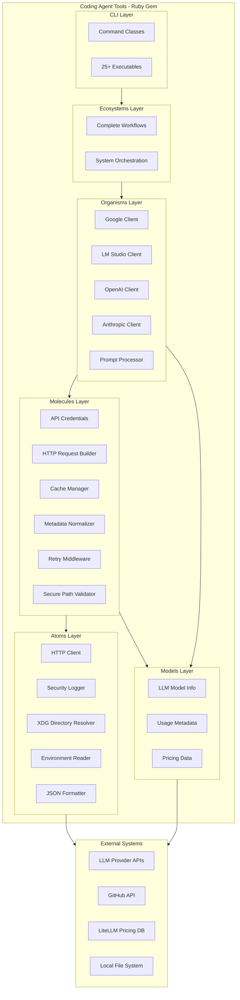
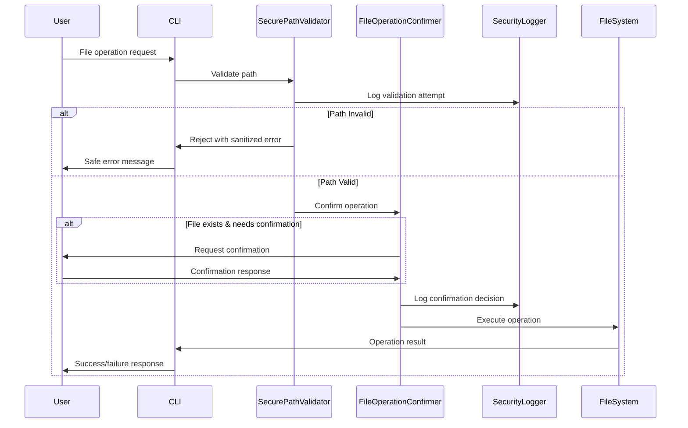
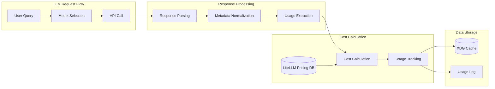

# Coding Agent Tools Ruby Gem - Technical Architecture

## Overview

This document outlines the detailed technical architecture and implementation of the Coding Agent Tools (CAT) Ruby gem, which provides the executable tools component of the Coding Agent Workflow Toolkit. For the broader system architecture, see [System Architecture](./architecture.md).

## Technology Stack

### Core Technologies

- **Primary Language**: Ruby (>= 3.2)
- **Runtime/Framework**: MRI (C Ruby) 
- **Package Manager**: Bundler
- **Architecture Pattern**: ATOM (Atoms, Molecules, Organisms, Ecosystems)

### Development Tools

- **Build System**: Standard Ruby Gem build (`gemspec`)
- **Testing Framework**: RSpec (unit/integration), Aruba (CLI integration)
- **Linting/Formatting**: StandardRB for code style enforcement
- **CLI Framework**: dry-cli for command structure
- **HTTP Client**: Faraday with middleware architecture
- **Caching**: XDG-compliant with automatic migration

### External Dependencies

- **Faraday**: Flexible HTTP client library
- **Zeitwerk**: Efficient and thread-safe code loader
- **dry-monitor**: Event-based monitoring and instrumentation
- **dry-cli**: Command-line interface framework
- **VCR**: HTTP interaction recording for tests
- **WebMock**: HTTP request stubbing for tests

## ATOM Architecture

The gem implements a sophisticated ATOM-based hierarchy inspired by Atomic Design principles:



### Component Classifications

#### Atoms (`lib/coding_agent_tools/atoms/`)
**Definition**: Smallest, indivisible units with no dependencies on other gem components.

**Key Components**:
- `HTTPClient` - Basic HTTP request execution
- `SecurityLogger` - Security-focused logging with sanitization
- `XDGDirectoryResolver` - Cross-platform directory resolution
- `EnvReader` - Environment variable reading
- `JSONFormatter` - JSON serialization/deserialization

#### Molecules (`lib/coding_agent_tools/molecules/`)
**Definition**: Behavior-oriented helpers that compose Atoms for focused operations.

**Key Components**:
- `APICredentials` - Authentication credential management
- `HTTPRequestBuilder` - HTTP request construction
- `CacheManager` - XDG-compliant cache operations with migration
- `MetadataNormalizer` - Provider response standardization
- `RetryMiddleware` - HTTP resilience with exponential backoff
- `SecurePathValidator` - Path security validation and sanitization

#### Organisms (`lib/coding_agent_tools/organisms/`)
**Definition**: Complex business logic components that orchestrate Molecules and Atoms.

**Key Components**:
- `GoogleClient` - Google Gemini API integration
- `LMStudioClient` - Local LM Studio integration
- `OpenAIClient` - OpenAI API integration
- `AnthropicClient` - Anthropic API integration
- `PromptProcessor` - LLM prompt preparation and processing

#### Models (`lib/coding_agent_tools/models/`)
**Definition**: Pure data carriers with no behavior or external dependencies.

**Key Components**:
- `LlmModelInfo` - Language model metadata (provider, name, context_size)
- `UsageMetadata` - Token usage and timing information
- `PricingData` - Cost calculation data structures

## Security Architecture

The gem implements a comprehensive multi-layered security framework:

### Security Components

#### SecurityLogger (Atom)
- **Purpose**: Security-focused logging with automatic sanitization
- **Features**: API key redaction, email/IP sanitization, path privacy protection
- **Integration**: Used across all security components

#### SecurePathValidator (Molecule)
- **Purpose**: Path validation and traversal attack prevention
- **Features**: Pattern detection, allowlist/denylist controls, normalization
- **Protection**: Against ../traversal, null bytes, system directory access

#### FileOperationConfirmer (Molecule)
- **Purpose**: Safe file operation confirmations
- **Features**: CI environment detection, interactive prompts, safe defaults

### Security Data Flow



## LLM Integration Architecture

The gem provides unified integration with multiple LLM providers:

### Provider Support
- **Google Gemini**: Full API integration with model discovery
- **OpenAI**: Complete ChatGPT and GPT-4 support
- **Anthropic**: Claude model family integration
- **Mistral**: Mistral model support
- **Together AI**: Open-source model access
- **LM Studio**: Local model integration (offline)

### Cost Tracking System



### Unified Usage Metadata

All providers normalize to a consistent usage structure:

```ruby
{
  input_tokens: Integer,
  output_tokens: Integer,
  total_tokens: Integer,
  took: Float, # execution time in seconds
  provider: String,
  model: String,
  timestamp: String, # ISO 8601 UTC
  finish_reason: String,
  cached_tokens: Integer, # when available
  cost: {
    input_cost: Float,
    output_cost: Float,
    total_cost: Float,
    currency: String
  },
  provider_specific: Hash # additional provider data
}
```

## Caching Architecture

### XDG Compliance

The gem implements XDG Base Directory Specification compliance:

- **Primary Location**: `$XDG_CACHE_HOME/coding-agent-tools/`
- **Fallback Location**: `$HOME/.cache/coding-agent-tools/`
- **Automatic Migration**: From legacy `~/.coding-agent-tools-cache`

### Cache Structure

```
$XDG_CACHE_HOME/coding-agent-tools/
├── models/              # LLM model information cache
│   ├── google_models.json
│   ├── openai_models.json
│   └── lmstudio_models.json
├── pricing/             # Cost tracking and pricing data
│   ├── litellm_pricing.json
│   └── usage_history.jsonl
├── usage/               # Usage tracking data
│   └── monthly_usage.json
└── temp/                # Temporary cache files
```

## Performance Considerations

### Startup Optimization
- **Target**: ≤ 200ms startup latency for CLI commands
- **Lazy Loading**: Components loaded on-demand
- **Zeitwerk**: Efficient autoloading without manual requires

### HTTP Resilience
- **Retry Middleware**: Exponential backoff with jitter
- **Circuit Breaker**: Prevent cascade failures
- **Timeout Management**: Configurable request timeouts

### Cache Performance
- **Atomic Operations**: Prevent cache corruption
- **Intelligent Invalidation**: Minimize redundant API calls
- **Concurrent Access**: Thread-safe cache operations

## Extension Points

The ATOM architecture provides clear extension paths:

### Adding New LLM Providers
1. Create new Organism in `organisms/`
2. Implement provider-specific Molecules as needed
3. Add provider-specific Models for data structures
4. Register new CLI commands in `cli/commands/`

### Adding New Security Features
1. Extend SecurityLogger Atom for new sanitization patterns
2. Create new security Molecules for specific validations
3. Integrate with existing FileIOHandler for automatic protection

### Adding New Cache Types
1. Extend CacheManager Molecule with new cache categories
2. Update XDGDirectoryResolver for new directory structures
3. Add Models for new cached data types

## Testing Strategy

### Test Categories
- **Unit Tests**: Individual component behavior
- **Integration Tests**: Component interaction
- **CLI Tests**: End-to-end command testing with Aruba
- **Security Tests**: Attack vector validation
- **HTTP Tests**: VCR-based API interaction testing

### Test Architecture
```
spec/
├── unit/                # Isolated component tests
│   ├── atoms/
│   ├── molecules/
│   ├── organisms/
│   └── models/
├── integration/         # Component interaction tests
├── cli/                 # End-to-end CLI tests
├── security/            # Security-specific tests
├── support/             # Test helpers and utilities
└── cassettes/           # VCR HTTP recordings
```

## Deployment Architecture

### Gem Distribution
- **Primary**: RubyGems.org publication
- **Secondary**: Submodule-based development environment
- **Installation**: `gem install coding_agent_tools` or Bundler

### Executable Structure
- **`exe/`**: User-facing CLI tools (25+ commands)
- **`bin/`**: Development tools (test, lint, build, setup)
- **Binstubs**: Generated by Bundler for PATH integration

## Future Architecture Considerations

### Planned Enhancements
- **Ecosystem Layer**: Complete workflow orchestration
- **Plugin System**: Third-party provider extensions  
- **Streaming Support**: Real-time LLM response handling
- **Advanced Caching**: Distributed cache support
- **Monitoring**: Enhanced observability and metrics

### Scalability Patterns
- **Concurrent Processing**: Multi-threaded request handling
- **Connection Pooling**: HTTP connection reuse
- **Background Processing**: Async operations for non-critical tasks
- **Resource Management**: Memory and connection limits

---

For system-level architecture and multi-repository coordination, see [System Architecture](./architecture.md).