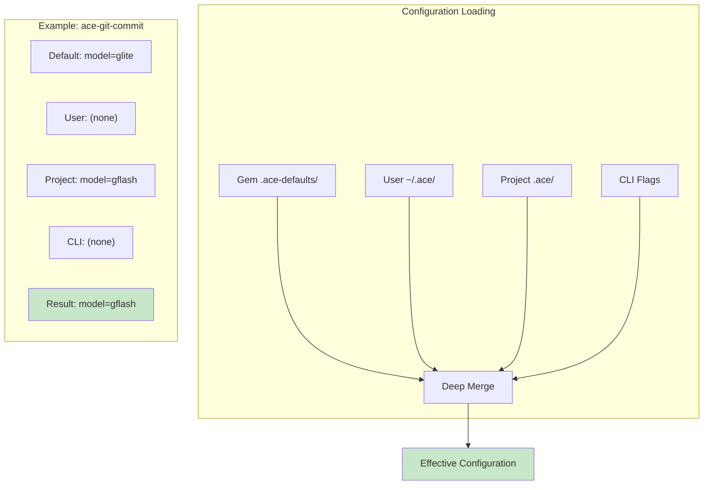

---
update:
  update_frequency: weekly
  max_lines: 220
  required_sections:
  - overview
  - scope
  frequency: weekly
  last-updated: '2026-01-17'
---

# ACE - System Architecture

## Overview

ACE (Agentic Coding Environment) is a mono-repo ecosystem of modular Ruby gems that provide a deterministic CLI surface
for AI-assisted software development. Both human developers and AI agents use the same tools through consistent
interfaces.

## Scope

This document covers the technical architecture of ACE:
- Component organization and ATOM pattern
- Configuration cascade (ADR-022)
- Key architectural decisions
- Security and quality standards

For the project vision and core principles, see [vision.md](vision.md). For CLI usage, see [tools.md](tools.md).

## Core Principles

* **Mono-Repo**: All ace-\* gems at root with shared dependencies
* **ATOM Pattern**: Consistent architecture (Atoms, Molecules, Organisms, Models)
* **Config Cascade**: `.ace/` hierarchy, nearest-wins resolution
* **Zero-Dependency Core**: ace-support-core uses only Ruby stdlib
* **AI-Native**: Deterministic commands for autonomous execution

Mono-repo contains modular gems; each follows ATOM with consistent structure. See [blueprint.md](blueprint.md) for
organization.

## ATOM Architecture Pattern

All ace-\* gems follow the ATOM pattern for consistent, testable code organization:

### Atoms (Pure Functions)

* No side effects or external dependencies
* Single, well-defined purpose
* Examples: `yaml_parser`, `deep_merger`, `path_expander`

### Molecules (Composed Operations)

* Combine atoms to perform specific operations
* May have controlled side effects (file I/O)
* Examples: `yaml_loader`, `config_finder`, `context_chunker`

### Organisms (Business Logic)

* Orchestrate molecules to implement features
* Handle complex workflows and coordination
* Examples: `config_resolver`, `context_loader`, `test_orchestrator`

### Models (Data Structures)

* Pure data carriers with no business logic
* Immutable value objects preferred
* Examples: `config`, `context_data`, `test_result`

### Implementation

All gems use flat directory structure: `lib/ace/gem/{atoms,molecules,organisms,models}/` with `commands/` for Thor CLI.
Tests mirror this in `test/{atoms,molecules,organisms,models,commands}/` (flat, not nested).

## Component Types

### Tools (ace-\* gems)

Modular Ruby gems providing focused CLI functionality:

* **ace-support-core**: Configuration management foundation
* **ace-bundle**: Project context loading with protocol support
* **ace-docs**: Documentation management with frontmatter-based tracking
* **ace-git**: Unified Git operations and PR context
* **ace-git-commit**: Smart git commit generation with LLM integration
* **ace-git-secrets**: Security scanning and token remediation
* **ace-git-worktree**: Worktree management
* **ace-lint**: Code quality linting (markdown, YAML, frontmatter)
* **ace-llm**: Multi-provider AI model integration with CLI-based providers
* **ace-nav**: Resource discovery and navigation with wfi:// protocol
* **ace-prompt-prep**: Prompt workspace with archiving, LLM enhancement, and task integration
* **ace-review**: Preset-based code review with LLM-powered analysis
* **ace-search**: Unified file and content search with DWIM pattern matching
* **ace-taskflow**: Task, release, and idea management with presets
* **ace-test**: Test execution and reporting
* **ace-test-support**: Shared testing infrastructure

All gems follow ATOM architecture with `handbook/` for agents/workflows. See [ace-gems.g.md](ace-gems.g.md) for
development guide.

### Workflows (.wf.md)

Self-contained instruction documents for complete processes:

* **Location**: `gem/handbook/workflow-instructions/*.wf.md`
* **Structure**: Frontmatter (purpose, params, tools) + complete instructions + embedded templates
* **Principle**: ADR-001 self-containment - include all context inline
* **Discovery**: `ace-bundle wfi://workflow-name`
* **Use when**: Multi-step process, decision points, context management

### Agents (.ag.md)

Single-purpose, composable agents for focused actions:

* **Location**: `gem/handbook/agents/*.ag.md`, symlinked to `.claude/agents/`
* **Design**: Single responsibility, minimal state, standardized responses
* **Use when**: Single command execution, composable operations
* **Examples**: `ace-search` has `search.ag.md` (execute search), `research.ag.md` (multi-search analysis)

### Guides

Development patterns and best practices:

* Located in each gem's `handbook/guides/` directory
* Generic guides in `ace-handbook/handbook/guides/`
* Package-specific guides in respective gems (e.g., `ace-review/handbook/guides/`)
* Reference documentation for humans and agents

### Handbook Organization

Each gem includes `handbook/` for AI integration:

    gem/handbook/
    ├── agents/*.ag.md               # Single-purpose, composable
    ├── guides/*.g.md                # Development guides
    ├── templates/**/*.template.md   # Document templates
    └── workflow-instructions/*.wf.md  # Complete, self-contained

**Agent vs Workflow**: Agents for single actions, workflows for multi-step processes. Both use frontmatter and
standardized formats.

## AI Integration

* **Skills**: `.claude/skills/` maps workflows to slash commands
* **Agents**: `.claude/agents/` provides agent access; frontmatter defines capabilities
* **Deterministic CLI**: Predictable, parseable output for autonomous execution
* **wfi:// Protocol**: Direct workflow access via ace-nav
* **Delegation Pattern**: Agents delegate to specialized subagents, aggregate results

## Key Architectural Decisions

**ADR-015 Mono-Repo**: Migrated from submodules to mono-repo; each capability as focused ace-\* gem; simplified
dependencies.

**ADR-011 ATOM Pattern**: Clean separation of concerns; consistent across gems; testable structure.

**ADR-001 Workflow Self-Containment**: Include all templates inline; no external dependencies except core docs; reliable
autonomous execution.

**Configuration Cascade**: Four-tier merge with CLI → Project → User → Gem defaults priority.

**Zero-Dependency Core**: ace-support-core uses only Ruby stdlib; stable foundation; reduces conflicts.

## Configuration Cascade

The configuration system (ADR-022) ensures flexibility without complexity through a four-tier cascade:



**Resolution priority** (highest to lowest):
1. CLI Flags - immediate overrides
2. Project `.ace/` - repository-specific settings
3. User `~/.ace/` - personal preferences
4. Gem `.ace-defaults/` - sensible defaults

**Implementation:**
```ruby
# How ACE tools load configuration
resolver = Ace::Support::Config.create
config = resolver.resolve_namespace("git", filename: "commit")

# Gem defaults + user overrides + project overrides = final config
```

This means you only specify what differs from defaults—no forking required to customize behavior.

## Security & Quality

* Path validation, input sanitization, comprehensive test coverage
* CI/CD with GitHub Actions matrix testing across Ruby versions
* Deterministic, predictable command output

## Future Vision

**ace-handbook gem**: Workflows, guides, templates as installable gem. Every capability becomes a gem with embedded
prompts, agents, workflows - instantly available via `gem install ace-*`.

*For detailed decisions, see [docs/decisions.md](decisions.md)*

