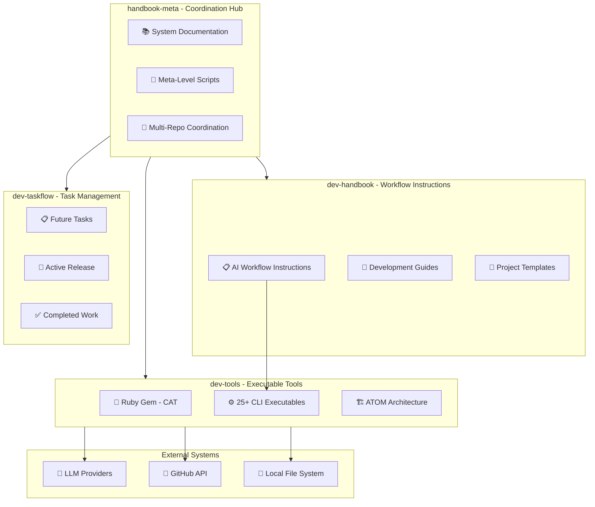
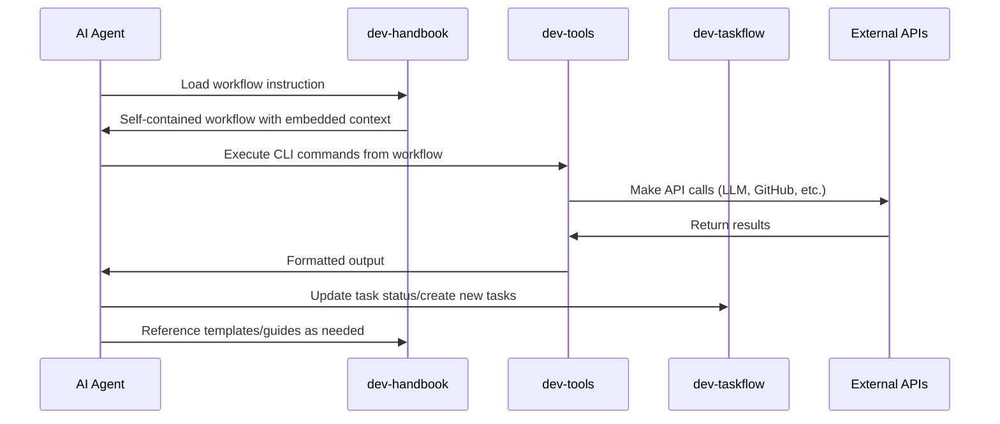
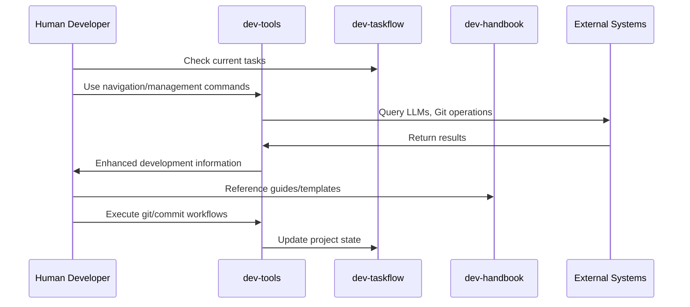

# Coding Agent Workflow Toolkit - System Architecture

## Overview

This document outlines the system architecture and technical design decisions for the Coding Agent Workflow Toolkit.

For detailed Ruby gem implementation, see [Tools Architecture](./architecture-tools.md).

## Core Design Principles

### System-Level Principles
- **Meta-Repository Architecture**: Multi-repository coordination using Git submodules for clear separation of concerns
- **Workflow Self-Containment**: AI workflows must be completely independent and executable without external dependencies (per ADR-001)
- **Documentation-Driven Development**: Workflows, tasks, and processes are documented first, then implemented
- **AI-Native Design**: Built specifically with autonomous AI agent capabilities and limitations in mind

### Implementation Principles
- **ATOM Architecture**: Structured around Atoms, Molecules, Organisms, and Ecosystems for maintainability and testability (per ADR-011)
- **Test-Driven Development**: High emphasis on testing with comprehensive unit and integration test coverage using RSpec
- **Predictable CLI**: Designing commands with ergonomic flags suitable for both human and agent interaction
- **Modularity**: Components are designed with explicit boundaries and dependency injection
- **Security-First**: Multi-layered security framework with path validation, sanitization, and secure logging

## Technology Stack

### Core Technology Choices
- **Primary Language**: Ruby (>= 3.2) - Chosen for its expressiveness, developer productivity, and suitability for scripting and tooling
- **Runtime**: MRI (C Ruby) >= 3.2 - Standard and widely adopted Ruby implementation
- **Architecture Pattern**: ATOM (Atoms, Molecules, Organisms, Ecosystems) - Guiding principle for structuring the codebase

### Technical Infrastructure
- **Coordination**: Git submodules for multi-repository management
- **Documentation**: Markdown with markdownlint validation
- **Template System**: XML-based embedding (per ADR-002)
- **CLI Framework**: dry-cli with comprehensive command structure
- **HTTP Client**: Faraday with retry middleware and observability (per ADR-010)
- **Testing**: RSpec with VCR for HTTP interaction recording (per ADR-006)
- **Autoloading**: Zeitwerk with proper inflections (per ADR-007)
- **Observability**: dry-monitor for event publishing (per ADR-008)
- **Error Handling**: Centralized ErrorReporter (per ADR-009)

### External Integrations
- **LLM Providers**: Google Gemini, OpenAI, Anthropic, Mistral, Together AI, LM Studio (per ADR-014)
- **Cost Tracking**: LiteLLM pricing database for accurate cost calculations
- **Version Control**: Git CLI, GitHub REST API

### Security Architecture
- **Path Validation**: Multi-layer validation for file operations
- **Sanitization**: Automatic sanitization of sensitive information
- **Secure Logging**: Privacy-preserving log output
- **Defense in Depth**: Multiple validation layers

## System Architecture

### Meta-Repository Structure

The Coding Agent Workflow Toolkit uses a sophisticated multi-repository architecture coordinated through Git submodules:

### Repository Descriptions

#### handbook-meta (Coordination Hub)
- Central coordination and system-level documentation
- Multi-repository coordination scripts
- Unified documentation and ADRs

#### dev-handbook (Workflow Instructions & Agents)
- Self-contained AI workflow instructions (.wf.md files)
- Specialized development agents (.ag.md files in `.integrations/claude/agents/`)
- Development guides and templates
- Complete workflow self-containment (per ADR-001)

#### dev-tools (Executable Tools)
- Ruby gem with CLI tools and automation
- ATOM-structured codebase
- Multi-provider LLM integration
- Both gem publication and submodule distribution

#### dev-taskflow (Task Management)
- Documentation-driven task management
- Structured organization (backlog/, current/, done/)
- Release planning and decision tracking

## Data Flow Architecture

### AI Agent Workflow Execution

### Human Developer Workflow

## Agent Architecture

### Specialized Development Agents

The toolkit includes specialized agents designed for focused development tasks, located in `dev-handbook/.integrations/claude/agents/`. Each agent follows a single-purpose design with standardized interfaces.

#### Agent Categories
- **Task Management**: `task-finder`, `task-creator`, `release-navigator`
- **Git Operations**: `git-all-commit`, `git-files-commit`, `git-review-commit`
- **Development Tools**: `lint-files`, `create-path`, `feature-research`
- **Search & Analysis**: `search` for intelligent code discovery

#### Compatibility Architecture
Agents are designed with multi-platform compatibility in mind:
- **Claude Code Subagents**: Primary integration through Claude's Task tool with `subagent_type` parameter
- **MCP Proxy Integration**: Compatible with the MCP (Model Context Protocol) proxy we're developing for broader AI platform support
- **Future OpenCode Support**: Architecture designed for direct integration with OpenCode and similar platforms

#### Agent Design Principles
- **Single Purpose**: Each agent performs one focused task exceptionally well
- **Standardized Response Format**: Consistent output structure across all agents
- **Parameter Support**: Accept `expected_params` for configuration
- **Composition Ready**: Agents can delegate to each other for complex workflows

## Integration Patterns

### AI Agent Integration
- Direct CLI execution via agent tools
- Structured workflow instructions (.wf.md)
- Specialized agent invocation through platform-specific interfaces
- Embedded template system
- Documentation-driven task tracking

### Human Developer Integration
- Enhanced CLI tools for productivity
- Development guides and templates
- Multi-repository coordination

### CI/CD Integration
- Batch processing support
- Non-interactive execution modes
2. **Configuration Management**: Environment-based configuration
3. **Security Integration**: Safe defaults for automated environments
4. **Cost Tracking**: Comprehensive usage and cost monitoring

## Security Architecture

### System-Level Security

- **Repository Isolation**: Clear boundaries between different concerns
- **Access Control**: Appropriate file permissions and path restrictions
- **Credential Management**: Secure handling of API keys and tokens
- **Audit Trail**: Comprehensive logging of all operations

### Implementation Security

- **Path Validation**: Prevent directory traversal attacks
- **Input Sanitization**: Clean all user inputs and file paths
- **Secure Logging**: Automatic redaction of sensitive information
- **Operation Confirmation**: Safe defaults with confirmation prompts

## Performance Considerations

### System-Level Performance

- **Submodule Efficiency**: Minimal overhead for multi-repository coordination
- **Documentation Speed**: Fast template synchronization and analysis
- **Task Management**: Efficient file-based task tracking

### Implementation Performance

- **Startup Speed**: ≤ 200ms CLI command initialization
- **Caching Strategy**: XDG-compliant caching with intelligent invalidation
- **HTTP Optimization**: Connection pooling, retry logic, and timeout management
- **Memory Efficiency**: Minimal memory footprint with lazy loading

## Deployment Architecture

### Development Environment

The toolkit is designed for complete development environment setup:

1. **Submodule Installation**: `git submodule update --init --recursive`
2. **Ruby Gem Setup**: Bundle installation for dev-tools
3. **Documentation Setup**: Node.js dependencies for markdownlint
4. **Integration Configuration**: Environment variables and API keys

### Production Deployment

For production use, the toolkit supports:

1. **Gem Installation**: Standard RubyGems installation
2. **Containerization**: Docker support for consistent environments
3. **CI/CD Integration**: GitHub Actions and other CI systems
4. **Monitoring**: Comprehensive logging and usage tracking

## Future Architecture Evolution

### Planned Enhancements

#### Short-Term (v0.4.0 - v0.6.0)
- **Unified Taskflow**: Merged task management across all repositories
- **Enhanced Security**: Additional security validations and monitoring
- **Provider Expansion**: Additional LLM providers and integrations
- **Performance Optimization**: Caching improvements and startup speed

#### Medium-Term (v0.7.0 - v1.0.0)
- **Ecosystem Layer**: Complete workflow orchestration in Ruby gem
- **Plugin Architecture**: Third-party extensibility for providers and workflows
- **Advanced Analytics**: Comprehensive usage analytics and cost optimization
- **Multi-Language Support**: Gradual expansion beyond Ruby

#### Long-Term (v1.0.0+)
- **Distributed Architecture**: Support for team-based development workflows
- **Cloud Integration**: Native cloud provider integrations
- **AI Model Training**: Custom model training based on usage patterns
- **Enterprise Features**: Advanced security, compliance, and governance

### Scalability Considerations

- **Horizontal Scaling**: Support for multiple concurrent operations
- **Resource Management**: Intelligent resource allocation and limits
- **Network Optimization**: Advanced caching and connection management
- **Storage Efficiency**: Compressed caching and intelligent cleanup

## Decision Records

All architectural decisions are documented as ADRs in the following locations:

- **System-Level ADRs**: `docs/decisions/` (handbook-meta)
- **Workflow ADRs**: Suffixed with `.wf.md`  
- **Tools ADRs**: Suffixed with `.t.md`

Key architectural decisions:
- **ADR-001**: Workflow Self-Containment Principle
- **ADR-002**: XML Template Embedding Architecture
- **ADR-006**: CI-Aware VCR Configuration (.t.md)
- **ADR-011**: ATOM Architecture House Rules (.t.md)
- **ADR-014**: LLM Integration Architecture (.t.md)

## Monitoring and Observability

### System Monitoring
- **Multi-Repository Health**: Git submodule status and synchronization
- **Documentation Quality**: Automated link checking and template validation
- **Task Flow Tracking**: Release progress and completion metrics

### Implementation Monitoring
- **CLI Usage**: Command execution frequency and success rates
- **LLM Integration**: API call success rates, costs, and performance
- **Security Events**: Comprehensive security event logging and analysis
- **Performance Metrics**: Response times, cache hit rates, and resource usage

---

*This document should be updated when significant structural changes are made to the system architecture. For tools-specific technical details, see [Tools Architecture](./architecture-tools.md).*