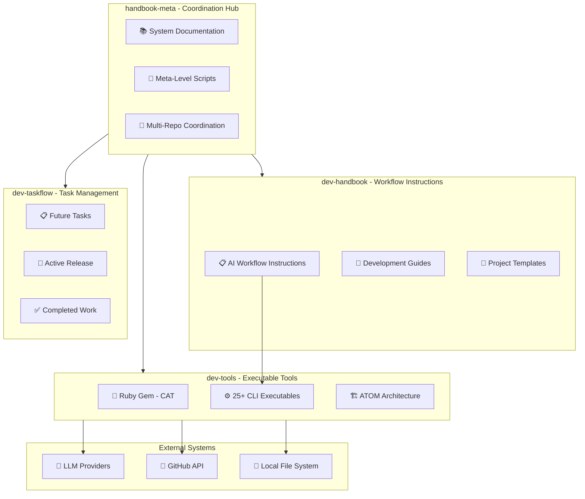
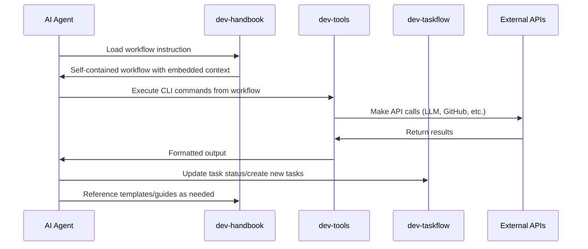
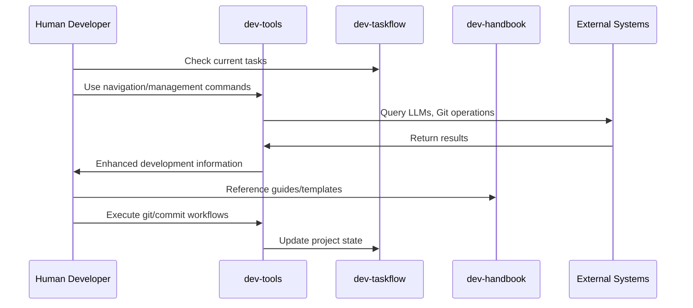

# Coding Agent Workflow Toolkit - System Architecture

## Overview

This document outlines the high-level system architecture of the Coding Agent Workflow Toolkit, a comprehensive meta-system that combines structured workflow instructions with executable development tools. It describes how the different repositories and components interact to enable seamless AI-assisted software development.

For detailed technical implementation of the Ruby gem tools, see [Tools Architecture](./architecture-tools.md).

## Technology Stack

### Meta-System Technologies

- **Coordination**: Git submodules for multi-repository management
- **Documentation**: Markdown with markdownlint for quality control
- **Task Management**: Documentation-driven with structured release cycles
- **Template Management**: XML-based template embedding with synchronization

### Executable Tools Technologies

- **Primary Language**: Ruby (>= 3.2) with ATOM architecture pattern
- **CLI Framework**: dry-cli with comprehensive command structure
- **HTTP Client**: Faraday with retry middleware and observability
- **Testing**: RSpec with VCR for HTTP interaction recording
- **Security**: Multi-layered security with path validation and sanitization
- **Caching**: XDG-compliant cache management with automatic migration

### External Integrations

- **LLM Providers**: Google Gemini, OpenAI, Anthropic, Mistral, Together AI, LM Studio
- **Cost Tracking**: LiteLLM pricing database for accurate cost calculations
- **Development Tools**: Git CLI, GitHub REST API, comprehensive repository management

## System Architecture

### Meta-Repository Structure

The Coding Agent Workflow Toolkit uses a sophisticated multi-repository architecture coordinated through Git submodules:

### Repository Descriptions

#### handbook-meta (Coordination Hub)
- **Purpose**: Central coordination and system-level documentation
- **Key Components**:
  - System architecture and vision documentation
  - Multi-repository coordination scripts
  - Unified ADRs from all projects
  - Meta-level automation (documentation analysis, template sync)
- **Role**: Provides the unified view and coordination layer for the entire toolkit

#### dev-handbook (Workflow Instructions)
- **Purpose**: Self-contained AI workflow instructions and development resources
- **Key Components**:
  - 19+ structured AI workflow instructions (.wf.md files)
  - Development guides organized by language and technology
  - Project templates and document templates
  - Editor integrations and development best practices
- **Architecture Principle**: Complete workflow self-containment (ADR-001)

#### dev-tools (Executable Tools)
- **Purpose**: Ruby gem providing CLI tools and development automation
- **Key Components**:
  - 25+ CLI executables for LLM integration, Git automation, navigation
  - ATOM-structured Ruby codebase (Atoms, Molecules, Organisms, Ecosystems)
  - Multi-provider LLM integration with cost tracking
  - Security framework with path validation and sanitization
- **Distribution**: Both gem publication and submodule integration

#### dev-taskflow (Task Management)
- **Purpose**: Documentation-driven task management and release planning
- **Key Components**:
  - Structured task organization (backlog/, current/, done/)
  - Release planning and roadmap management
  - Project-specific ADRs and decision tracking
- **Workflow**: Supports continuous release cycles with clear task progression

## Data Flow Architecture

### AI Agent Workflow Execution

### Human Developer Workflow

## Core Design Principles

### System-Level Principles

#### 1. Multi-Repository Coordination
- **Git Submodules**: Clean separation of concerns across repositories
- **Unified Documentation**: Central coordination through handbook-meta
- **Independent Development**: Each repository can be developed independently
- **Coordinated Releases**: Synchronized versioning across components

#### 2. Workflow Self-Containment (ADR-001)
- **Independent Execution**: AI workflows must be completely self-contained
- **Embedded Context**: All necessary templates, examples, and guidance embedded
- **No Cross-Dependencies**: Workflows cannot depend on external context loading
- **Autonomous Operation**: AI agents can execute workflows without human intervention

#### 3. Documentation-Driven Development
- **Workflows First**: Document processes before implementing tools
- **Task Transparency**: All work tracked through documentation
- **Decision Recording**: ADRs document architectural and implementation decisions
- **Template Synchronization**: Automated template management across documents

#### 4. AI-Native Design
- **Autonomous Execution**: Built for AI agent capabilities and limitations
- **Predictable Interfaces**: Consistent command structures for automation
- **Context Efficiency**: Minimize context window usage through self-containment
- **Error Handling**: Comprehensive error reporting for autonomous debugging

### Implementation Principles (Tools)

#### 1. ATOM Architecture
- **Atoms**: Indivisible utilities with no internal dependencies
- **Molecules**: Behavior-oriented helpers composing atoms
- **Organisms**: Business logic orchestrating molecules
- **Ecosystems**: Complete workflow coordination
- **Models**: Pure data carriers with no behavior

#### 2. Security-First Development
- **Multi-Layer Security**: Path validation, sanitization, secure logging
- **Defense in Depth**: Multiple validation layers for file operations
- **Privacy Protection**: Automatic sanitization of sensitive information
- **Safe Defaults**: Secure-by-default configuration and behavior

#### 3. Standards Compliance
- **XDG Compliance**: Follow OS-level directory standards
- **HTTP Best Practices**: Proper retry logic, timeouts, and error handling
- **Ruby Conventions**: Adhere to community standards and best practices

## Integration Patterns

### AI Agent Integration

The toolkit provides multiple integration points for AI agents:

1. **Direct CLI Usage**: Execute tools directly via command line
2. **Workflow Instructions**: Follow structured .wf.md workflow files
3. **Template System**: Use embedded templates for consistent output
4. **Task Management**: Integrate with documentation-driven task tracking

### Human Developer Integration

Human developers can integrate through:

1. **Enhanced CLI Tools**: 25+ productivity-focused commands
2. **Development Guides**: Language and technology-specific guidance
3. **Template Library**: Reusable project and document templates
4. **Multi-Repo Coordination**: Seamless work across all repositories

### CI/CD Integration

The toolkit supports automated workflows through:

1. **Batch Processing**: CLI tools designed for non-interactive execution
2. **Configuration Management**: Environment-based configuration
3. **Security Integration**: Safe defaults for automated environments
4. **Cost Tracking**: Comprehensive usage and cost monitoring

## Security Architecture

### System-Level Security

- **Repository Isolation**: Clear boundaries between different concerns
- **Access Control**: Appropriate file permissions and path restrictions
- **Credential Management**: Secure handling of API keys and tokens
- **Audit Trail**: Comprehensive logging of all operations

### Implementation Security

- **Path Validation**: Prevent directory traversal attacks
- **Input Sanitization**: Clean all user inputs and file paths
- **Secure Logging**: Automatic redaction of sensitive information
- **Operation Confirmation**: Safe defaults with confirmation prompts

## Performance Considerations

### System-Level Performance

- **Submodule Efficiency**: Minimal overhead for multi-repository coordination
- **Documentation Speed**: Fast template synchronization and analysis
- **Task Management**: Efficient file-based task tracking

### Implementation Performance

- **Startup Speed**: ≤ 200ms CLI command initialization
- **Caching Strategy**: XDG-compliant caching with intelligent invalidation
- **HTTP Optimization**: Connection pooling, retry logic, and timeout management
- **Memory Efficiency**: Minimal memory footprint with lazy loading

## Deployment Architecture

### Development Environment

The toolkit is designed for complete development environment setup:

1. **Submodule Installation**: `git submodule update --init --recursive`
2. **Ruby Gem Setup**: Bundle installation for dev-tools
3. **Documentation Setup**: Node.js dependencies for markdownlint
4. **Integration Configuration**: Environment variables and API keys

### Production Deployment

For production use, the toolkit supports:

1. **Gem Installation**: Standard RubyGems installation
2. **Containerization**: Docker support for consistent environments
3. **CI/CD Integration**: GitHub Actions and other CI systems
4. **Monitoring**: Comprehensive logging and usage tracking

## Future Architecture Evolution

### Planned Enhancements

#### Short-Term (v0.4.0 - v0.6.0)
- **Unified Taskflow**: Merged task management across all repositories
- **Enhanced Security**: Additional security validations and monitoring
- **Provider Expansion**: Additional LLM providers and integrations
- **Performance Optimization**: Caching improvements and startup speed

#### Medium-Term (v0.7.0 - v1.0.0)
- **Ecosystem Layer**: Complete workflow orchestration in Ruby gem
- **Plugin Architecture**: Third-party extensibility for providers and workflows
- **Advanced Analytics**: Comprehensive usage analytics and cost optimization
- **Multi-Language Support**: Gradual expansion beyond Ruby

#### Long-Term (v1.0.0+)
- **Distributed Architecture**: Support for team-based development workflows
- **Cloud Integration**: Native cloud provider integrations
- **AI Model Training**: Custom model training based on usage patterns
- **Enterprise Features**: Advanced security, compliance, and governance

### Scalability Considerations

- **Horizontal Scaling**: Support for multiple concurrent operations
- **Resource Management**: Intelligent resource allocation and limits
- **Network Optimization**: Advanced caching and connection management
- **Storage Efficiency**: Compressed caching and intelligent cleanup

## Decision Records

All architectural decisions are documented as ADRs in the following locations:

- **System-Level ADRs**: `docs/decisions/` (handbook-meta)
- **Workflow ADRs**: Suffixed with `.wf.md`  
- **Tools ADRs**: Suffixed with `.t.md`

Key architectural decisions:
- **ADR-001**: Workflow Self-Containment Principle
- **ADR-002**: XML Template Embedding Architecture
- **ADR-006**: CI-Aware VCR Configuration (.t.md)
- **ADR-011**: ATOM Architecture House Rules (.t.md)
- **ADR-014**: LLM Integration Architecture (.t.md)

## Monitoring and Observability

### System Monitoring
- **Multi-Repository Health**: Git submodule status and synchronization
- **Documentation Quality**: Automated link checking and template validation
- **Task Flow Tracking**: Release progress and completion metrics

### Implementation Monitoring
- **CLI Usage**: Command execution frequency and success rates
- **LLM Integration**: API call success rates, costs, and performance
- **Security Events**: Comprehensive security event logging and analysis
- **Performance Metrics**: Response times, cache hit rates, and resource usage

---

*This document should be updated when significant structural changes are made to the system architecture. For tools-specific technical details, see [Tools Architecture](./architecture-tools.md).*