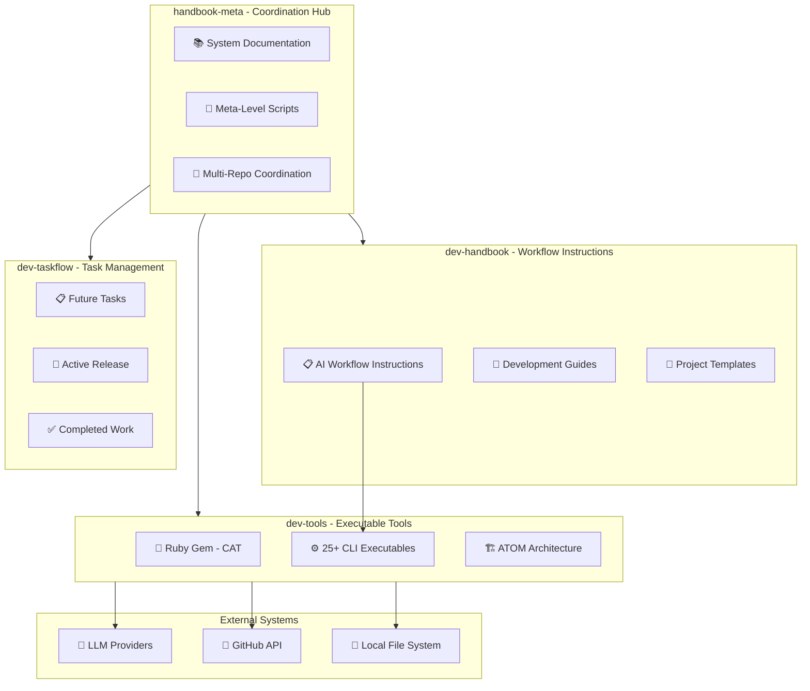
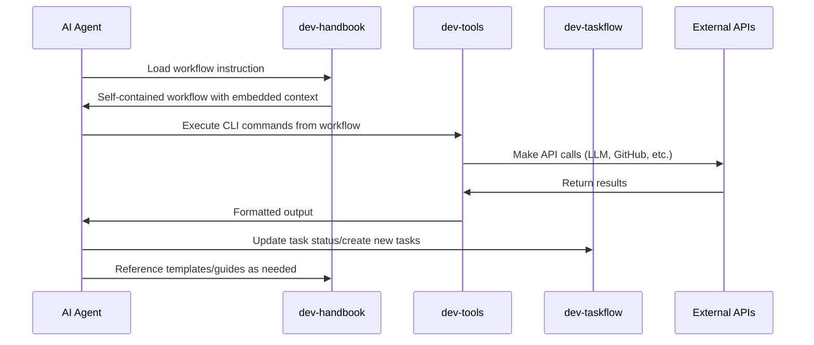
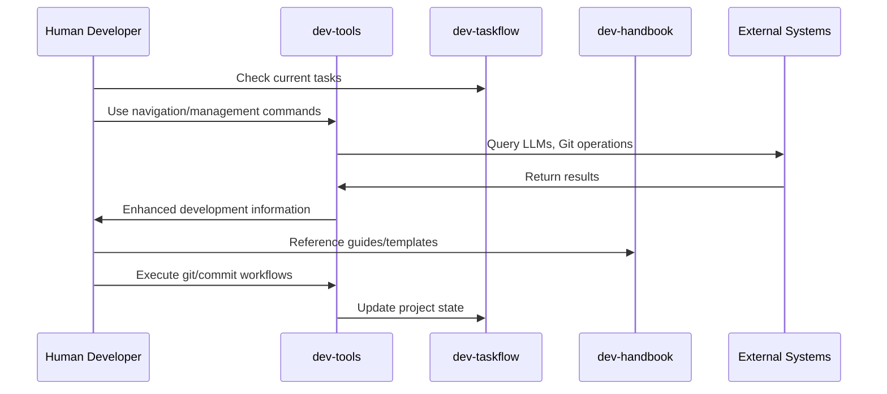

# Context

## Files

<file path="README.md" size="10366">
# Coding Agent Workflow Toolkit (Meta)

This repository (`coding-agent-workflow-toolkit-meta`) provides the overarching documentation and guidance for setting up and using a comprehensive, AI-assisted
development workflow. It explains how to integrate the `dev-handbook` toolkit (which contains standardized development guides and workflow instructions) with a
`dev-taskflow` structure (for your project-specific documentation and task management).

The goal is to create a consistent, efficient, and AI-friendly development environment.

## Core Components

1.  **`dev-handbook` Toolkit**: A specialized toolkit, ideally consumed from its own repository: `https://github.com/cs3b/coding-agent-workflow-toolkit`. It
```text
provides standardized development guides, workflow instructions, templates, and utilities.
* You integrate `dev-handbook` into your project, typically as a Git submodule, into a local `dev-handbook/` directory. The `dev-handbook/` folder within
  *this* meta-repository contains an *example* of such a toolkit\'s README and structure, primarily for illustrative purposes here. For actual use and the
  latest version, always refer to the dedicated `dev-handbook` toolkit repository.
2.  **`dev-taskflow` Structure**: A standardized directory structure for all your project-specific documentation (e.g., `what-do-we-build.md`,
`architecture.md`, `blueprint.md`), task management (`backlog/`, `current/`, `done/`), and decision logs.
* This structure is typically initialized and managed by workflows found in the `dev-handbook` toolkit. The `dev-taskflow/` folder within *this*
  meta-repository contains an *example* README detailing the `dev-taskflow` specification and an example of its structure.

## Getting Started / Setup

To establish this workflow in your project:

**Prerequisites:**

* Git installed on your system.

**Step 1: Integrate the `dev-handbook` Toolkit**

The `dev-handbook` toolkit contains all the standard guides, workflow instructions, and templates. It is highly recommended to add it to your project as a Git
submodule from its dedicated repository.

* **Canonical `dev-handbook` repository**: `https://github.com/cs3b/coding-agent-workflow-toolkit`

In your project's root directory, run:

git submodule add https://github.com/cs3b/coding-agent-workflow-toolkit.git dev-handbook
git submodule update --init --recursive
```

This will clone the `dev-handbook` toolkit into a `dev-handbook/` directory in your project, ready for use.

**Advanced: Forking `dev-handbook` for Customization**

If you need to customize the `dev-handbook` toolkit (e.g., tailor guides/workflows, create technology-specific branches for your projects):

Fork the canonical `dev-handbook` repository (i.e., `https://github.com/cs3b/coding-agent-workflow-toolkit`) on GitHub.

1.  **Add Your Fork as Submodule**: In your project\'s root, add your personal fork as the submodule:
^

```sh
git submodule add <URL_OF_YOUR_FORKED_DOCS_DEV_REPO> dev-handbook
git submodule update --init --recursive
```

(Replace `<URL_OF_YOUR_FORKED_DOCS_DEV_REPO>` with the URL of your fork).

1.  **Customize**: Navigate into your local `dev-handbook` submodule (`cd dev-handbook`), create a new branch (e.g., `git checkout -b
```text
my-project-specific-branch`), and make your modifications.
2.  **Stay Updated**: To incorporate updates from the original `dev-handbook` toolkit, periodically fetch and merge changes from the upstream repository into
your fork's main branch, and then merge those updates into your custom branches.

**Step 2: Initialize Your `dev-taskflow` Structure**

Once the `dev-handbook` toolkit is integrated (i.e., you have a `dev-handbook/` directory in your project containing the toolkit), use its
`initialize-project-structure.md` workflow to set up your project-specific `dev-taskflow/` directory.

This is typically done by instructing an AI coding assistant. See the "Using Workflow Instructions with a Chat Interface" section below for how to do this.

## Understanding `dev-taskflow/`

The `dev-taskflow/` directory, once initialized in your project, becomes the central hub for its living documentation and operational context. It includes:

Core documents defining the project: `what-do-we-build.md`, `architecture.md`, `blueprint.md`.

* Task management system: `backlog/`, `current/`, `done/` directories.
* Decision log: `decisions/` directory.

For a detailed explanation of the `dev-taskflow` specification and structure, refer to the example `README.md` located at
`coding-agent-workflow-toolkit-meta/dev-taskflow/README.md`.

## Using Workflow Instructions with a Chat Interface

Most interactions with the `dev-handbook` workflows are designed to be performed via an AI-powered chat interface or coding assistant that can read files and
execute commands. To run a workflow:

1.  Ensure the `dev-handbook` toolkit is present in your project at the `dev-handbook/` path (see Step 1 in "Getting Started / Setup").
2.  Instruct your AI assistant to read and execute the desired workflow instruction file, providing any necessary inputs like file paths.

### Claude Code Integration

For [Claude Code][1] users, this repository includes native command integration through the `.claude/commands/` system. Each workflow instruction has a
corresponding command:

**Available Commands:**

* `/commit` - Follow commit workflow
* `/create-adr` - Create Architecture Decision Record
* `/create-api-docs` - Generate API documentation
* `/create-reflection-note` - Create project reflection
* `/create-test-cases` - Generate test cases
* `/create-user-docs` - Create user documentation
* `/draft-release` - Draft new release
* `/fix-tests` - Fix failing tests
* `/initialize-project-structure` - Set up project structure
* `/load-project-context` - Load project context
* `/publish-release` - Publish release
* `/plan-task` - Plan task implementation
* `/update-blueprint` - Update project blueprint
* `/update-roadmap` - Update project roadmap
* `/work-on-task` - Work on a task

**Usage:** Simply type `/command-name` in Claude Code to execute the corresponding workflow. Each command automatically reads the full workflow instructions and
commits changes when complete.

Here are some common examples:

**1. Initialize Project Structure** To set up your project\'s documentation and task management structure, often using a Product Requirements Document (PRD) as
initial input:

Read and execute the workflow instruction
`dev-handbook/workflow-instructions/initialize-project-structure.md`.
(The AI will likely ask for the location of a PRD or prompt for project details if one isn't found.)
```

**2. Breakdown Ideas/Notes into Actionable Tasks** To convert various inputs (like Feature Requirements Documents, raw notes, or PR feedback) into well-defined,
actionable tasks: This often involves a preparatory step to structure the input, followed by task creation. For instance, to process an FRD:

```text
1. Prepare an analysis from your Feature Requirements Document (FRD):
   Read and execute the workflow instruction `dev-handbook/workflow-instructions/draft-task.md`.
   (The AI will likely ask for the FRD content or path).

2. Create tasks from the structured analysis:
   Instruct the AI to use the output from the previous step to define and create
   individual task files in `dev-taskflow/backlog/{release_version}/tasks/`,
   following the guidelines in `dev-handbook/guides/write-actionable-task.md`.
```

(Note: The `dev-handbook/workflow-instructions/draft-task.md` workflow handles different input sources for task creation in a single, comprehensive workflow.)

**3. Review a Task** To thoroughly review an existing task definition (e.g., the next one suggested by a script like `task-manager next`) against project goals,
architecture, and recent changes, and to propose refinements:

```text
You might use a helper script (e.g., `task-manager next` if available in your
`` directory) via the terminal tool, or manually select
a task from `dev-taskflow/current/{release_version}/tasks/`.

2. Instruct the agent with the task's file path:
   Read and execute the workflow instruction
   `dev-handbook/workflow-instructions/plan-task.md` using the task file
   <path_to_identified_task.md>.
```

(The agent will then guide you through the review process as per the workflow, checking against project context and recent changes.)

**4. Work on a Task** To implement a defined and reviewed task (e.g., the next one suggested by `task-manager next`), following its embedded step-by-step plan:

```text
(Similar to reviewing a task, use `task-manager next` or manual selection).

2. Instruct the agent with the task's file path:
   Read and execute the workflow instruction
   `dev-handbook/workflow-instructions/work-on-task.md` using the task file
   <path_to_identified_task.md>.
```

(The agent will then follow the implementation plan within the task file, guiding you through the test-code-refactor cycle for each step.)

## Integration Examples

To see how the Coding Agent Workflow Toolkit can be integrated with various coding tools and for examples of specific workflows, please refer to the
`coding-agent-workflow-toolkit-meta/examples/` directory within this repository.

## FAQ

| Question | Answer |
|----------
| **What’s the difference between `dev-handbook` and `dev-taskflow`?** | `dev-handbook` is reusable, language-agnostic guidance; `dev-taskflow` holds your project-specific artefacts. (in this case the meta project, where we use it to improve itself) |

* * *

## Purpose of This Meta-Repository

This `coding-agent-workflow-toolkit-meta` repository serves to:

Explain the overall philosophy, architecture, and integration strategy of the `dev-handbook` toolkit and the `dev-taskflow` specification. Provide illustrative
examples of README files and directory structures for both `dev-handbook` and `dev-taskflow`. These are for guidance; the canonical `dev-handbook` toolkit
should be sourced from its own repository. Offer a centralized place for high-level discussions, issues, and examples related to the entire AI-assisted
development workflow ecosystem.

For the actual `dev-handbook` toolkit, its most current version, and its own issue tracking, please refer to its dedicated repository:
`https://github.com/cs3b/coding-agent-workflow-toolkit`.


[1]: https://claude.ai/code
</file>

<file path="docs/what-do-we-build.md" size="15299">
# Coding Agent Workflow Toolkit

## What We Build 🔍

The **Coding Agent Workflow Toolkit** is a comprehensive meta-system that provides both **development handbook workflows** and **executable tools** to enable seamless AI-assisted software development. It combines structured workflow instructions for autonomous AI agents with a robust Ruby gem (Coding Agent Tools - CAT) that provides CLI tools for LLM integration, Git automation, and project management.

The system bridges the gap between human developers and AI coding agents by offering:
- **Standardized workflow instructions** that AI agents can execute independently
- **Predictable CLI tools** for common development operations
- **Documentation-driven task management** integrated with executable tooling
- **Multi-provider LLM integration** with cost tracking and caching

By providing both the "what to do" (workflows) and "how to do it" (tools), the toolkit enables developers and AI agents to collaborate effectively on higher-value design and coding activities.

## ✨ Key Features

### Workflow Instructions & Documentation
- **Self-Contained AI Workflows**: 19+ structured workflow instructions (.wf.md) that AI agents can execute independently
- **Development Handbook**: Comprehensive guides, templates, and best practices organized by language and technology
- **Documentation-Driven Task Management**: Structured task organization with backlog/, current/, done/ workflow
- **Template Synchronization**: Embedded document templates with automatic synchronization

### Executable Tools (Ruby Gem - CAT)
- **Multi-Provider LLM Communication**: Unified interface supporting Google Gemini, OpenAI, Anthropic, Mistral, Together AI, and LM Studio
- **Model Discovery and Management**: List and filter available models from different providers with caching support
- **Cost Tracking & Analytics**: Comprehensive usage tracking with cost calculation using LiteLLM pricing database
- **Enhanced Git Workflow Automation**: 25+ CLI tools including intelligent commit message generation, multi-repo operations, and GitHub integration
- **Intelligent Navigation**: Smart project navigation with path resolution, task management, and directory listing
- **Task Management Utilities**: Commands to identify next actionable tasks, review recent work, and manage release cycles
- **Code Review Automation**: Interactive and batch code review tools with synthesis capabilities
- **Standardized Interface**: Consistent CLI and API surface designed for both human and AI agent interaction
- **Offline Support**: Full offline capability with local LM Studio integration and XDG-compliant caching

## Core Design Principles

### System-Level Principles
- **Meta-Repository Architecture**: Multi-repository coordination using Git submodules for clear separation of concerns
- **Workflow Self-Containment**: AI workflows must be completely independent and executable without external dependencies
- **Documentation-Driven Development**: Workflows, tasks, and processes are documented first, then implemented
- **AI-Native Design**: Built specifically with autonomous AI agent capabilities and limitations in mind

### Implementation Principles (Ruby Gem)
- **ATOM Architecture**: Structured around Atoms, Molecules, Organisms, and Ecosystems for maintainability, testability, and clear separation of concerns
- **Test-Driven Development**: High emphasis on testing with comprehensive unit and integration test coverage using RSpec
- **Predictable CLI**: Designing commands with ergonomic flags suitable for both human and agent interaction
- **Modularity**: Components are designed with explicit boundaries and dependency injection
- **Ruby Best Practices**: Adhering to standard Ruby conventions and practices
- **Security-First**: Multi-layered security framework with path validation, sanitization, and secure logging

## Target Use Cases

### Primary Use Cases

- **Automated Development Workflows**: AI coding agents using CAT commands to perform tasks like committing code, querying models, or finding the next work item within CI/CD pipelines or local development environments.
- **Accelerated Project Setup**: Developers quickly initializing Git repositories and setting up remotes with standardized commands.
- **Streamlined Commit Process**: Developers generating informative and consistent commit messages automatically based on their code changes and intent.
- **Efficient Task Navigation**: Developers and agents easily identifying and tracking development tasks within a structured documentation system.

### Secondary Use Cases

- **Offline AI Interaction**: Developers and agents interacting with local language models via LM Studio for rapid iteration or sensitive tasks.
- **Integrating with Documentation**: Utilizing CAT commands to manage task backlogs defined within documentation files.

## User Personas

### Primary Users

**Alex – AI Coding Agent**: An automated system designed to perform coding tasks.

- Needs: A deterministic and stable CLI surface to reliably execute development and operations steps.
- Goals: Successfully complete assigned coding and Dev Ops tasks without manual intervention.
- Pain Points: Brittle and inconsistent ad-hoc shell scripts that cause workflow failures.

**Sam – Senior Dev**: An experienced software engineer focused on efficient development.

- Needs: Rapidly set up new project remotes, easily craft descriptive and atomic commits.
- Goals: Reduce time spent on routine Git and project setup chores; maintain a clean and traceable commit history.
- Pain Points: Forgetting push URLs for new repositories, struggling to write clear and concise commit messages for complex changes.

### Secondary Users

**Priya – DX Engineer**: An engineer focused on improving the developer experience.

- Context: Priya uses CAT as a foundation for building standardized, testable, and extendable developer tools and workflows within their organization. They need a framework that follows Ruby best practices and is easy to integrate and extend.

## Success Metrics

### Primary Metrics

- **Time-to-Commit**: Reduce median time from code change to committed diff by **30%** within the pilot team (Target: ≤ 70% of original time).
- **Agent Adoption**: ≥ **80%** of automated CI runs invoke at least one CAT command.

### Secondary Metrics

- **Support Load**: ≤ **2** support tickets per week related to Git setup or task selection after 1 month post-launch.
- **Reliability**: CLI commands succeed ≥ **99%** over 1,000 automated invocations in testing/monitoring.

## Technology Philosophy

### Core Technology Choices

- **Primary Language**: Ruby - Chosen for its expressiveness, developer productivity, and suitability for scripting and tooling development.
- **Runtime**: MRI (C Ruby) ≥ 3.2 - Standard and widely adopted Ruby implementation.

### Technical Principles

- **ATOM Architecture**: Guiding principle for structuring the codebase into distinct, testable layers.
- **Focus on CLI/API**: Prioritizing a stable and well-documented interface for programmatic and human use.
- **External Dependency Management**: Explicitly managing dependencies and aiming for minimal, well-vetted external libraries.

## Project Boundaries

### Distribution Architecture

The Coding Agent Workflow Toolkit employs a **submodule-based distribution model** that reflects its nature as a comprehensive development environment rather than a single-purpose library:

- **Primary Distribution**: Multi-repository coordination via Git submodules (handbook-meta as coordination repository)
- **Component Repositories**: 
  - `dev-handbook/` - Development resources, workflows, guides, and templates
  - `dev-tools/` - Core Ruby gem with CLI tools and executables
  - `dev-taskflow/` - Task management, project planning, and release coordination
- **Secondary Distribution**: Traditional Ruby gem publication for library integration scenarios
- **Target Environment**: Complete development environments with integrated toolchain, task management, and documentation

This approach enables coordinated development across interconnected components while maintaining flexibility for library-style integration when needed.

### What We Build

#### Meta-System Components
- A comprehensive **workflow instruction system** with 19+ self-contained AI workflows
- **Development handbook** with guides, templates, and best practices
- **Documentation-driven task management** with structured release cycles
- **Multi-repository coordination tools** for managing the entire ecosystem

#### Ruby Gem (CAT) Components
- A Ruby gem (`coding_agent_tools`) installable via standard Ruby package managers (RubyGems, Bundler)
- A suite of **25+ CLI executables** for development automation and LLM integration
- Core **ATOM architecture components**:
  - **Atoms**: `XDGDirectoryResolver`, `SecurityLogger`, `EnvReader`
  - **Molecules**: `CacheManager`, `MetadataNormalizer`, `APICredentials`, `HTTPRequestBuilder`
  - **Organisms**: `GoogleClient`, `LMStudioClient`, `OpenaiClient`, `AnthropicClient`, `PromptProcessor`
  - **Ecosystems**: Complete workflow orchestration and system-level coordination
- **Multi-provider LLM integrations**: Google Gemini, OpenAI, Anthropic, Mistral, Together AI, LM Studio
- **Enhanced Git/GitHub integration** with intelligent automation
- **XDG-compliant caching system** with automatic migration
- **Comprehensive cost tracking** using LiteLLM pricing database
- **Security framework** with path validation and sanitized logging
- **Comprehensive unit and integration tests** with VCR cassette management
- **Extensive documentation** including architecture guides, user documentation, and API references

### What We Don't Build (v1)

- SDKs or libraries in languages other than Ruby.
- A full-featured graphical user interface (GUI) for Git or task management.
- Direct integrations with proprietary LLM endpoints other than those specified (e.g., direct OpenAI calls within the gem, although wrappers could be built by users).
- Real-time collaborative editing features.
- A complete replacement for robust ticketing systems (Jira, Asana, etc.), but rather a tool to interact with backlog information potentially stored elsewhere or locally in docs.

## Value Proposition

### Problems We Solve

1. **Inconsistent Automation**: Replaces ad-hoc, project-specific scripts with a standardized, testable, and maintainable toolkit.
2. **Agent Orchestration Gap**: Provides coding agents with reliable, deterministic tools to perform common development and Dev Ops tasks they currently struggle with.
3. **Dev Ops Overhead**: Automates routine tasks like repository creation and commit message generation, reducing manual effort for developers.

### Unique Advantages

- **AI-Native Design**: Built specifically with the needs of AI coding agents in mind, offering a robust and predictable interface.
- **Documentation-Driven**: Designed to integrate with documentation-based workflows and task management.
- **Opinionated but Extendable**: Provides strong conventions while allowing for customization and extension of specific tools and workflows.
- **Offline Capability**: Supports interaction with local LLMs for enhanced privacy and speed.

## Future Vision

### Short-term Goals (Complete by ~Aug 2025 - v1.0.0)

- Achieve GA for core LLM communication commands.
- Finalize and release GitHub repository creation and commit generator tools.
- Implement and stabilize task utility commands (`tn`, `tr`, `rc`).
- Reach ≥ 95% test coverage.
- Publish stable v1.0.0 to RubyGems.

### Medium-term Goals (6-12 months post-v1)

- Gather user feedback and prioritize feature requests.
- Explore integrations with other LLM providers (if needed and not proprietary).
- Enhance task management features, potentially integrating with external systems.
- Improve performance and scalability.

### Long-term Vision (1+ years)

- Become a standard tool in AI-assisted Ruby development workflows.
- Potentially explore mechanisms for cross-language support (e.g., via a shared core or well-defined API boundaries).
- Expand the suite of automated Dev Ops and development tasks supported.

## Dependencies and Ecosystem

### Key Dependencies

#### Runtime Requirements
- **Ruby ≥ 3.2**: The required runtime environment for the tools
- **Node.js**: Required for markdownlint documentation quality control
- **Git CLI**: Fundamental command-line tool for repository operations

#### External Service Integrations
- **LLM Providers**: 
  - Google Gemini API (online)
  - OpenAI API (online)
  - Anthropic API (online)
  - Mistral API (online)
  - Together AI API (online)
  - LM Studio (local/offline)
- **GitHub REST API (v3)**: Used for repository creation and management
- **LiteLLM Pricing Database**: For accurate cost tracking across all providers

#### Development Dependencies
- **Ruby Ecosystem**: Bundler, RSpec, StandardRB, Faraday, dry-cli, VCR, WebMock
- **Documentation**: markdownlint-cli for quality control
- **Security**: Gitleaks for secrets scanning

### Ecosystem Integration

- **Multi-Repository Development**: Seamless coordination across handbook, tools, and taskflow repositories
- **AI Coding Agents**: Primary users and integrators designed for autonomous operation
- **Human Developer Workflows**: Enhanced productivity tools for manual development tasks
- **Git/GitHub**: Deep integration for repository management, commit workflows, and multi-repo operations
- **Documentation-Driven Development**: Tight integration between workflows, tasks, and executable tools
- **CI/CD Pipelines**: Designed to be invoked as part of automated workflows and deployment processes
- **Development Environments**: Complete integration with XDG-compliant caching and configuration standards

## Submodules

This project uses 3 Git submodules plus the root repository (4 total repositories):

### dev-handbook
- **Path**: `dev-handbook/`
- **Repository**: External repository for development resources
- **Purpose**: Contains development resources, guides, workflow instructions, templates, and best practices used by both developers and AI agents
- **Key Contents**: Self-contained AI workflows, development guides, project templates, editor integrations
- **Important**: Commits for this submodule must be made from within the submodule directory

### dev-tools
- **Path**: `dev-tools/`
- **Repository**: External repository for the Ruby gem
- **Purpose**: Core Ruby gem with CLI tools, LLM integrations, and development automation
- **Key Contents**: ATOM-structured Ruby code, 25+ CLI executables, comprehensive test suite, security framework
- **Important**: Commits for this submodule must be made from within the submodule directory

### dev-taskflow
- **Path**: `dev-taskflow/`
- **Repository**: External repository for task management
- **Purpose**: Project-specific task management, release planning, and project coordination
- **Key Contents**: Structured task organization (backlog/current/done), release planning, project decisions
- **Important**: Commits for this submodule must be made from within the submodule directory

---

*This document should be updated as the project evolves and new insights are gained about user needs and project direction.*

</file>

<file path="docs/architecture.md" size="13961">
# Coding Agent Workflow Toolkit - System Architecture

## Overview

This document outlines the high-level system architecture of the Coding Agent Workflow Toolkit, a comprehensive meta-system that combines structured workflow instructions with executable development tools. It describes how the different repositories and components interact to enable seamless AI-assisted software development.

For detailed technical implementation of the Ruby gem tools, see [Tools Architecture](./architecture-tools.md).

## Technology Stack

### Meta-System Technologies

- **Coordination**: Git submodules for multi-repository management
- **Documentation**: Markdown with markdownlint for quality control
- **Task Management**: Documentation-driven with structured release cycles
- **Template Management**: XML-based template embedding with synchronization

### Executable Tools Technologies

- **Primary Language**: Ruby (>= 3.2) with ATOM architecture pattern
- **CLI Framework**: dry-cli with comprehensive command structure
- **HTTP Client**: Faraday with retry middleware and observability
- **Testing**: RSpec with VCR for HTTP interaction recording
- **Security**: Multi-layered security with path validation and sanitization
- **Caching**: XDG-compliant cache management with automatic migration

### External Integrations

- **LLM Providers**: Google Gemini, OpenAI, Anthropic, Mistral, Together AI, LM Studio
- **Cost Tracking**: LiteLLM pricing database for accurate cost calculations
- **Development Tools**: Git CLI, GitHub REST API, comprehensive repository management

## System Architecture

### Meta-Repository Structure

The Coding Agent Workflow Toolkit uses a sophisticated multi-repository architecture coordinated through Git submodules:



### Repository Descriptions

#### handbook-meta (Coordination Hub)
- **Purpose**: Central coordination and system-level documentation
- **Key Components**:
  - System architecture and vision documentation
  - Multi-repository coordination scripts
  - Unified ADRs from all projects
  - Meta-level automation (documentation analysis, template sync)
- **Role**: Provides the unified view and coordination layer for the entire toolkit

#### dev-handbook (Workflow Instructions)
- **Purpose**: Self-contained AI workflow instructions and development resources
- **Key Components**:
  - 19+ structured AI workflow instructions (.wf.md files)
  - Development guides organized by language and technology
  - Project templates and document templates
  - Editor integrations and development best practices
- **Architecture Principle**: Complete workflow self-containment (ADR-001)

#### dev-tools (Executable Tools)
- **Purpose**: Ruby gem providing CLI tools and development automation
- **Key Components**:
  - 25+ CLI executables for LLM integration, Git automation, navigation
  - ATOM-structured Ruby codebase (Atoms, Molecules, Organisms, Ecosystems)
  - Multi-provider LLM integration with cost tracking
  - Security framework with path validation and sanitization
- **Distribution**: Both gem publication and submodule integration

#### dev-taskflow (Task Management)
- **Purpose**: Documentation-driven task management and release planning
- **Key Components**:
  - Structured task organization (backlog/, current/, done/)
  - Release planning and roadmap management
  - Project-specific ADRs and decision tracking
- **Workflow**: Supports continuous release cycles with clear task progression

## Data Flow Architecture

### AI Agent Workflow Execution



### Human Developer Workflow



## Core Design Principles

### System-Level Principles

#### 1. Multi-Repository Coordination
- **Git Submodules**: Clean separation of concerns across repositories
- **Unified Documentation**: Central coordination through handbook-meta
- **Independent Development**: Each repository can be developed independently
- **Coordinated Releases**: Synchronized versioning across components

#### 2. Workflow Self-Containment (ADR-001)
- **Independent Execution**: AI workflows must be completely self-contained
- **Embedded Context**: All necessary templates, examples, and guidance embedded
- **No Cross-Dependencies**: Workflows cannot depend on external context loading
- **Autonomous Operation**: AI agents can execute workflows without human intervention

#### 3. Documentation-Driven Development
- **Workflows First**: Document processes before implementing tools
- **Task Transparency**: All work tracked through documentation
- **Decision Recording**: ADRs document architectural and implementation decisions
- **Template Synchronization**: Automated template management across documents

#### 4. AI-Native Design
- **Autonomous Execution**: Built for AI agent capabilities and limitations
- **Predictable Interfaces**: Consistent command structures for automation
- **Context Efficiency**: Minimize context window usage through self-containment
- **Error Handling**: Comprehensive error reporting for autonomous debugging

### Implementation Principles (Tools)

#### 1. ATOM Architecture
- **Atoms**: Indivisible utilities with no internal dependencies
- **Molecules**: Behavior-oriented helpers composing atoms
- **Organisms**: Business logic orchestrating molecules
- **Ecosystems**: Complete workflow coordination
- **Models**: Pure data carriers with no behavior

#### 2. Security-First Development
- **Multi-Layer Security**: Path validation, sanitization, secure logging
- **Defense in Depth**: Multiple validation layers for file operations
- **Privacy Protection**: Automatic sanitization of sensitive information
- **Safe Defaults**: Secure-by-default configuration and behavior

#### 3. Standards Compliance
- **XDG Compliance**: Follow OS-level directory standards
- **HTTP Best Practices**: Proper retry logic, timeouts, and error handling
- **Ruby Conventions**: Adhere to community standards and best practices

## Integration Patterns

### AI Agent Integration

The toolkit provides multiple integration points for AI agents:

1. **Direct CLI Usage**: Execute tools directly via command line
2. **Workflow Instructions**: Follow structured .wf.md workflow files
3. **Template System**: Use embedded templates for consistent output
4. **Task Management**: Integrate with documentation-driven task tracking

### Human Developer Integration

Human developers can integrate through:

1. **Enhanced CLI Tools**: 25+ productivity-focused commands
2. **Development Guides**: Language and technology-specific guidance
3. **Template Library**: Reusable project and document templates
4. **Multi-Repo Coordination**: Seamless work across all repositories

### CI/CD Integration

The toolkit supports automated workflows through:

1. **Batch Processing**: CLI tools designed for non-interactive execution
2. **Configuration Management**: Environment-based configuration
3. **Security Integration**: Safe defaults for automated environments
4. **Cost Tracking**: Comprehensive usage and cost monitoring

## Security Architecture

### System-Level Security

- **Repository Isolation**: Clear boundaries between different concerns
- **Access Control**: Appropriate file permissions and path restrictions
- **Credential Management**: Secure handling of API keys and tokens
- **Audit Trail**: Comprehensive logging of all operations

### Implementation Security

- **Path Validation**: Prevent directory traversal attacks
- **Input Sanitization**: Clean all user inputs and file paths
- **Secure Logging**: Automatic redaction of sensitive information
- **Operation Confirmation**: Safe defaults with confirmation prompts

## Performance Considerations

### System-Level Performance

- **Submodule Efficiency**: Minimal overhead for multi-repository coordination
- **Documentation Speed**: Fast template synchronization and analysis
- **Task Management**: Efficient file-based task tracking

### Implementation Performance

- **Startup Speed**: ≤ 200ms CLI command initialization
- **Caching Strategy**: XDG-compliant caching with intelligent invalidation
- **HTTP Optimization**: Connection pooling, retry logic, and timeout management
- **Memory Efficiency**: Minimal memory footprint with lazy loading

## Deployment Architecture

### Development Environment

The toolkit is designed for complete development environment setup:

1. **Submodule Installation**: `git submodule update --init --recursive`
2. **Ruby Gem Setup**: Bundle installation for dev-tools
3. **Documentation Setup**: Node.js dependencies for markdownlint
4. **Integration Configuration**: Environment variables and API keys

### Production Deployment

For production use, the toolkit supports:

1. **Gem Installation**: Standard RubyGems installation
2. **Containerization**: Docker support for consistent environments
3. **CI/CD Integration**: GitHub Actions and other CI systems
4. **Monitoring**: Comprehensive logging and usage tracking

## Future Architecture Evolution

### Planned Enhancements

#### Short-Term (v0.4.0 - v0.6.0)
- **Unified Taskflow**: Merged task management across all repositories
- **Enhanced Security**: Additional security validations and monitoring
- **Provider Expansion**: Additional LLM providers and integrations
- **Performance Optimization**: Caching improvements and startup speed

#### Medium-Term (v0.7.0 - v1.0.0)
- **Ecosystem Layer**: Complete workflow orchestration in Ruby gem
- **Plugin Architecture**: Third-party extensibility for providers and workflows
- **Advanced Analytics**: Comprehensive usage analytics and cost optimization
- **Multi-Language Support**: Gradual expansion beyond Ruby

#### Long-Term (v1.0.0+)
- **Distributed Architecture**: Support for team-based development workflows
- **Cloud Integration**: Native cloud provider integrations
- **AI Model Training**: Custom model training based on usage patterns
- **Enterprise Features**: Advanced security, compliance, and governance

### Scalability Considerations

- **Horizontal Scaling**: Support for multiple concurrent operations
- **Resource Management**: Intelligent resource allocation and limits
- **Network Optimization**: Advanced caching and connection management
- **Storage Efficiency**: Compressed caching and intelligent cleanup

## Decision Records

All architectural decisions are documented as ADRs in the following locations:

- **System-Level ADRs**: `docs/decisions/` (handbook-meta)
- **Workflow ADRs**: Suffixed with `.wf.md`  
- **Tools ADRs**: Suffixed with `.t.md`

Key architectural decisions:
- **ADR-001**: Workflow Self-Containment Principle
- **ADR-002**: XML Template Embedding Architecture
- **ADR-006**: CI-Aware VCR Configuration (.t.md)
- **ADR-011**: ATOM Architecture House Rules (.t.md)
- **ADR-014**: LLM Integration Architecture (.t.md)

## Monitoring and Observability

### System Monitoring
- **Multi-Repository Health**: Git submodule status and synchronization
- **Documentation Quality**: Automated link checking and template validation
- **Task Flow Tracking**: Release progress and completion metrics

### Implementation Monitoring
- **CLI Usage**: Command execution frequency and success rates
- **LLM Integration**: API call success rates, costs, and performance
- **Security Events**: Comprehensive security event logging and analysis
- **Performance Metrics**: Response times, cache hit rates, and resource usage

---

*This document should be updated when significant structural changes are made to the system architecture. For tools-specific technical details, see [Tools Architecture](./architecture-tools.md).*
</file>

<file path="dev-handbook/README.md" size="1560">
# Coding Agent Workflow Toolkit (`dev-handbook`)

This toolkit provides standardized development guides, workflow instructions, and templates for AI-assisted software development. It's designed to be integrated as a Git submodule.

## Directory Structure

* **`guides/`**: Development best practices and standards
  * Includes `.meta/` subdirectory for self-referential guides about maintaining the documentation itself
* **`workflow-instructions/`**: Step-by-step procedures for AI agents to execute common development tasks
* **`templates/`**: Reusable templates for projects, tasks, documentation, and releases
* **`tmp/`**: Temporary files and working directories

## Integration

Add as a Git submodule to your project:

```sh
git submodule add <repository-url> dev-handbook
git submodule update --init --recursive
```

## Usage

* **AI Workflow Execution**: Direct AI agents to read and execute specific workflow files
* **Reference Guides**: Consult guides for development standards and best practices  
* **Templates**: Use templates for consistent project structure and documentation
* **Getting Started**: See `workflow-instructions/README.md` for workflow guidance

## Relationships

**`dev-taskflow`**: This toolkit provides the standardized processes, while your project-specific content (tasks, architecture docs, decisions) lives in a separate `dev-taskflow/` directory at your project root.

**`dev-tools`**: Companion Ruby gem providing CLI tools for LLM integration, Git automation, and development utilities that complement these workflows.

</file>

<file path="dev-taskflow/README.md" size="61">
# Test line
# Another test line
# Test for length
# Test fix

</file>

<file path="dev-tools/README.md" size="14356">
# Coding Agent Tools (CAT) Ruby Gem

[](https://github.com/cs3b/coding-agent-tools/actions/workflows/ci.yml)
[](https://badge.fury.io/rb/coding_agent_tools)
[](https://opensource.org/licenses/MIT)

A Ruby gem providing CLI tools designed for AI coding agents and developers to streamline development workflows through predictable, standardized commands.

> **⚠️ Breaking Changes in v0.2.0**: The LLM query commands have been unified and cache directory location has changed to XDG-compliant paths. If you're upgrading from v0.1.x, see the **[Migration Guide](docs/MIGRATION.md)** for instructions on updating your scripts and cache migration information.

## 🚀 Quick Start

### Installation

**1. Install as a published gem (once available):**

```bash
gem install coding_agent_tools
```

**2. Or, for local development/use from source:**

Add this line to your application's Gemfile if you are using it as a dependency from a local path (e.g., as a submodule or a local copy):

```ruby
gem 'coding_agent_tools', path: '.'
```

Then execute:

```bash
bundle install
```

After installation (either globally or via Bundler in a project), the `coding_agent_tools` command will be available.

## ✨ Key Features

- **LLM Integration**: Query multiple LLM providers using unified syntax
  - **Unified LLM Query**: Direct integration with multiple providers via `exe/llm-query provider:model`
- **Model Discovery**: List and filter available models from different providers
  - **Unified Model Discovery**: Discover available models via `exe/llm-models <provider>`
  - **Caching Support**: Model information is cached for faster response times
- **Cost Tracking**: Comprehensive cost analysis and usage reporting
  - **Automatic Cost Calculation**: Real-time cost tracking using LiteLLM pricing data
  - **Usage Reports**: Detailed breakdowns by provider, model, and time period via `exe/llm-usage-report`
  - **Multiple Export Formats**: JSON, CSV, and formatted table outputs
- **Enhanced Security**: Multi-layered security framework with comprehensive protections
  - **Path Validation**: Robust defense against directory traversal attacks and unauthorized access
  - **Interactive Confirmations**: Safe defaults with user prompts for file overwrites
  - **Credential Protection**: Automatic redaction of sensitive information from logs
  - **XDG Compliance**: Secure, standards-compliant file and cache management
- **Claude Code Integration**: Unified CLI for managing Claude Code commands and agents
  - **Command Generation**: Automatically create commands from workflow instructions
  - **Coverage Validation**: Ensure all workflows have corresponding commands
  - **Smart Organization**: Separate custom and generated commands
- **LM Studio Integration**: Direct integration with local LM Studio models
- **Git Automation**: Create repositories, generate commit messages with AI
- **Task Management**: Navigate documentation-based task backlogs
- **Context Tools**: Generate comprehensive project context documents
- **Offline Support**: Work with local language models via LM Studio

## 🛠 Core Commands (Planned Structure)

The primary executable for the gem is `coding_agent_tools`. Here's a look at the planned command structure (specific commands and options are illustrative and will be implemented in future tasks):

```bash
# General
coding_agent_tools --version
coding_agent_tools --help
coding_agent_tools help <command>

# LLM Communication
coding_agent_tools llm query --provider gemini --prompt "How to optimize Ruby performance?"
coding_agent_tools llm query --provider lm_studio --prompt "Explain SOLID principles"

# Source Control Management (SCM)
coding_agent_tools scm repository create --provider github my-new-repo
coding_agent_tools scm commit_with_message --intention "Refactor user authentication"
coding_agent_tools scm log --oneline

# Task Management
coding_agent_tools task next
coding_agent_tools task list --recent
coding_agent_tools task new_id

# Project Utilities
coding_agent_tools project release_context
# For development tasks related to the gem itself:
# coding_agent_tools project test (or bundle exec rspec)
# coding_agent_tools project lint (or bundle exec standardrb)
# coding_agent_tools project build_gem (or gem build coding_agent_tools.gemspec)
```

*Note: The existing `bin/*` scripts will be gradually replaced or wrapped by these new gem commands.*

## 🔧 Available Standalone Commands

### New Standalone Commands

- **`exe/llm-query`**: Query any supported LLM provider using unified syntax
  - Usage: `exe/llm-query provider:model "prompt or file path" [--output FILE] [--format json|markdown|text] [--temperature TEMP] [--max-tokens TOKENS] [--system "system prompt or file path"] [--force] [--debug]`
  - Examples:
    - `exe/llm-query google:gemini-2.5-flash "What is Ruby?"`
    - `exe/llm-query anthropic:claude-sonnet-4-20250514 prompt.txt --output response.json`
    - `exe/llm-query openai:gpt-4o "Question" --system system.md --output result.md`
    - `exe/llm-query lmstudio "Explain SOLID principles"`
    - `exe/llm-query gflash "Quick question"` (using alias for google:gemini-2.5-flash)
    - `exe/llm-query google "Overwrite example" --output existing.txt --force` (bypass confirmation)
  - Supports: Google Gemini, Anthropic Claude, OpenAI GPT, Mistral, Together AI, LM Studio
  - Provider aliases: `gflash`, `csonet`, `o4mini` and more
  - Requires: API keys for respective providers (see Setup Guide)
  - **File Operations**: When using `--output`, if the target file exists, you'll be prompted for confirmation unless `--force` (or `-f`) is specified. In non-interactive environments (CI/automation), use `--force` to bypass prompts.

- **`exe/llm-models`**: List available AI models from various providers
  - Usage: `exe/llm-models [PROVIDER] [--filter FILTER] [--format json] [--refresh]`
  - Examples:
    - `exe/llm-models google --filter "gemini-pro"`
    - `exe/llm-models lmstudio --filter "mistral"`
    - `exe/llm-models google --refresh` (refresh cache)
  - **New Output Fields**: Now includes `Context Size` and `Max Output` token limits for better model selection
  - **Sample Output**:

    ```
    Available LM Studio Models:
    ==================================================

    ID: mistralai/devstral-small-2505
    Name: Devstral Small
    Description: Specialized coding model, optimized for development tasks
    Context Size: 32.8K tokens
    Max Output: 16.4K tokens
    Status: Default model
    ```

  - Providers: `google` (default), `lmstudio`
  - Requires: `GOOGLE_API_KEY` for Google, LM Studio running on localhost:1234 for LMStudio

- **`exe/llm-usage-report`**: Generate comprehensive cost and usage reports
  - Usage: `exe/llm-usage-report [--format json|csv|table] [--date-range today|week|month|YYYY-MM-DD:YYYY-MM-DD] [--provider PROVIDER] [--model MODEL] [--output FILE] [--debug]`
  - Examples:
    - `exe/llm-usage-report` (basic table format)
    - `exe/llm-usage-report --format json --output monthly-report.json`
    - `exe/llm-usage-report --date-range week --provider google`
    - `exe/llm-usage-report --model claude-3-5-sonnet --format csv`
    - `exe/llm-usage-report --date-range 2024-01-01:2024-01-31`
  - Features: Automatic cost calculation using LiteLLM pricing data, provider/model filtering, multiple export formats
  - See: [Cost Tracking Guide](./docs/llm-integration/cost-tracking.md) for detailed usage

## 🛡️ File Operations & Security

### Interactive Overwrite Confirmation

When using the `--output` flag with `exe/llm-query`, the tool includes built-in security features for file operations:

**Interactive Mode** (terminals):

- If the output file already exists, you'll receive a confirmation prompt:

  ```
  File 'response.txt' already exists. Overwrite? [y/N]:
  ```

- Type `y` or `yes` to confirm overwrite, or `n`/`no` (or just press Enter) to cancel

**Non-Interactive Mode** (CI/automation):

- In CI environments or non-TTY contexts, overwrite attempts are automatically denied for safety
- Use the `--force` (or `-f`) flag to bypass confirmation prompts:

  ```bash
  exe/llm-query google "Question" --output response.txt --force
  ```

**Examples**:

```bash
# Interactive confirmation (will prompt if file exists)
exe/llm-query google "What is Ruby?" --output answer.txt

# Force overwrite without prompts (useful for scripts)
exe/llm-query google "What is Ruby?" --output answer.txt --force

# Alias for force flag
exe/llm-query google "What is Ruby?" --output answer.txt -f
```

This behavior ensures safe file operations while maintaining compatibility with automated workflows.

## 💰 Cost Tracking & Usage Analytics

All LLM queries automatically include cost tracking and usage analytics. Here's what you'll see:

**Basic Query with Cost Summary:**

```bash
$ exe/llm-query google:gemini-2.5-flash "What is Ruby programming?"

Ruby is a dynamic, object-oriented programming language...

Token Usage:
    Input:      234 tokens
   Output:      156 tokens

Cost Breakdown:
  Input cost:  $0.000292 (234 tokens × $0.00000125/token)
  Output cost: $0.000195 (156 tokens × $0.00000125/token)
  Total cost:  $0.000487
```

**Usage Report Generation:**

```bash
$ exe/llm-usage-report --date-range today

LLM Usage Report
================================================================================

Summary:
  Total Queries: 5
  Total Cost: $0.023847
  Total Tokens: 12,450
  Average Cost per Query: $0.004769

By Provider:
  Google: 3 queries, $0.012891
  Anthropic: 2 queries, $0.010956

Detailed Usage:
Timestamp           Provider     Model                   Input   Output   Cached       Cost     Time
--------------------------------------------------------------------------------
2024-01-15T10:30:45 google       gemini-2.5-flash          234      156        0 $0.000487    1.2s
2024-01-15T11:15:22 anthropic    claude-3-5-sonnet         892      445       50 $0.005234    2.8s
```

This helps you:

- **Monitor Costs**: Track spending across providers and models
- **Optimize Usage**: Compare model costs and performance
- **Budget Planning**: Generate reports for cost analysis
- **Token Efficiency**: Understand prompt and response sizes

## 🏗 Architecture

The gem's library code in `lib/coding_agent_tools/` is structured using an **ATOM-based hierarchy** (Atoms, Molecules, Organisms, Ecosystems), promoting modularity and reusability:

- **`lib/coding_agent_tools/atoms/`**: Smallest, indivisible utility functions or classes.
- **`lib/coding_agent_tools/molecules/`**: Simple compositions of Atoms forming reusable operations.
- **`lib/coding_agent_tools/organisms/`**: More complex units performing specific business logic or features.
- **`lib/coding_agent_tools/ecosystems/`**: The largest units, representing complete subsystems (the CLI app itself is an ecosystem).
- **`lib/coding_agent_tools/models/`**: Data structures (POROs) used across layers.
- **`lib/coding_agent_tools/cli/`**: Contains `dry-cli` command classes.
- **`lib/coding_agent_tools/cli.rb`**: Main `dry-cli` registry.

### Core Dependencies

- **Faraday**: HTTP client for API integrations (Google Gemini)
- **dry-cli**: Command-line interface framework

See the [Architecture Document](docs/architecture.md) for more details.

## 🔧 Configuration

For detailed instructions on configuring API keys (e.g., `GEMINI_API_KEY`) and setting up LM Studio, please refer to the [Setup Guide](docs/SETUP.md#api-keys-optional).

### LM Studio

Ensure LM Studio is running on `localhost:1234` for offline LLM queries. No API credentials required for default localhost usage.

## 📋 Requirements

- Ruby ≥ 3.4.2
- Git CLI
- Optional: LM Studio for offline LLM support

## 🎯 Use Cases

### For AI Agents

- Deterministic CLI interface for automation
- Reliable Git and task management operations
- Structured JSON output with `--json` flag

### For Developers

- Rapid repository setup and configuration
- AI-generated commit messages based on diffs
- Streamlined task navigation in documentation-driven workflows

## 🚧 Development Status

Currently in active development (v0.1.0 focusing on establishing the gem structure). See [roadmap](docs/roadmap.md) for planned releases.

## 💻 Development

For complete development information including environment setup, testing, build tools, and contribution workflow, see:

- **[Development Guide](docs/DEVELOPMENT.md)** - Complete development workflow and contributor quick start
- **[Setup Guide](docs/SETUP.md)** - Environment setup instructions
- **[Contributing](.github/CONTRIBUTING.md)** - Contribution guidelines and standards

## 📚 Documentation

### User Documentation

- **[Setup Guide](docs/SETUP.md)** - Development environment setup
- **[Development Guide](docs/DEVELOPMENT.md)** - Workflow and best practices
- **[Contributing](.github/CONTRIBUTING.md)** - How to contribute

### Project Documentation

- [Project Vision](docs/what-do-we-build.md) - Goals and use cases
- [Architecture](docs/architecture.md) - System design and patterns
- [Documentation Structure Guide](dev-handbook/guides/documentation.g.md) - Clarifies overall documentation organization and responsibilities

## 🤝 Contributing

We welcome contributions! Please see our [Contributing Guide](.github/CONTRIBUTING.md) for details on:

- Setting up your development environment
- Code style and quality standards
- Testing requirements and practices
- Pull request process and guidelines
- Commit message conventions

This project follows documentation-driven development with structured task management in `dev-taskflow/`. See the [project blueprint](docs/blueprint.md) for navigation guidance.

### Quick Contribution Workflow

1. Fork the repository and clone your fork
2. Set up development environment: `bin/setup`
3. Create a feature branch: `git checkout -b feature/name`
4. Make your changes following our standards
5. Test your changes: `bin/test && bin/lint`
6. Commit with conventional format and push
7. Open a pull request using our template

## 📄 License

[MIT License](LICENSE)
# Test fix
# Test correct behavior

</file>

<file path="CLAUDE.md" size="2620">
# CLAUDE.md

This file provides guidance to Claude Code (claude.ai/code) when working with code in this repository.

## Project Overview

This is the **Coding Agent Workflow Toolkit (Meta)** repository - a meta-repository that provides documentation and guidance for setting up AI-assisted
development workflow systems. It contains three Git submodules:

* **dev-handbook/**: Standardized development guides, workflow instructions, and templates *(integrated development)*
* **dev-taskflow/**: Unified task management structure for all components *(integrated development)*
* **dev-tools/**: Ruby gem with CLI tools for LLM integration and development automation *(integrated development)*

**Main work focus**: The development work is now integrated across all three submodules as part of a unified meta-project. The **dev-taskflow/** provides
centralized task management for coordinated development across **dev-handbook/** (guides and workflows) and **dev-tools/** (executable tools).

## Agent Recommendations

When working with specific tasks, use these specialized agents for focused, efficient execution. All agents follow single-purpose design and standardized response formats.

### Task Management
- **`task-finder`** - FIND tasks only - list, filter, discover next actionable tasks
- **`task-creator`** - CREATE tasks only - generate task files with content and metadata
- **`release-navigator`** - NAVIGATE releases - discover current/all releases, track recent activity

### Git Operations  
- **`git-all-commit`** - COMMIT ALL changes - fast execution without file selection
- **`git-files-commit`** - COMMIT SPECIFIC files - requires file list
- **`git-review-commit`** - REVIEW then COMMIT - analyze changes before committing

### Development Tools
- **`lint-files`** - LINT and FIX code quality - supports ruby, markdown, all types with autofix
- **`create-path`** - CREATE files/directories - supports templates (NOT for tasks)
- **`feature-research`** - RESEARCH gaps and missing features - outputs .fr.md reports
- **`search`** - SEARCH code patterns and files - intelligent filtering across codebase

### Agent Invocation
- **Direct**: `@agent-name` or use the Task tool with `subagent_type: agent-name`
- **With params**: Agents accept expected_params documented in their definitions
- **Composition**: Agents delegate to each other for complex workflows

### Agent Management
- **Location**: All agents in `dev-handbook/.integrations/claude/agents/*.ag.md`
- **Symlinks**: `.claude/agents/` contains symlinks to originals
- **Workflow**: Use `@manage-agents` workflow for creating/updating agents

</file>

<file path="CLAUDE.local.md" size="96">
## Project Paths

* Global project path: `/Users/michalczyz/Projects/CodingAgent/handbook-meta`

</file>

## Commands

<output command="git-status --short" success="true">
[main] Status:
  On branch master
  Your branch is up to date with 'origin/master'.
  
  Changes not staged for commit:
    (use "git add <file>..." to update what will be committed)
    (use "git restore <file>..." to discard changes in working directory)
  	modified: .coding-agent/context.yml
  	modified: dev-taskflow (new commits)
  	modified: dev-tools (new commits)
  	modified: docs/context/cached/project.md
  
  Untracked files:
    (use "git add <file>..." to include in what will be committed)
  	.claude/commands/load-context.md
  	docs/context/cached/project-stdo.md
  
  no changes added to commit (use "git add" and/or "git commit -a")

[dev-handbook] Status:
  On branch main
  Your branch is up to date with 'origin/main'.
  
  nothing to commit, working tree clean

[dev-taskflow] Status:
  On branch main
  Your branch is ahead of 'origin/main' by 1 commit.
    (use "git push" to publish your local commits)
  
  nothing to commit, working tree clean

[dev-tools] Status:
  On branch main
  Your branch is up to date with 'origin/main'.
  
  nothing to commit, working tree clean

</output>

<output command="task-manager next" success="true">
Status: 4 completed, 13 done (17 total)
No actionable tasks found

</output>

<output command="release-manager current" success="true">
Current Release Information:
========================================
  Name:      v.0.5.0-insights
  Version:   v.0.5.0
  Path:      /Users/michalczyz/Projects/CodingAgent/handbook-meta/dev-taskflow/current/v.0.5.0-insights
  Status:    active
  Tasks:     17
  Created:   2025-08-09 09:18:37
  Modified:  2025-07-30 10:12:20

</output>

<output command="nav-tree --depth 2" success="true">
.
├── bin
├── CHANGELOG.md
├── CLAUDE.local.md
├── CLAUDE.md
├── dev-handbook
│   ├── guides
│   ├── README.md
│   ├── test_dev_handbook.txt
│   └── workflow-instructions
├── dev-local
│   └── handbook
├── dev-taskflow
│   ├── current
│   ├── README.md
│   ├── roadmap.md
│   └── taskflow_test.txt
├── dev-tools
│   ├── bin
│   ├── CHANGELOG.md
│   ├── config
│   ├── coverage_analysis
│   ├── Current Git Status}
│   ├── Current Release Information}
│   ├── dev-handbook
│   ├── dev-taskflow
│   ├── docs
│   ├── exe
│   ├── Gemfile
│   ├── git-status,
│   ├── lib
│   ├── LICENSE
│   ├── nav-tree --depth 2,
│   ├── Next Actionable Task}
│   ├── Project Structure Overview}
│   ├── Rakefile
│   ├── README.md
│   ├── release-manager current,
│   ├── sig
│   ├── spec
│   ├── STYLE_GUIDE.md
│   └── task-manager next,
├── doc-dependencies.dot
├── doc-dependencies.json
├── docs
│   ├── architecture-tools.md
│   ├── architecture.md
│   ├── blueprint.md
│   ├── context
│   ├── decisions
│   ├── migrations
│   ├── tools.md
│   └── what-do-we-build.md
├── etc
├── README.md
├── v.0.3.0-workflows
│   └── reflections
└── vendor
    └── test

29 directories, 30 files

</output>