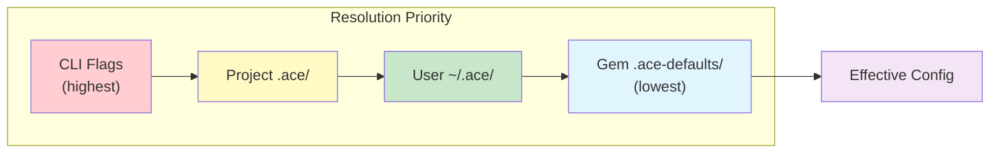
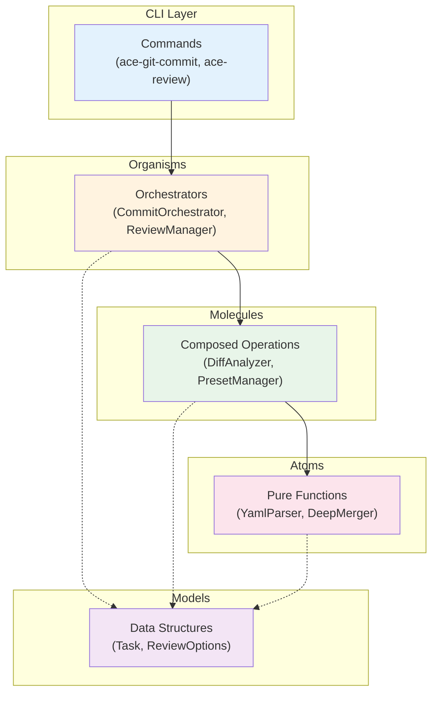
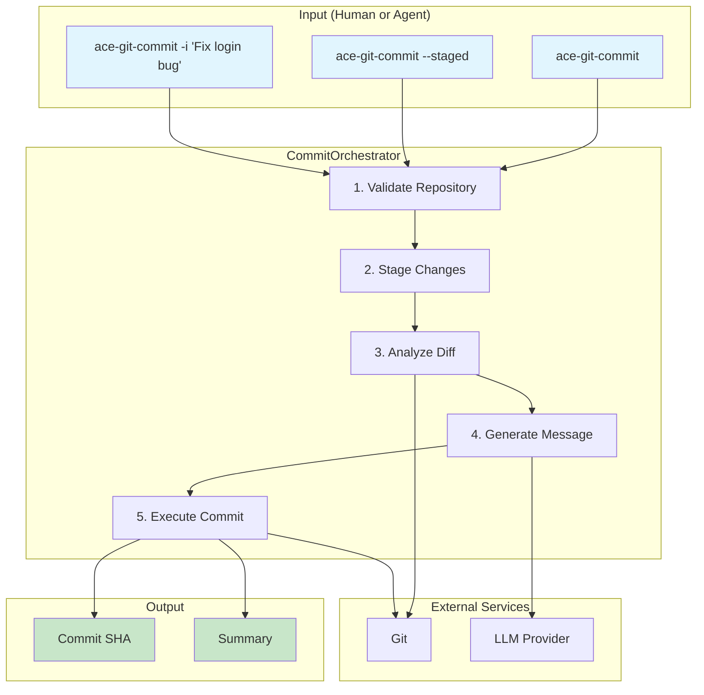
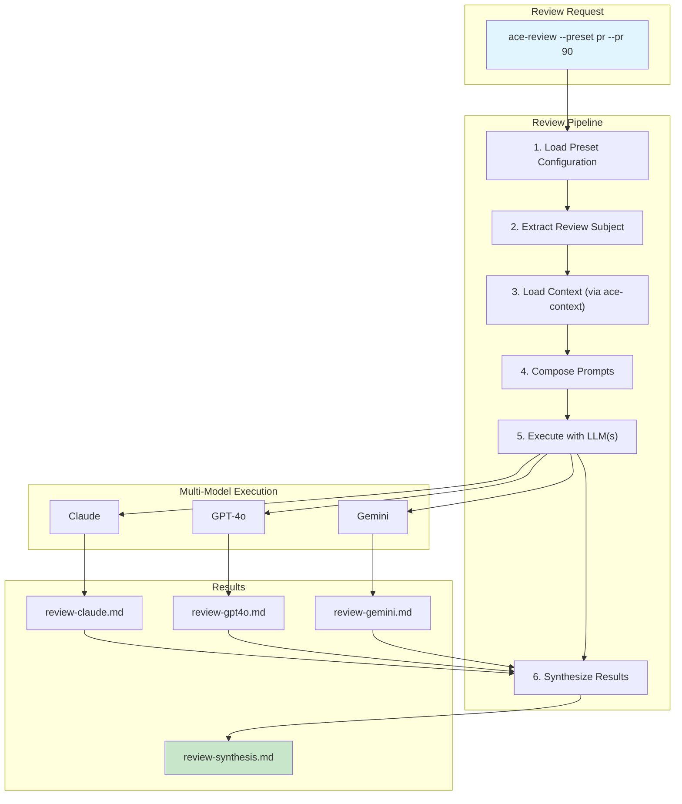
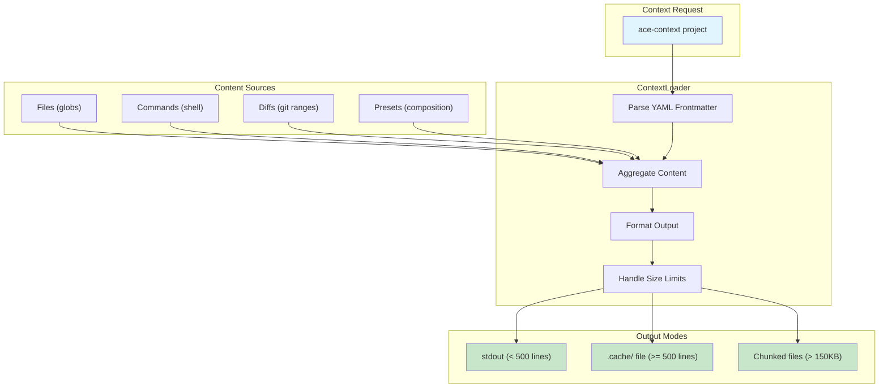
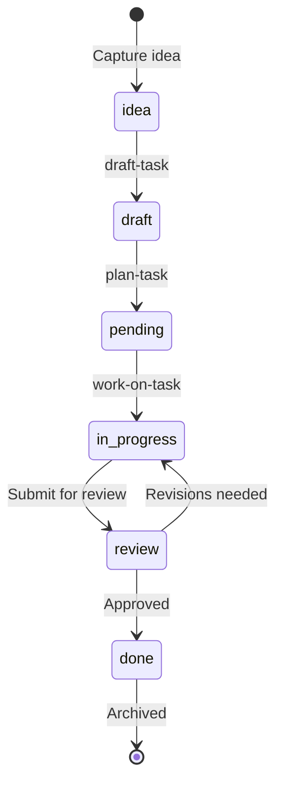

---
update:
  update_frequency: on-change
  last-updated: '2026-01-10'
  required_sections:
  - core-principles
  - architecture
  - workflows
---

# ACE Vision: Agentic Coding Environment

> **ACE (Agentic Coding Environment)** is built on a simple belief: AI coding assistants should work in the same environment as developers, using the same tools. Not tools designed only for agents, or tools retrofitted to sort-of work with agents, but tools that are excellent for both.

*This document consolidates the former `docs/ace-philosophy.md` and `docs/what-do-we-build.md` into a single comprehensive vision reference.*

## Table of Contents

- [Why ACE Exists](#why-ace-exists)
- [What We Build](#what-we-build)
- [Core Principles](#core-principles)
  - [1. Same Environment, Same Tools](#1-same-environment-same-tools)
  - [2. DX/AX Dual Optimization](#2-dxax-dual-optimization)
  - [3. Configuration Without Lock-In](#3-configuration-without-lock-in)
  - [4. Distribution Without Friction](#4-distribution-without-friction)
- [Architecture in Practice](#architecture-in-practice)
  - [ATOM: Component Architecture](#atom-component-architecture)
  - [Configuration Cascade](#configuration-cascade)
- [Workflow Examples](#workflow-examples)
  - [ace-git-commit: From Intent to Commit](#ace-git-commit-from-intent-to-commit)
  - [ace-review: Multi-Model Code Analysis](#ace-review-multi-model-code-analysis)
  - [ace-context: One Call, All Context](#ace-context-one-call-all-context)
  - [ace-taskflow: Task Lifecycle Management](#ace-taskflow-task-lifecycle-management)
- [Getting Started](#getting-started)
- [Cross-References](#cross-references)

---

## Why ACE Exists

### The Problem

Today's AI coding assistants face a fundamental friction: they operate in a different world than developers.

Developers have terminals, shells, and years of muscle memory with tools like `git`, `grep`, and custom scripts. AI agents have special APIs, sandboxed environments, and tool-call interfaces that try to approximate what developers do. This creates a gap:

- **Custom agent tools** that don't match how developers actually work
- **Inconsistent behavior** between what an agent does and what a developer would do
- **Duplicated effort** maintaining separate tooling for humans and machines
- **Lost context** when switching between agent-assisted and manual work

### The Vision

ACE eliminates this gap by providing a single set of CLI tools that work identically for both developers and AI agents:

```bash
# Human developer types:
ace-git-commit

# AI agent executes:
ace-git-commit

# Same command. Same behavior. Same result.
```

The agent isn't using a special "agent mode" or a custom API. It's using the exact same tool the developer uses, producing the exact same output.

### Why "Agentic"?

We chose "Agentic" over "Agent" deliberately. "Agent" implies a helper that executes commands. "Agentic" implies **autonomy**—the ability to understand context, make decisions, and take independent action.

ACE tools are designed for this agentic behavior:
- **Deterministic output** that agents can parse and reason about
- **Rich context loading** so agents understand the full picture
- **Self-contained workflows** that agents can execute without human intervention
- **Predictable behavior** that agents can rely on across different projects

---

## What We Build

ACE packages development capabilities as Ruby gems for AI coding assistants. Each gem includes CLI tools, agents, and workflows - making it a complete, reusable capability. Whether it's documentation management, code review, or task orchestration - ACE turns it into an installable gem that works with Claude Code, Codex, OpenCode, and other AI environments.

### Current Capabilities

- **ace-core**: Configuration management and shared utilities
- **ace-context**: Project context loading with smart caching
- **ace-docs**: Documentation management with frontmatter-based tracking
- **ace-git**: Unified Git operations (status, diff, branch, PR context)
- **ace-git-commit**: Smart git commit generation with LLM integration
- **ace-git-secrets**: Token detection and security remediation
- **ace-git-worktree**: Git worktree management
- **ace-lint**: Code quality linting (markdown, YAML, frontmatter)
- **ace-llm**: Multi-provider AI model integration with CLI-based providers
- **ace-nav**: Resource discovery and navigation with wfi:// protocol
- **ace-prompt**: Prompt workspace with LLM enhancement and task integration
- **ace-review**: Preset-based code review with LLM-powered analysis
- **ace-search**: Unified file and content search with intelligent pattern matching
- **ace-taskflow**: Task, release, and idea management with presets
- **ace-test**: Test execution and CI integration
- **ace-test-support**: Testing infrastructure and helpers

### Coming Soon

- **ace-handbook**: Workflows, guides, and templates as a gem

Every development capability becomes an installable Ruby gem. Prompts, agents, and workflows are embedded within thematic gems rather than generic bundles. Install with `gem install ace-*` and use immediately - whether you're a human developer or an AI agent.

---

## Core Principles

### 1. Same Environment, Same Tools

> Tools and scripts aren't going anywhere. They just need to work well for everyone.

Every ACE tool is a standard CLI command:

```bash
ace-git-commit          # Generate intelligent commits
ace-review --preset pr  # Review code changes
ace-taskflow task 123   # Show task details
ace-context project     # Load project context
```

There is no separate "agent API." When Claude Code or another AI assistant runs `ace-git-commit`, it executes the same binary, reads the same configuration, and produces the same output as when a developer runs it manually.

**Why this matters:**
- Developers can test and debug the exact tools agents use
- Agents benefit from years of CLI design best practices
- No synchronization problems between "agent tools" and "developer tools"
- Seamless handoff between agent-assisted and manual work

### 2. DX/AX Dual Optimization

> If a tool is awkward for developers, it will be worse for agents.

Every ACE tool must be excellent for both:

| Developer Experience (DX) | Agent Experience (AX) |
|---------------------------|----------------------|
| Clear, helpful documentation | Parseable, structured output |
| Intuitive defaults | Consistent interfaces |
| Meaningful error messages | Predictable, deterministic behavior |
| Progressive disclosure | Embedded context and workflows |

**Example: `ace-git status`**

For **developers**, this command provides a clear, readable summary:
```
# Repository Status

## Position
## main...origin/main [ahead 2]

## Recent Commits
4b03bebf fix(ace-test-suite): Resolve test file paths
e984add4 docs(taskflow): Add implementation plan

## PR Activity
Merged: #136 feat: Migrate CLI gems (25m ago)
Open: #135 feat: Migrate CLI framework (@cs3b)
```

For **agents**, the same command can output JSON:
```bash
ace-git status --json
```

Same tool, both experiences optimized.

### 3. Configuration Without Lock-In

> Every project is different. ACE provides sensible defaults that can be overridden at any level.

ACE uses a three-tier configuration cascade:



**You only specify what differs from defaults:**

```yaml
# .ace/git/commit.yml - Project override
git:
  model: gflash  # Use faster model for this project
  conventions:
    format: conventional
```

This means:
- **No forking** required to customize behavior
- **No vendor lock-in**—switch tools by changing one config file
- **Project-specific settings** that travel with the repository
- **User preferences** that apply across all projects

### 4. Distribution Without Friction

> Every capability becomes an installable Ruby gem.

Each ACE gem is a **complete capability bundle**:

```
ace-git-commit/
├── exe/ace-git-commit          # CLI tool
├── .ace-defaults/              # Sensible defaults
├── handbook/
│   ├── agents/                 # AI agent definitions
│   └── workflow-instructions/  # Self-contained workflows
└── lib/                        # Implementation
```

Install with `gem install ace-git-commit` and you get:
- The `ace-git-commit` command
- Default configuration for conventional commits
- A `/ace:commit` workflow for Claude Code
- Everything needed to use the capability immediately

**Workflows are self-contained** (ADR-001). A workflow file includes all its templates, instructions, and context inline. No external dependencies that might break. No "first, install these prerequisites." Just execute and it works.

---

## Architecture in Practice

### ATOM: Component Architecture

Every ACE gem follows the **ATOM architecture pattern** for consistent, testable code:



| Layer | Responsibility | Side Effects | Example |
|-------|---------------|--------------|---------|
| **Atoms** | Pure functions, single purpose | None | `yaml_parser`, `deep_merger` |
| **Molecules** | Composed operations | Controlled (file I/O) | `config_loader`, `diff_analyzer` |
| **Organisms** | Business logic orchestration | Coordinated | `CommitOrchestrator`, `TaskManager` |
| **Models** | Data structures | None | `Task`, `CommitOptions` |

**Why ATOM matters:**
- Predictable testability at every layer
- Clear dependency direction (up → down)
- Consistent patterns across 29+ gems
- Easy to understand and extend

### Configuration Cascade

The configuration system (ADR-022) ensures flexibility without complexity:

```mermaid
flowchart TD
    subgraph Load["Configuration Loading"]
        A["Gem .ace-defaults/"] --> B["Deep Merge"]
        C["User ~/.ace/"] --> B
        D["Project .ace/"] --> B
        E["CLI Flags"] --> B
    end

    B --> F["Effective Configuration"]

    subgraph Example["Example: ace-git-commit"]
        G["Default: model=glite"]
        H["User: (none)"]
        I["Project: model=gflash"]
        J["CLI: (none)"]
        K["Result: model=gflash"]
    end

    style F fill:#c8e6c9
    style K fill:#c8e6c9
```



**Implementation:**
```ruby
# How ACE tools load configuration
resolver = Ace::Support::Config.create
config = resolver.resolve_namespace("git", filename: "commit")

# Gem defaults + user overrides + project overrides = final config
```

---

## Workflow Examples

### ace-git-commit: From Intent to Commit

`ace-git-commit` demonstrates the full ACE philosophy: same tool for humans and agents, LLM-powered intelligence, deterministic behavior.



**Key characteristics:**
- **Same command** whether typed by human or executed by agent
- **LLM integration** for intelligent message generation
- **Configurable model** via `.ace/git/commit.yml`
- **Deterministic output** suitable for scripting

### ace-review: Multi-Model Code Analysis

`ace-review` shows how ACE handles complex, multi-step workflows with LLM coordination:



**Preset composition for DRY configuration:**
```yaml
# .ace/review/presets/pr.yml
presets:
  - code              # Inherit base code review preset

description: "Pull request review"
subject:
  diff: ["origin...HEAD"]
context:
  include_architecture: true
```

### ace-context: One Call, All Context

`ace-context` is the foundation for context-aware operations. One command loads everything an agent (or developer) needs:



**Example preset composition:**
```yaml
# .ace/context/presets/project.yml
context:
  files:
    - docs/architecture.md
    - docs/vision.md
    - README.md
  commands:
    - name: "Git Status"
      run: "ace-git status"
    - name: "Task Status"
      run: "ace-taskflow status"
```

**The power of one call:**
```bash
# Load full project context for an agent
ace-context project

# Load via protocol
ace-context wfi://load-context

# Load with embedding
ace-context project --embed-source
```

### ace-taskflow: Task Lifecycle Management

`ace-taskflow` manages the full development lifecycle from idea to completion:



**Directory structure:**
```
.ace-taskflow/
├── v.0.9.0/                    # Current release
│   ├── tasks/                  # Active tasks
│   │   ├── 181-task-standardize-project/
│   │   └── 182-task-descriptive-slugs/
│   ├── ideas/                  # Ideas for this release
│   └── retros/                 # Retrospectives
├── _archive/                   # Completed releases
├── _backlog/                   # Future release ideas
└── _anyday/                    # No-urgency tasks
```

**Key commands:**
```bash
ace-taskflow task 181           # Show task details
ace-taskflow tasks next         # What to work on next
ace-taskflow status             # Release progress overview
ace-taskflow task done 181      # Complete and archive
```

---

## Getting Started

1. **Install ACE gems** for the capabilities you need:
   ```bash
   gem install ace-git-commit ace-review ace-context ace-taskflow
   ```

2. **Try a command** to see ACE in action:
   ```bash
   ace-git status        # Repository overview
   ace-context project   # Load project context
   ```

3. **Customize configuration** if defaults don't fit:
   ```bash
   mkdir -p .ace/git
   echo "git:\n  model: gflash" > .ace/git/commit.yml
   ```

4. **Explore workflows** for AI-assisted development:
   ```bash
   ace-nav wfi://         # List available workflows
   ace-context wfi://commit  # Load commit workflow
   ```

---

## Cross-References

### Architecture & Design
- [docs/architecture.md](architecture.md) - Technical system architecture
- [docs/blueprint.md](blueprint.md) - Codebase navigation guide

### Tools & Usage
- [docs/tools.md](tools.md) - CLI tools quick reference
- [docs/ace-gems.g.md](ace-gems.g.md) - Gem development guide

### Architecture Decision Records
- [ADR-001](decisions/ADR-001-workflow-self-containment-principle.md) - Workflow self-containment
- [ADR-011](decisions/ADR-011-ATOM-Architecture-House-Rules.t.md) - ATOM architecture pattern
- [ADR-022](decisions/ADR-022-configuration-default-and-override-pattern.md) - Configuration cascade

### Package Documentation
- [ace-git-commit/README.md](../ace-git-commit/README.md) - Commit generation
- [ace-review/README.md](../ace-review/README.md) - Code review
- [ace-context/README.md](../ace-context/README.md) - Context loading
- [ace-taskflow/README.md](../ace-taskflow/README.md) - Task management

---

*ACE: Making AI-assisted development as simple as `gem install`.*
